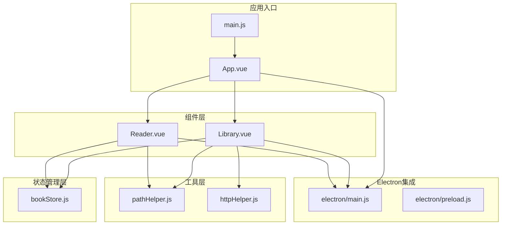
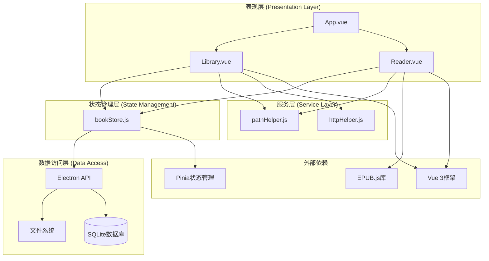
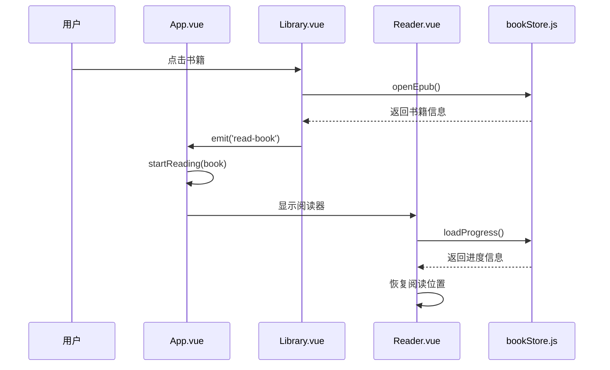
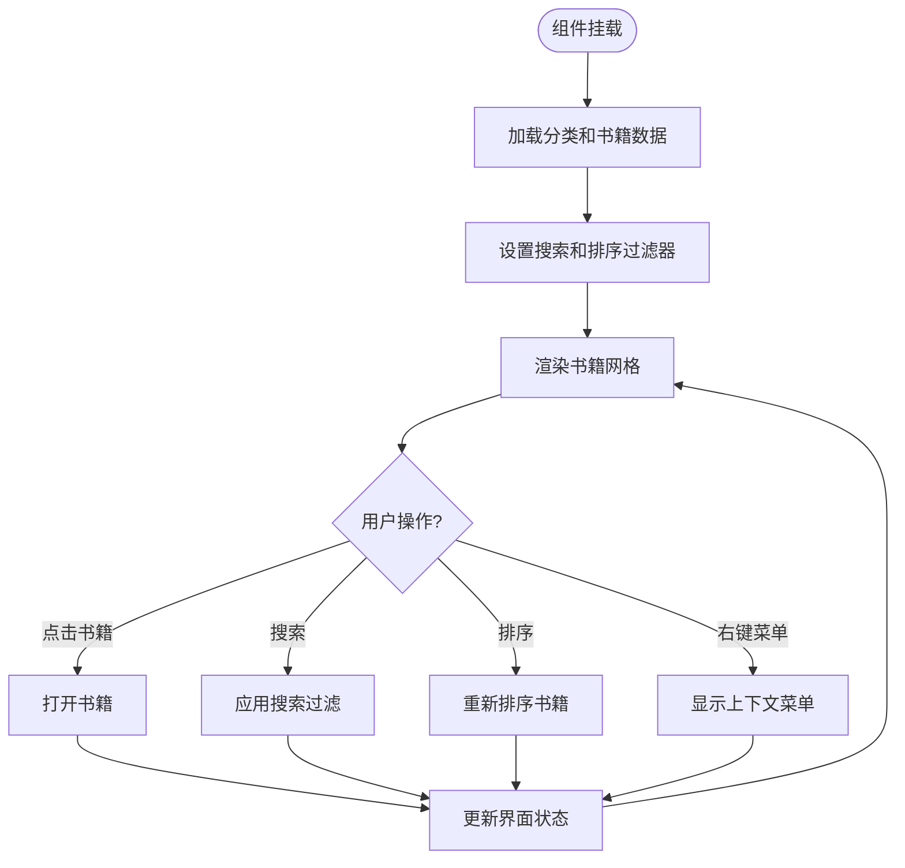
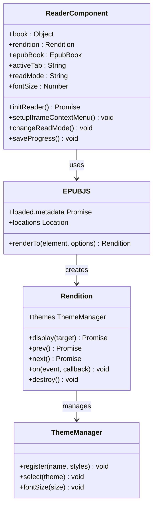
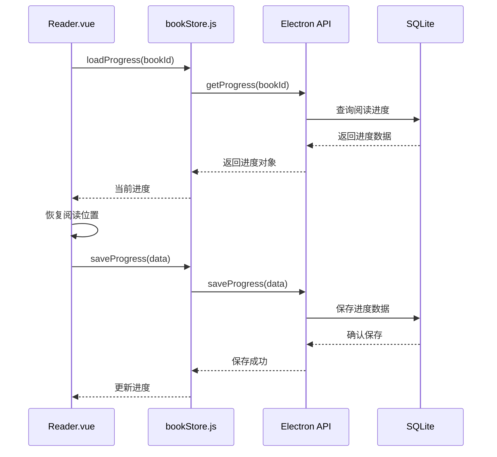
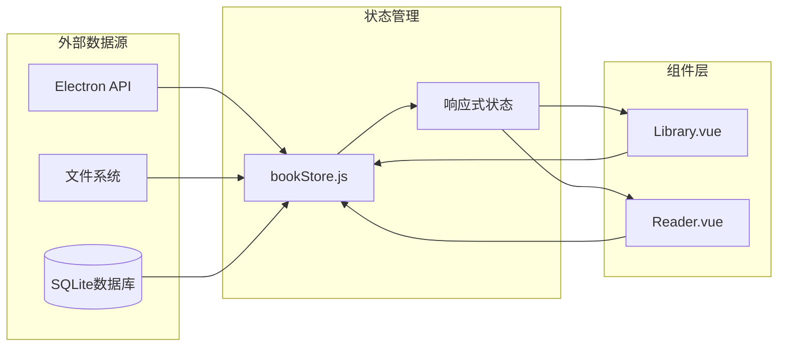
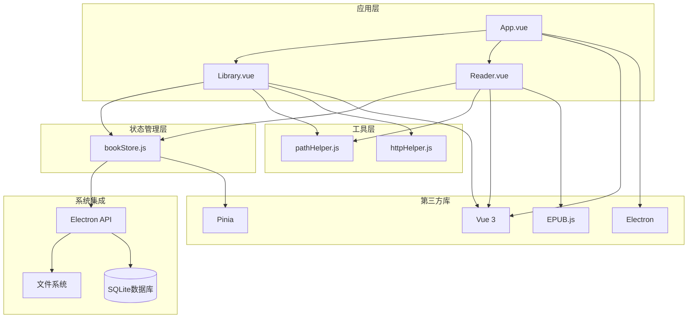

# 核心组件

<cite>
**本文档引用的文件**
- [App.vue](file://src/App.vue)
- [Library.vue](file://src/components/Library.vue)
- [Reader.vue](file://src/components/Reader.vue)
- [bookStore.js](file://src/stores/bookStore.js)
- [main.js](file://src/main.js)
- [pathHelper.js](file://src/utils/pathHelper.js)
- [httpHelper.js](file://src/utils/httpHelper.js)
- [package.json](file://package.json)
</cite>

## 目录
1. [简介](#简介)
2. [项目结构](#项目结构)
3. [核心组件](#核心组件)
4. [架构概览](#架构概览)
5. [详细组件分析](#详细组件分析)
6. [依赖关系分析](#依赖关系分析)
7. [性能考虑](#性能考虑)
8. [故障排除指南](#故障排除指南)
9. [结论](#结论)

## 简介

ROSAA电子书阅读器是一个基于Vue 3和Electron的桌面应用程序，专门设计用于阅读EPUB格式的电子书。该应用提供了完整的电子书管理功能，包括书籍浏览、分类管理、进度跟踪、书签和批注功能。

该应用采用现代化的前端技术栈，使用Vue 3 Composition API进行组件开发，Pinia进行状态管理，Electron提供桌面应用能力，EPUB.js库处理EPUB文件渲染。

## 项目结构

项目采用模块化的组织方式，主要分为以下几个核心部分：



**图表来源**
- [main.js:1-11](file://src/main.js#L1-L11)
- [App.vue:1-64](file://src/App.vue#L1-L64)
- [bookStore.js:1-234](file://src/stores/bookStore.js#L1-L234)

**章节来源**
- [main.js:1-11](file://src/main.js#L1-L11)
- [package.json:1-82](file://package.json#L1-L82)

## 核心组件

### 应用根组件 (App.vue)

App.vue是整个应用的根组件，负责应用的整体布局和组件切换。它实现了条件渲染机制，根据用户当前的操作状态在书架组件和阅读器组件之间切换。

**主要功能特性：**
- 动态组件切换机制
- Electron API集成验证
- URL参数解析和处理
- 窗口标题动态管理

**章节来源**
- [App.vue:1-64](file://src/App.vue#L1-L64)

### 书架组件 (Library.vue)

Library.vue是应用的主要界面组件，提供了完整的电子书管理功能。它包含了复杂的UI交互和业务逻辑。

**核心功能模块：**
- 书籍列表展示和管理
- 分类系统和管理
- 搜索和筛选功能
- 批量操作支持
- 用户认证系统

**章节来源**
- [Library.vue:1-800](file://src/components/Library.vue#L1-L800)

### 阅读器组件 (Reader.vue)

Reader.vue是应用的核心功能组件，负责EPUB文件的渲染和阅读体验。它集成了EPUB.js库，提供了专业的电子书阅读功能。

**主要功能：**
- EPUB文件渲染和显示
- 翻页和滚动两种阅读模式
- 进度保存和恢复
- 书签和批注功能
- 右键菜单和文本选择

**章节来源**
- [Reader.vue:1-800](file://src/components/Reader.vue#L1-L800)

### 状态管理 (bookStore.js)

bookStore.js使用Pinia进行状态管理，提供了应用级别的数据持久化和共享机制。

**核心状态管理：**
- 全局书籍数据管理
- 分类系统状态
- 用户进度跟踪
- 书签和批注数据
- 与Electron主进程的数据同步

**章节来源**
- [bookStore.js:1-234](file://src/stores/bookStore.js#L1-L234)

## 架构概览

应用采用了清晰的分层架构设计，确保了组件间的松耦合和高内聚。



**图表来源**
- [App.vue:8-12](file://src/App.vue#L8-L12)
- [bookStore.js:1-234](file://src/stores/bookStore.js#L1-L234)
- [pathHelper.js:1-63](file://src/utils/pathHelper.js#L1-L63)

## 详细组件分析

### App.vue 根组件设计

App.vue采用了简洁而高效的组件设计模式，实现了以下关键特性：

#### 路由切换机制

应用通过简单的布尔值控制在两个主要视图间切换：
- `isReading`: 控制是否显示阅读器
- `currentBook`: 存储当前正在阅读的书籍信息



**图表来源**
- [App.vue:43-62](file://src/App.vue#L43-L62)
- [Library.vue:365-387](file://src/components/Library.vue#L365-L387)

#### 全局状态管理集成

App.vue通过Pinia集成实现了全局状态管理：
- 使用 `useBookStore()` 获取状态管理实例
- 统一管理应用级别的数据流
- 处理组件间的数据共享和通信

**章节来源**
- [App.vue:8-16](file://src/App.vue#L8-L16)
- [App.vue:18-41](file://src/App.vue#L18-L41)

### Library.vue 书架组件功能实现

Library.vue是应用的核心界面，实现了完整的电子书管理功能。

#### 书籍列表展示

组件使用响应式数据和计算属性实现了高效的书籍列表管理：



**图表来源**
- [Library.vue:266-294](file://src/components/Library.vue#L266-L294)
- [Library.vue:365-387](file://src/components/Library.vue#L365-L387)

#### 分类管理系统

应用实现了灵活的分类系统，支持动态创建和管理：

**分类功能特性：**
- 预设颜色方案选择
- 动态颜色分配
- 分类层次结构管理
- 分类与书籍的关联

**章节来源**
- [Library.vue:127-162](file://src/components/Library.vue#L127-L162)
- [Library.vue:395-401](file://src/components/Library.vue#L395-L401)

#### 搜索筛选功能

实现了智能的搜索和筛选机制：

**搜索功能：**
- 支持书名和作者的模糊匹配
- 实时搜索过滤
- 多字段搜索支持

**排序功能：**
- 最近添加时间排序
- 书名字母排序
- 响应式排序切换

**章节来源**
- [Library.vue:266-294](file://src/components/Library.vue#L266-L294)

#### 批量操作功能

提供了丰富的批量操作选项：

**右键菜单功能：**
- 打开书籍
- 添加到分类
- 导出书籍
- 导出笔记
- 彻底删除

**章节来源**
- [Library.vue:164-186](file://src/components/Library.vue#L164-L186)
- [Library.vue:427-466](file://src/components/Library.vue#L427-L466)

### Reader.vue 阅读器组件复杂功能

Reader.vue是应用最复杂的功能组件，集成了EPUB.js库提供了专业的电子书阅读体验。

#### EPUB渲染架构

组件使用EPUB.js实现了高性能的EPUB文件渲染：



**图表来源**
- [Reader.vue:161-222](file://src/components/Reader.vue#L161-L222)
- [Reader.vue:250-335](file://src/components/Reader.vue#L250-L335)

#### 阅读模式切换

实现了灵活的阅读模式切换机制：

**翻页模式 (Paginated):**
- 传统纸质书阅读体验
- 页面分割显示
- 翻页动画效果

**滚动模式 (Scrolled):**
- 网页阅读体验
- 连续滚动显示
- 自适应内容高度

**章节来源**
- [Reader.vue:649-761](file://src/components/Reader.vue#L649-L761)

#### 进度保存和恢复

实现了智能的阅读进度管理：



**图表来源**
- [Reader.vue:497-507](file://src/components/Reader.vue#L497-L507)
- [bookStore.js:161-176](file://src/stores/bookStore.js#L161-L176)

#### 用户交互功能

实现了丰富的用户交互功能：

**书签管理：**
- 添加书签
- 删除书签
- 跳转到书签位置

**批注系统：**
- 文本选择和高亮
- 批注创建和管理
- 批注可视化显示

**章节来源**
- [Reader.vue:509-527](file://src/components/Reader.vue#L509-L527)
- [Reader.vue:974-1012](file://src/components/Reader.vue#L974-L1012)

### bookStore.js 状态管理设计模式

bookStore.js使用Pinia的组合式API实现了现代化的状态管理模式。

#### 全局状态定义

**核心状态变量：**
- `books`: 书籍列表数组
- `categories`: 分类列表数组
- `currentCategory`: 当前选中的分类
- `currentBook`: 当前操作的书籍
- `currentProgress`: 当前阅读进度
- `bookmarks`: 书签列表

**章节来源**
- [bookStore.js:4-11](file://src/stores/bookStore.js#L4-L11)

#### 数据流管理

实现了完整的数据流管理机制：



**图表来源**
- [bookStore.js:12-22](file://src/stores/bookStore.js#L12-L22)
- [bookStore.js:24-33](file://src/stores/bookStore.js#L24-L33)

#### 组件间通信机制

实现了多种组件间通信方式：

**事件驱动通信：**
- App.vue与Library.vue的事件传递
- 组件状态的响应式更新

**状态共享：**
- Pinia全局状态管理
- 组件间数据的自动同步

**章节来源**
- [App.vue:3-4](file://src/App.vue#L3-L4)
- [Library.vue:337](file://src/components/Library.vue#L337)

## 依赖关系分析

应用的依赖关系体现了清晰的分层架构和模块化设计。



**图表来源**
- [package.json:22-29](file://package.json#L22-L29)
- [main.js:1-11](file://src/main.js#L1-L11)

### 核心依赖关系

**Vue生态系统依赖：**
- Vue 3: 提供响应式数据绑定和组件系统
- Pinia: 提供状态管理解决方案
- Vite: 提供构建和开发服务器

**功能依赖：**
- EPUB.js: EPUB文件渲染和处理
- Electron: 桌面应用平台集成
- better-sqlite3: SQLite数据库操作

**章节来源**
- [package.json:22-29](file://package.json#L22-L29)
- [package.json:30-41](file://package.json#L30-L41)

## 性能考虑

应用在多个层面考虑了性能优化：

### 渲染性能优化

**虚拟滚动和懒加载：**
- 书籍网格使用虚拟滚动减少DOM节点
- 图片资源懒加载避免初始加载压力
- 分页加载大量书籍数据

**内存管理：**
- 组件卸载时清理事件监听器
- 及时销毁EPUB渲染实例
- 合理的图片资源管理

### 状态管理优化

**响应式更新策略：**
- 使用计算属性避免不必要的重渲染
- 精确的状态更新减少组件刷新
- 批量操作合并状态变更

**数据缓存：**
- 本地存储认证令牌
- 缓存分类和书籍数据
- 进度信息的快速恢复

### 网络和文件操作优化

**异步操作管理：**
- 所有文件操作使用异步处理
- 进度条和加载指示器提升用户体验
- 错误处理和重试机制

**章节来源**
- [Reader.vue:201-222](file://src/components/Reader.vue#L201-L222)
- [Library.vue:562-589](file://src/components/Library.vue#L562-L589)

## 故障排除指南

### 常见问题和解决方案

**Electron API未加载错误**
```javascript
// 检查和处理Electron API加载
if (!window.electronAPI) {
  console.error('ERROR: window.electronAPI is not defined!')
  alert('错误：Electron API 未加载！\n请确保通过 npm run electron:dev 启动应用，而不是直接在浏览器中打开。')
}
```

**EPUB文件加载失败**
- 检查文件路径是否正确
- 验证EPUB文件完整性
- 确认文件权限设置

**进度保存异常**
- 检查数据库连接状态
- 验证进度数据格式
- 确认文件系统写入权限

**章节来源**
- [App.vue:18-23](file://src/App.vue#L18-L23)
- [Reader.vue:418-425](file://src/components/Reader.vue#L418-L425)

### 调试技巧

**开发环境调试：**
- 使用Vue DevTools检查组件状态
- 利用浏览器开发者工具监控网络请求
- 通过控制台输出调试信息

**生产环境监控：**
- 实施错误日志记录
- 监控应用性能指标
- 收集用户反馈和使用数据

## 结论

ROSAA电子书阅读器展现了现代Web应用开发的最佳实践，通过合理的架构设计和组件分离，实现了功能丰富且性能优异的桌面应用。

**主要成就：**
- 成功集成Vue 3和Electron技术栈
- 实现了完整的EPUB阅读功能
- 建立了可扩展的状态管理架构
- 提供了优秀的用户体验设计

**技术亮点：**
- 响应式状态管理
- 高效的EPUB渲染机制
- 灵活的阅读模式切换
- 完善的用户交互功能

该应用为类似项目的开发提供了宝贵的参考模板，展示了如何在桌面应用中有效利用现代Web技术栈。