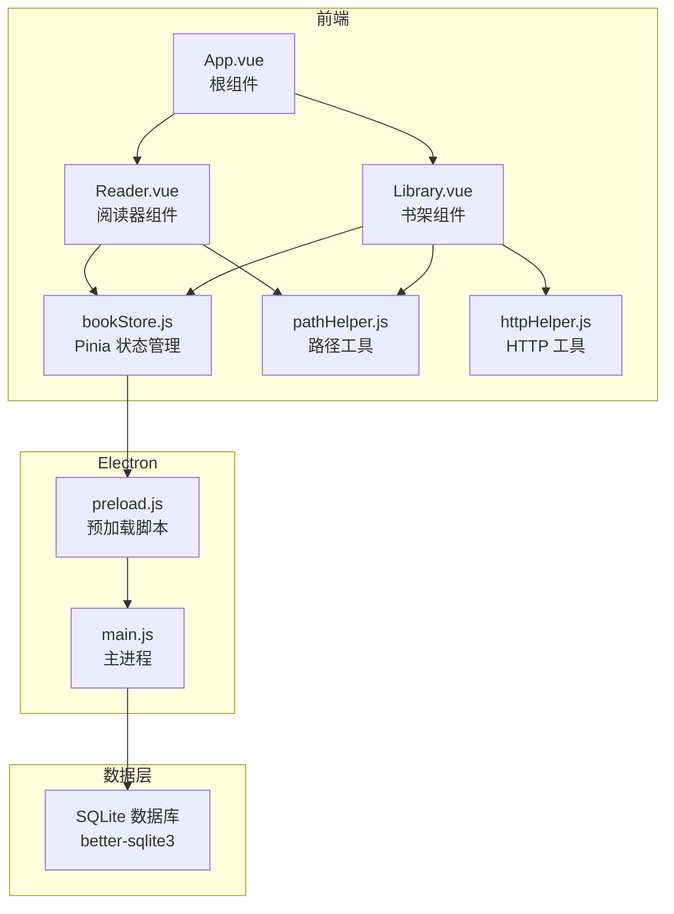
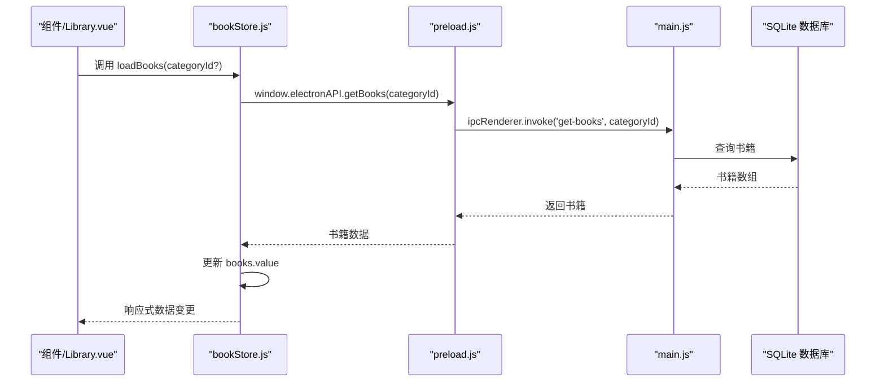
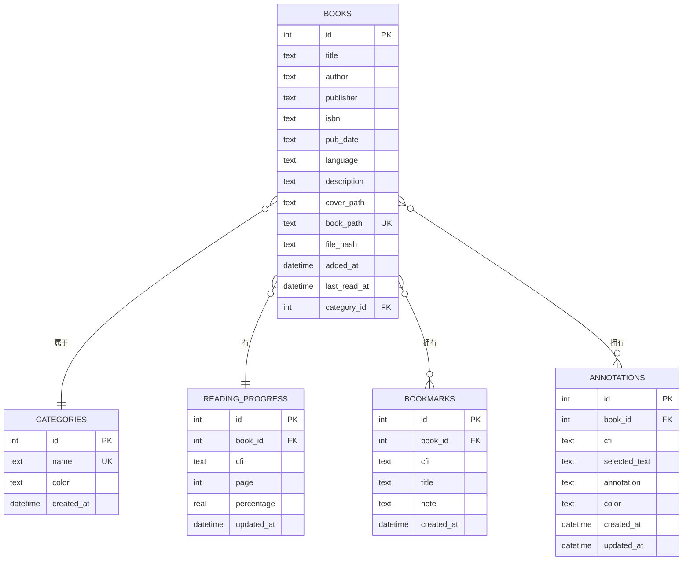
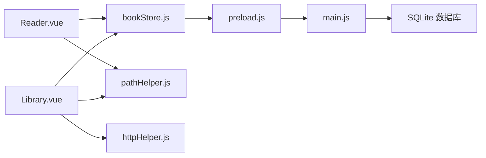

# 状态管理

<cite>
**本文引用的文件**
- [bookStore.js](file://src/stores/bookStore.js)
- [main.js](file://src/main.js)
- [App.vue](file://src/App.vue)
- [Library.vue](file://src/components/Library.vue)
- [Reader.vue](file://src/components/Reader.vue)
- [preload.js](file://electron/preload.js)
- [main.js](file://electron/main.js)
- [pathHelper.js](file://src/utils/pathHelper.js)
- [httpHelper.js](file://src/utils/httpHelper.js)
- [package.json](file://package.json)
- [README.md](file://README.md)
</cite>

## 目录
1. [简介](#简介)
2. [项目结构](#项目结构)
3. [核心组件](#核心组件)
4. [架构总览](#架构总览)
5. [详细组件分析](#详细组件分析)
6. [依赖关系分析](#依赖关系分析)
7. [性能考量](#性能考量)
8. [故障排查指南](#故障排查指南)
9. [结论](#结论)
10. [附录](#附录)

## 简介
本文件围绕 bookStore.js 的状态管理设计与实现进行深入解析，涵盖：
- 全局状态定义与响应式数据管理
- 与 Electron 主进程的 IPC 交互与数据持久化
- API 接口能力：书籍数据、分类、进度、书签、批注、导出等
- 组件集成方式与数据流
- 异步处理、错误管理与性能优化策略
- 最佳实践与扩展性建议
- 调试技巧与常见问题定位

## 项目结构
本项目采用 Electron + Vue 3 + Pinia 的桌面应用架构，状态管理集中于 Pinia Store，通过 Electron 的 contextBridge 暴露 API 至前端，由 SQLite 存储数据。

图表来源
- [main.js:1-11](file://src/main.js#L1-L11)
- [App.vue:1-64](file://src/App.vue#L1-L64)
- [Library.vue:1-1292](file://src/components/Library.vue#L1-L1292)
- [Reader.vue:1-1026](file://src/components/Reader.vue#L1-L1026)
- [bookStore.js:1-234](file://src/stores/bookStore.js#L1-L234)
- [preload.js:1-95](file://electron/preload.js#L1-L95)
- [main.js:1-922](file://electron/main.js#L1-L922)
- [pathHelper.js:1-63](file://src/utils/pathHelper.js#L1-L63)
- [httpHelper.js:1-47](file://src/utils/httpHelper.js#L1-L47)

章节来源
- [main.js:1-11](file://src/main.js#L1-L11)
- [package.json:1-82](file://package.json#L1-L82)

## 核心组件
- Pinia Store（bookStore.js）
  - 全局状态：书籍列表、分类、当前分类、当前书籍、阅读进度、书签
  - 异步 API：加载书籍、加载分类、添加/删除分类、选择分类、导入书籍、删除书籍、更新分类、导出书籍/笔记、设置当前书籍、加载/保存进度、加载/添加/删除书签
- 组件集成
  - App.vue：应用入口，初始化并决定显示 Library 或 Reader
  - Library.vue：书架视图，负责分类、搜索、排序、右键菜单、登录等
  - Reader.vue：阅读器视图，负责目录、书签、批注、进度、字体与模式切换
- Electron 层
  - preload.js：通过 contextBridge 暴露 electronAPI
  - main.js：IPC 处理器，数据库 CRUD、文件系统操作、导出、窗口管理

章节来源
- [bookStore.js:1-234](file://src/stores/bookStore.js#L1-L234)
- [App.vue:1-64](file://src/App.vue#L1-L64)
- [Library.vue:1-1292](file://src/components/Library.vue#L1-L1292)
- [Reader.vue:1-1026](file://src/components/Reader.vue#L1-L1026)
- [preload.js:1-95](file://electron/preload.js#L1-L95)
- [main.js:1-922](file://electron/main.js#L1-L922)

## 架构总览
状态管理采用 Pinia 的组合式 Store，以函数式定义，内部使用 ref 声明响应式状态，通过 window.electronAPI 与主进程通信，数据持久化由 SQLite 完成。

图表来源
- [bookStore.js:12-22](file://src/stores/bookStore.js#L12-L22)
- [preload.js:12-15](file://electron/preload.js#L12-L15)
- [main.js:429-449](file://electron/main.js#L429-L449)

## 详细组件分析

### Pinia Store：bookStore.js
- 状态定义
  - books：书籍数组
  - categories：分类数组
  - currentCategory：当前选中分类（null 表示全部）
  - currentBook：当前阅读书籍
  - currentProgress：当前书籍阅读进度
  - bookmarks：当前书籍书签数组
- 关键 API
  - loadBooks(categoryId?)：按分类或全部加载书籍
  - loadCategories()：加载分类
  - addCategory(name, color)：新增分类
  - deleteCategory(categoryId)：删除分类（若删除当前分类则切回全部）
  - selectCategory(categoryId)：切换分类并刷新书籍
  - openEpub()：打开 EPUB 文件并导入（去重），导入后刷新书籍
  - deleteBook(bookId)：删除书籍（仅数据库记录）
  - deleteBookCompletely(bookId)：彻底删除（删除文件与记录）
  - updateBookCategory(bookId, categoryId)：更新书籍分类
  - exportBook(bookId)/exportNotes(bookId)：导出书籍/笔记
  - setCurrentBook(book)：设置当前书籍
  - loadProgress(bookId)/saveProgress(data)：加载/保存进度
  - loadBookmarks(bookId)/addBookmark(data)/deleteBookmark(bookmarkId)：书签管理
- 错误处理
  - 所有异步操作均包裹 try/catch 并打印错误日志
  - 对 window.electronAPI 可用性进行前置校验
- 性能与优化
  - 通过 IPC invoke 与主进程通信，避免阻塞 UI
  - 书架组件对书籍进行本地搜索与排序，减少后端压力

章节来源
- [bookStore.js:1-234](file://src/stores/bookStore.js#L1-L234)

### 组件集成与数据流

#### App.vue
- 初始化：检查 window.electronAPI，加载书籍
- 路由：根据 isReading 决定显示 Library 或 Reader
- URL 参数：支持通过查询参数自动打开阅读器

章节来源
- [App.vue:1-64](file://src/App.vue#L1-L64)

#### Library.vue
- 与 Store 的集成：通过 computed 读取 books、categories、currentCategory
- 交互：添加书籍、选择分类、右键菜单、导出、删除、登录
- 路径处理：使用 pathHelper 构建封面 URL
- 登录：使用 httpHelper 注入 Authorization 头

章节来源
- [Library.vue:1-1292](file://src/components/Library.vue#L1-L1292)
- [pathHelper.js:1-63](file://src/utils/pathHelper.js#L1-L63)
- [httpHelper.js:1-47](file://src/utils/httpHelper.js#L1-L47)

#### Reader.vue
- 与 Store 的集成：读取 bookmarks、toc；保存/加载进度
- 阅读器：EPUB.js 渲染、目录跳转、书签跳转、批注高亮
- 进度：relocated 事件触发保存；支持翻页/滚动两种模式
- 字体：动态调整字号并应用主题

章节来源
- [Reader.vue:1-1026](file://src/components/Reader.vue#L1-L1026)

### Electron 层：IPC 与数据库

#### preload.js
- 暴露 electronAPI：openEpub、getBooks、saveProgress、getProgress、addBookmark、getBookmarks、deleteBookmark、deleteBook、getCategories、addCategory、deleteCategory、updateBookCategory、exportBook、exportNotes、deleteBookCompletely、getAppPath、getUserDataPath、openReaderWindow、saveAnnotation、getAnnotations、deleteAnnotation
- 所有方法通过 ipcRenderer.invoke 调用主进程处理器

章节来源
- [preload.js:1-95](file://electron/preload.js#L1-L95)

#### main.js
- 数据库初始化：WAL 模式、建表（books、reading_progress、bookmarks、annotations、categories）、迁移（新增列）
- IPC 处理器：open-epub（去重、元数据提取、文件复制、入库）、get-books、get-categories、add-category、delete-category、update-book-category、export-book、export-notes、delete-book-completely、save-progress、get-progress、add-bookmark、get-bookmarks、delete-bookmark、delete-book、save-annotation、get-annotations、delete-annotation、get-app-path、get-user-data-path、open-reader-window
- 文件系统：封面与书籍复制到用户数据目录，导出文件与笔记

章节来源
- [main.js:1-922](file://electron/main.js#L1-L922)

### 数据模型与持久化
- 数据库表
  - books：书籍信息、封面路径、书籍路径、文件哈希、添加时间、最后阅读时间
  - reading_progress：书籍进度（CFI、页码、百分比）
  - bookmarks：书签（CFI、标题、备注）
  - annotations：批注（CFI、选中文本、批注内容、颜色）
  - categories：分类（名称、颜色）

图表来源
- [main.js:190-282](file://electron/main.js#L190-L282)

## 依赖关系分析

图表来源
- [bookStore.js:1-234](file://src/stores/bookStore.js#L1-L234)
- [preload.js:1-95](file://electron/preload.js#L1-L95)
- [main.js:1-922](file://electron/main.js#L1-L922)
- [Library.vue:1-1292](file://src/components/Library.vue#L1-L1292)
- [Reader.vue:1-1026](file://src/components/Reader.vue#L1-L1026)
- [pathHelper.js:1-63](file://src/utils/pathHelper.js#L1-L63)
- [httpHelper.js:1-47](file://src/utils/httpHelper.js#L1-L47)

章节来源
- [package.json:22-41](file://package.json#L22-L41)

## 性能考量
- 异步与响应式
  - Store 使用 ref 声明状态，配合 async API 与 IPC，避免阻塞 UI
- 本地搜索与排序
  - Library.vue 对书籍进行本地过滤与排序，降低后端压力
- 阅读器优化
  - Reader.vue 在后台生成 locations，避免首屏阻塞
  - 滚动模式下对 iframe 宽度进行修复，保证渲染稳定
- 数据库优化
  - WAL 模式提升并发写入性能
  - ON CONFLICT UPSERT 保存进度，减少查询次数

章节来源
- [Reader.vue:427-438](file://src/components/Reader.vue#L427-L438)
- [main.js:185-187](file://electron/main.js#L185-L187)

## 故障排查指南
- 常见问题
  - window.electronAPI 未定义：确认通过 npm run electron:dev 启动，而非直接在浏览器打开
  - 打开 EPUB 失败：检查文件是否存在、权限是否足够、日志中是否有错误堆栈
  - 进度未保存：确认 Reader.vue 的 relocated 事件是否触发 saveProgress
  - 书签/批注不显示：检查 annotations 表是否正确写入，以及 Reader.vue 的高亮逻辑
- 调试技巧
  - 前端：查看 Vite 控制台日志；在 Library.vue/Reader.vue 中观察日志输出
  - 后端：查看主进程日志与数据库状态；关注 IPC 调用链
  - 数据库：使用 SQLite 工具查看 books、reading_progress、bookmarks、annotations 表

章节来源
- [App.vue:18-22](file://src/App.vue#L18-L22)
- [bookStore.js:71-104](file://src/stores/bookStore.js#L71-L104)
- [Reader.vue:497-507](file://src/components/Reader.vue#L497-L507)
- [main.js:343-427](file://electron/main.js#L343-L427)

## 结论
bookStore.js 以 Pinia 为核心，结合 Electron 的 IPC 与 SQLite，实现了完整的桌面 EPUB 阅读器状态管理与持久化。其设计遵循响应式与异步分离的原则，组件间通过 Store 解耦，具备良好的可维护性与扩展性。建议在后续迭代中进一步完善错误提示与日志分级，增强用户反馈与可观测性。

## 附录

### API 接口清单（按功能分组）
- 书籍管理
  - loadBooks(categoryId?)：加载书籍
  - openEpub()：导入 EPUB（去重）
  - deleteBook(bookId)：删除书籍记录
  - deleteBookCompletely(bookId)：彻底删除（文件+记录）
  - updateBookCategory(bookId, categoryId)：更新分类
  - exportBook(bookId)：导出书籍文件
  - exportNotes(bookId)：导出笔记文本
- 分类管理
  - loadCategories()：加载分类
  - addCategory(name, color)：新增分类
  - deleteCategory(categoryId)：删除分类
  - selectCategory(categoryId)：切换分类
- 进度与书签
  - loadProgress(bookId)：加载进度
  - saveProgress(data)：保存进度
  - loadBookmarks(bookId)：加载书签
  - addBookmark(data)：添加书签
  - deleteBookmark(bookmarkId)：删除书签
- 用户偏好与当前书籍
  - setCurrentBook(book)：设置当前书籍
- 路径与认证
  - pathHelper.buildFileUrl(relativePath, userDataPath, appPath)：构建 file:// URL
  - httpHelper.authFetch(url, options)：带 Authorization 的请求

章节来源
- [bookStore.js:12-232](file://src/stores/bookStore.js#L12-L232)
- [pathHelper.js:13-53](file://src/utils/pathHelper.js#L13-L53)
- [httpHelper.js:43-46](file://src/utils/httpHelper.js#L43-L46)