# 阅读器组件

<cite>
**本文档引用的文件**
- [Reader.vue](file://src/components/Reader.vue)
- [bookStore.js](file://src/stores/bookStore.js)
- [pathHelper.js](file://src/utils/pathHelper.js)
- [App.vue](file://src/App.vue)
- [main.js](file://src/main.js)
- [style.css](file://src/style.css)
- [package.json](file://package.json)
</cite>

## 目录
1. [简介](#简介)
2. [项目结构](#项目结构)
3. [核心组件](#核心组件)
4. [架构概览](#架构概览)
5. [详细组件分析](#详细组件分析)
6. [依赖关系分析](#依赖关系分析)
7. [性能考虑](#性能考虑)
8. [故障排除指南](#故障排除指南)
9. [结论](#结论)

## 简介

Reader.vue 是一个基于 Vue 3 和 EPUB.js 的桌面 EPUB 阅读器组件，专为 Electron 应用设计。该组件提供了完整的电子书阅读体验，包括 EPUB 文件渲染、多种阅读模式、进度保存、书签管理和批注系统等功能。

该组件采用现代化的前端技术栈，结合 Electron 的原生能力，为用户提供流畅的桌面端阅读体验。组件支持翻页模式和滚动模式两种阅读方式，具备智能的进度保存机制和丰富的用户交互功能。

## 项目结构

该项目采用标准的 Vue 3 + Vite + Electron 架构，主要文件组织如下：

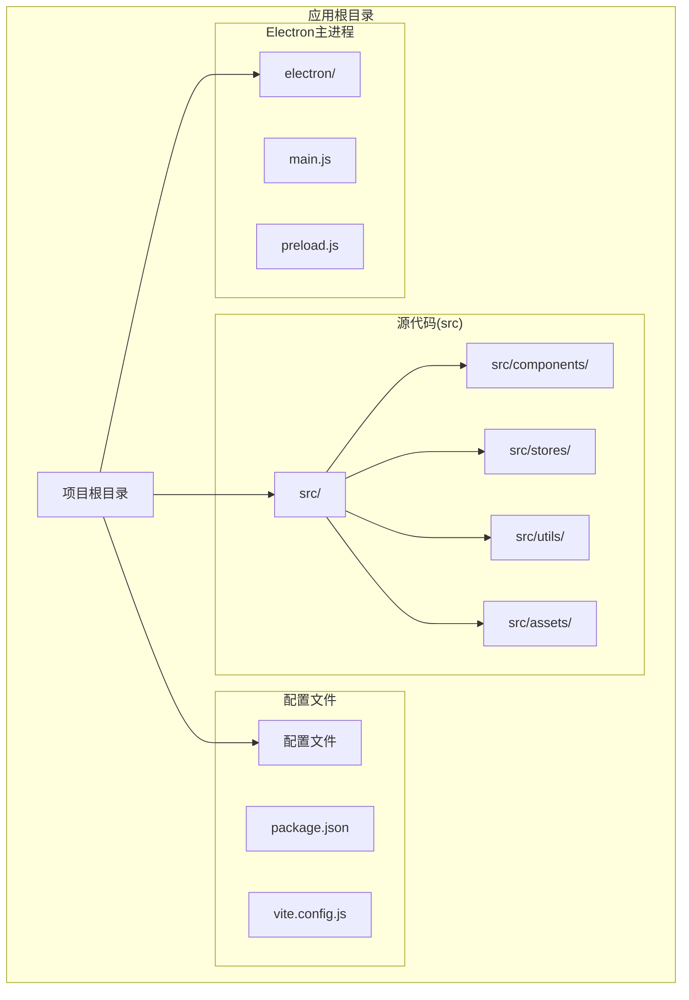

**图表来源**
- [package.json:1-82](file://package.json#L1-L82)
- [main.js:1-11](file://src/main.js#L1-L11)

**章节来源**
- [package.json:1-82](file://package.json#L1-L82)
- [main.js:1-11](file://src/main.js#L1-L11)

## 核心组件

Reader.vue 组件是整个应用的核心，负责处理 EPUB 文件的渲染和用户交互。该组件具有以下关键特性：

### 主要功能模块

1. **EPUB 文件渲染** - 基于 EPUB.js 引擎进行电子书渲染
2. **双模式阅读** - 支持翻页模式和滚动模式
3. **进度管理** - 智能保存和恢复阅读进度
4. **书签系统** - 添加、管理和跳转书签
5. **批注功能** - 文本摘抄和批注管理
6. **目录导航** - 章节目录浏览
7. **右键菜单** - 快速操作界面

### 技术架构

组件采用 Composition API 设计模式，结合 Pinia 状态管理，实现了清晰的职责分离和良好的可维护性。

**章节来源**
- [Reader.vue:161-175](file://src/components/Reader.vue#L161-L175)
- [bookStore.js:4-234](file://src/stores/bookStore.js#L4-L234)

## 架构概览

Reader.vue 组件的整体架构采用分层设计，各层职责明确：

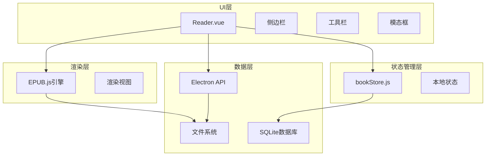

**图表来源**
- [Reader.vue:161-222](file://src/components/Reader.vue#L161-L222)
- [bookStore.js:161-234](file://src/stores/bookStore.js#L161-L234)

### 组件关系图

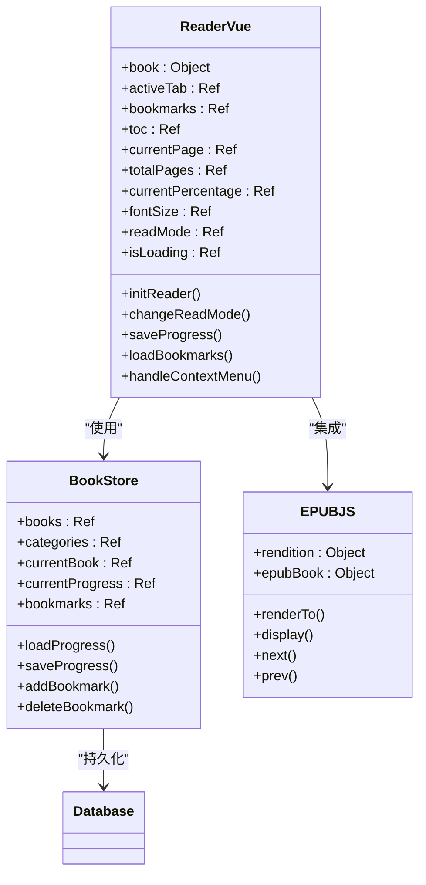

**图表来源**
- [Reader.vue:161-222](file://src/components/Reader.vue#L161-L222)
- [bookStore.js:4-234](file://src/stores/bookStore.js#L4-L234)

## 详细组件分析

### EPUB 渲染引擎集成

Reader.vue 组件深度集成了 EPUB.js 渲染引擎，实现了完整的电子书渲染功能：

#### 初始化流程

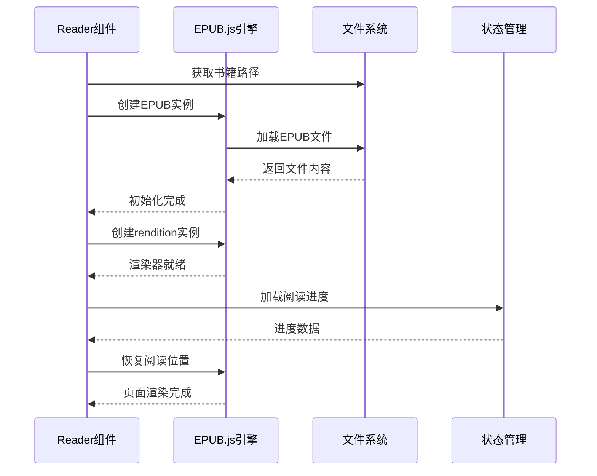

**图表来源**
- [Reader.vue:232-425](file://src/components/Reader.vue#L232-L425)

#### 渲染配置

组件支持灵活的渲染配置，包括：

- **翻页模式配置**：固定分页，支持左右翻页
- **滚动模式配置**：连续滚动，适合长篇阅读
- **字体大小控制**：动态调整字体大小
- **主题定制**：支持自定义样式

**章节来源**
- [Reader.vue:260-277](file://src/components/Reader.vue#L260-L277)
- [Reader.vue:669-684](file://src/components/Reader.vue#L669-L684)

### 阅读模式切换机制

Reader.vue 实现了智能的阅读模式切换功能，支持翻页模式和滚动模式之间的无缝切换：

#### 模式切换流程

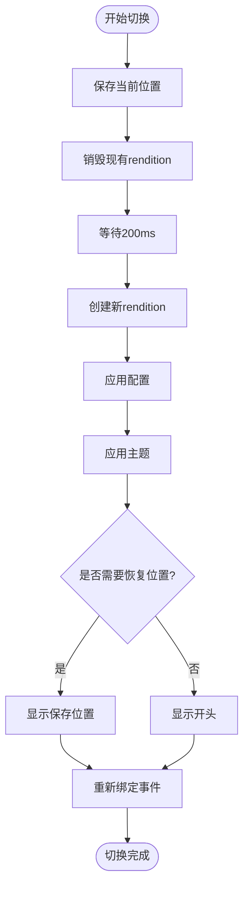

**图表来源**
- [Reader.vue:650-761](file://src/components/Reader.vue#L650-L761)

#### 模式特定配置

| 配置项 | 翻页模式 | 滚动模式 |
|--------|----------|----------|
| flow | paginated | scrolled |
| manager | 默认 | continuous |
| overflow | 默认 | auto |
| spread | none | none |

**章节来源**
- [Reader.vue:669-684](file://src/components/Reader.vue#L669-L684)

### 进度保存机制

Reader.vue 实现了智能的进度保存系统，确保用户能够从上次离开的地方继续阅读：

#### 进度保存流程

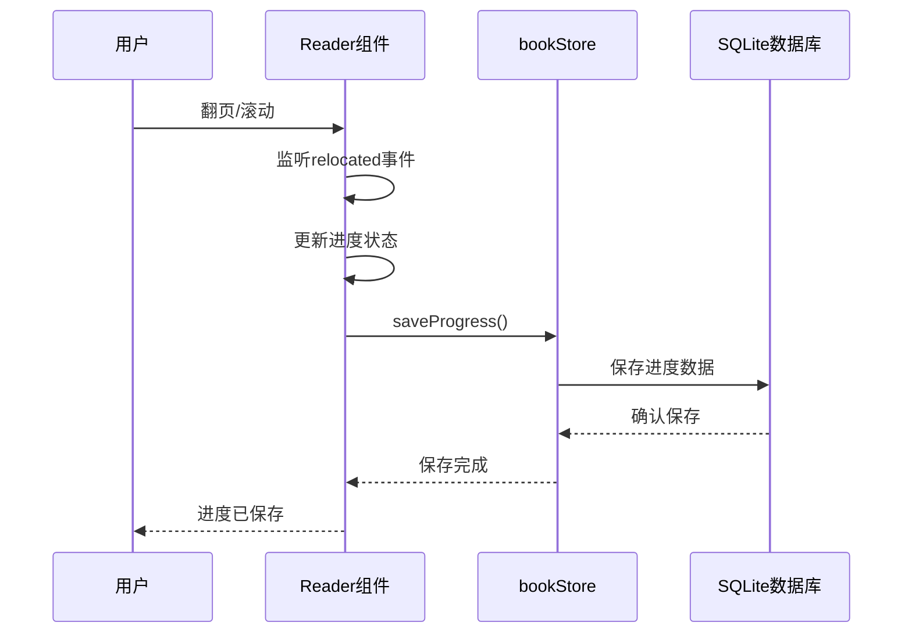

**图表来源**
- [Reader.vue:497-507](file://src/components/Reader.vue#L497-L507)
- [bookStore.js:169-176](file://src/stores/bookStore.js#L169-L176)

#### 进度数据结构

| 字段名 | 类型 | 描述 | 示例值 |
|--------|------|------|--------|
| bookId | Number | 书籍ID | 123 |
| cfi | String | EPUB CFI定位符 | "epubcfi(/6/4!/4/12/2/12) |
| page | Number | 当前页码 | 45 |
| percentage | Number | 阅读百分比 | 67.8 |

**章节来源**
- [Reader.vue:497-507](file://src/components/Reader.vue#L497-L507)

### 用户交互功能

Reader.vue 提供了丰富的用户交互功能，包括书签管理、批注系统和目录导航：

#### 书签管理系统

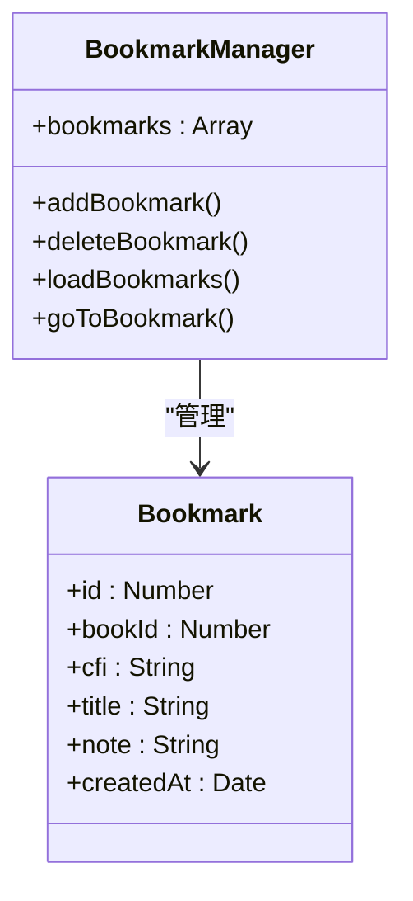

**图表来源**
- [Reader.vue:628-648](file://src/components/Reader.vue#L628-L648)
- [bookStore.js:186-206](file://src/stores/bookStore.js#L186-L206)

#### 批注系统架构

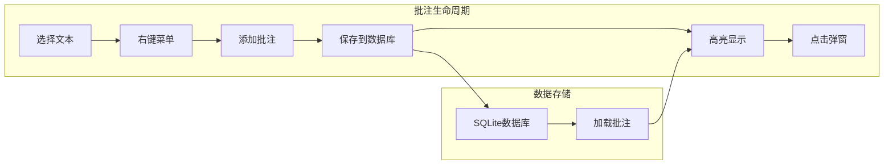

**图表来源**
- [Reader.vue:975-1012](file://src/components/Reader.vue#L975-L1012)

**章节来源**
- [Reader.vue:628-648](file://src/components/Reader.vue#L628-L648)
- [Reader.vue:975-1012](file://src/components/Reader.vue#L975-L1012)

### 目录导航系统

Reader.vue 实现了完整的目录导航功能，支持章节跳转和快速定位：

#### 目录加载流程

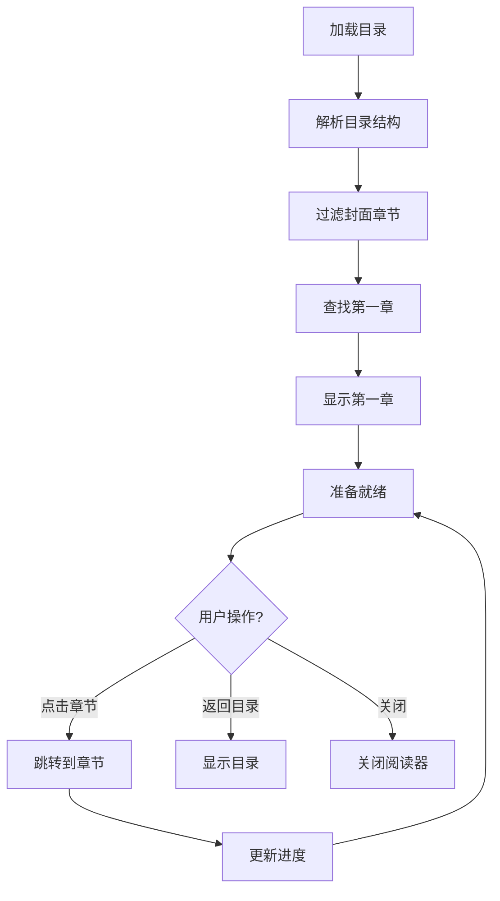

**图表来源**
- [Reader.vue:336-417](file://src/components/Reader.vue#L336-L417)

**章节来源**
- [Reader.vue:336-417](file://src/components/Reader.vue#L336-L417)

### 右键菜单系统

Reader.vue 实现了智能的右键菜单系统，提供便捷的文本操作功能：

#### 右键菜单工作流程

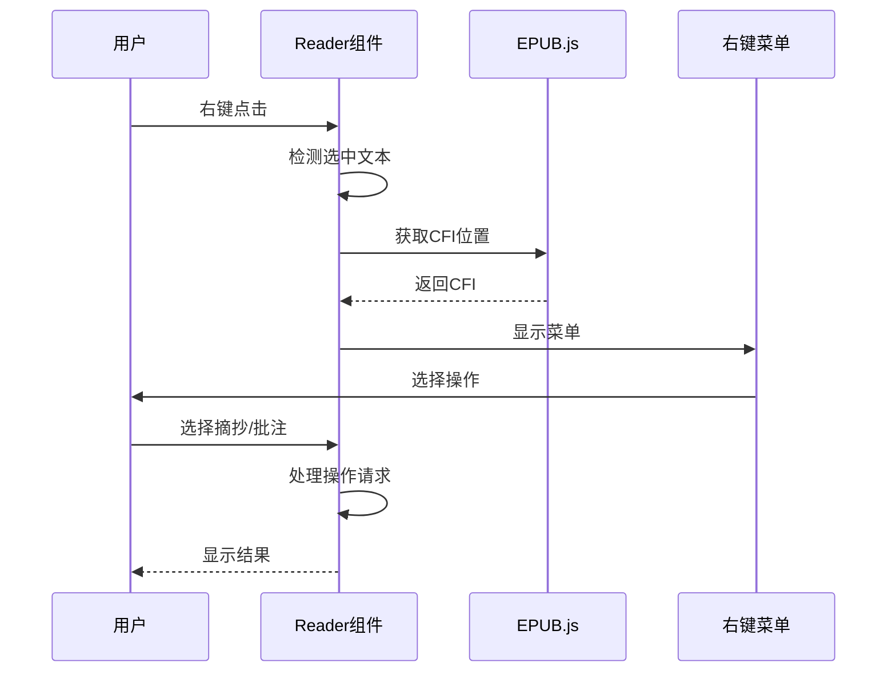

**图表来源**
- [Reader.vue:764-939](file://src/components/Reader.vue#L764-L939)

**章节来源**
- [Reader.vue:764-939](file://src/components/Reader.vue#L764-L939)

## 依赖关系分析

Reader.vue 组件的依赖关系体现了清晰的分层架构：

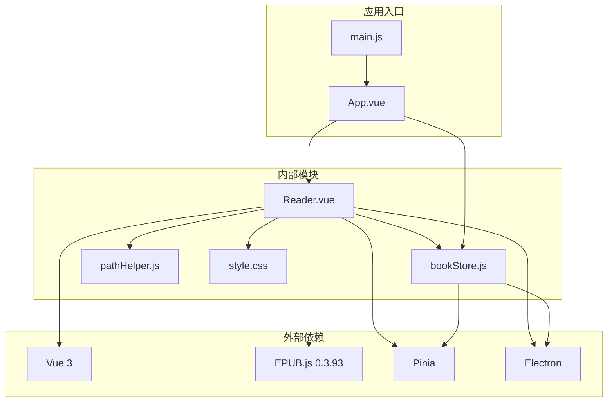

**图表来源**
- [package.json:22-29](file://package.json#L22-L29)
- [Reader.vue:161-166](file://src/components/Reader.vue#L161-L166)

### 核心依赖说明

| 依赖包 | 版本 | 用途 | 重要性 |
|--------|------|------|--------|
| vue | ^3.3.0 | 前端框架 | 核心 |
| epubjs | ^0.3.93 | EPUB渲染引擎 | 核心 |
| pinia | ^2.1.0 | 状态管理 | 核心 |
| electron | ^28.3.3 | 桌面应用框架 | 核心 |
| better-sqlite3 | ^12.10.0 | 数据库操作 | 重要 |
| adm-zip | ^0.5.17 | ZIP文件处理 | 重要 |

**章节来源**
- [package.json:22-41](file://package.json#L22-L41)

## 性能考虑

Reader.vue 组件在设计时充分考虑了性能优化，采用了多种策略来提升用户体验：

### 内存管理策略

1. **组件卸载清理**：在组件卸载时自动清理 EPUB.js 实例和事件监听器
2. **异步加载**：使用异步方式加载书籍和批注，避免阻塞主线程
3. **后台任务**：将位置生成等耗时操作放在后台执行

### 渲染优化

1. **懒加载**：目录和批注采用懒加载方式
2. **虚拟滚动**：对于大量书签和目录项，采用虚拟滚动技术
3. **缓存机制**：缓存已加载的书籍元数据和目录结构

### 性能监控

组件内置了详细的日志记录系统，帮助开发者监控性能问题：

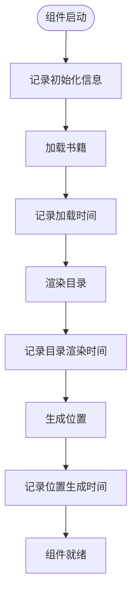

**图表来源**
- [Reader.vue:428-438](file://src/components/Reader.vue#L428-L438)

**章节来源**
- [Reader.vue:214-222](file://src/components/Reader.vue#L214-L222)
- [Reader.vue:428-438](file://src/components/Reader.vue#L428-L438)

## 故障排除指南

Reader.vue 组件提供了完善的错误处理和故障排除机制：

### 常见问题及解决方案

#### EPUB 文件加载失败

**问题描述**：书籍无法正常加载或显示空白页面

**可能原因**：
1. EPUB 文件损坏或格式不正确
2. 文件路径解析错误
3. Electron API 未正确初始化

**解决步骤**：
1. 检查 EPUB 文件完整性
2. 验证文件路径格式
3. 确认 Electron 环境正常

**章节来源**
- [Reader.vue:418-425](file://src/components/Reader.vue#L418-L425)

#### 阅读模式切换失败

**问题描述**：翻页模式和滚动模式之间切换时出现异常

**可能原因**：
1. EPUB.js 实例未正确销毁
2. 新的渲染器配置错误
3. DOM 元素未正确更新

**解决步骤**：
1. 确保 rendition.destroy() 正确执行
2. 检查渲染配置参数
3. 验证 DOM 结构完整性

**章节来源**
- [Reader.vue:756-761](file://src/components/Reader.vue#L756-L761)

#### 进度保存异常

**问题描述**：阅读进度无法正确保存或恢复

**可能原因**：
1. 数据库连接问题
2. CFI 位置获取失败
3. 状态同步异常

**解决步骤**：
1. 检查数据库连接状态
2. 验证 CFI 位置有效性
3. 确认状态管理正常

**章节来源**
- [Reader.vue:497-507](file://src/components/Reader.vue#L497-L507)

### 调试工具和技巧

1. **浏览器开发者工具**：检查网络请求和控制台错误
2. **Electron DevTools**：调试主进程和渲染进程
3. **日志分析**：利用组件内置的日志系统定位问题
4. **性能分析**：使用 Chrome Performance 工具分析性能瓶颈

**章节来源**
- [Reader.vue:201-222](file://src/components/Reader.vue#L201-L222)

## 结论

Reader.vue 阅读器组件是一个功能完整、架构清晰的 EPUB 阅读解决方案。该组件成功地将 EPUB.js 渲染引擎与 Vue 3 前端框架相结合，为用户提供了优秀的桌面端阅读体验。

### 主要优势

1. **技术先进**：采用最新的 Vue 3 Composition API 和 EPUB.js 引擎
2. **功能丰富**：支持多种阅读模式、书签管理、批注系统等
3. **性能优化**：内置多种性能优化策略和内存管理机制
4. **易于扩展**：清晰的架构设计便于功能扩展和维护

### 技术亮点

- 智能的进度保存和恢复机制
- 流畅的阅读模式切换体验
- 完善的错误处理和故障排除机制
- 优雅的用户界面和交互设计

### 发展方向

未来可以在以下方面进一步改进：
1. 增加更多阅读主题和自定义选项
2. 优化大文件的加载性能
3. 扩展批注系统的协作功能
4. 增强离线阅读能力

该组件为构建高质量的桌面 EPUB 阅读器奠定了坚实的基础，是 Electron + Vue 应用开发的优秀范例。