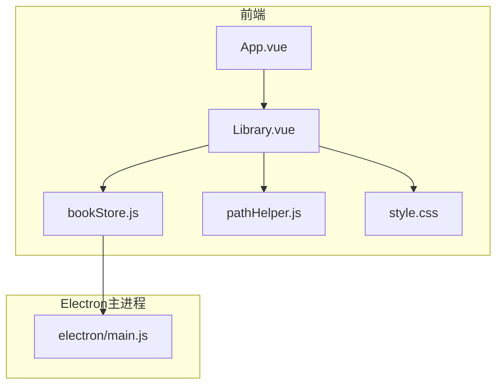
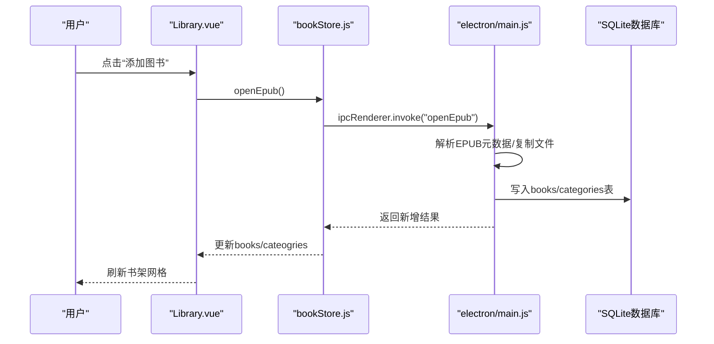
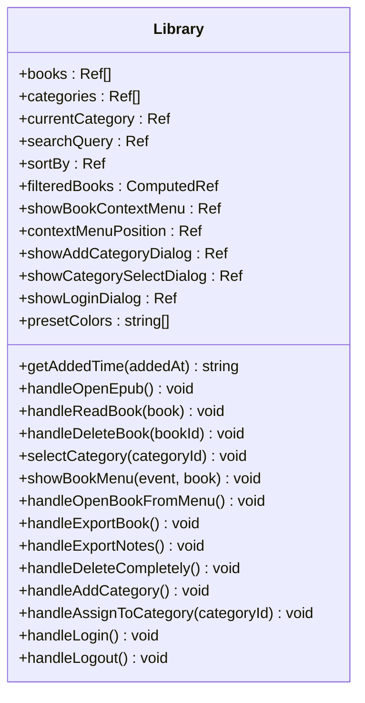
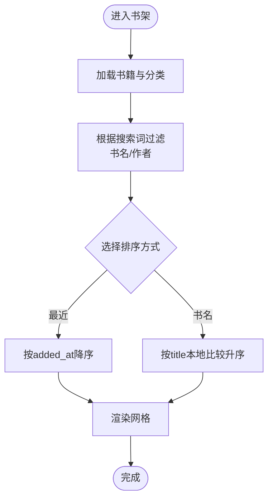
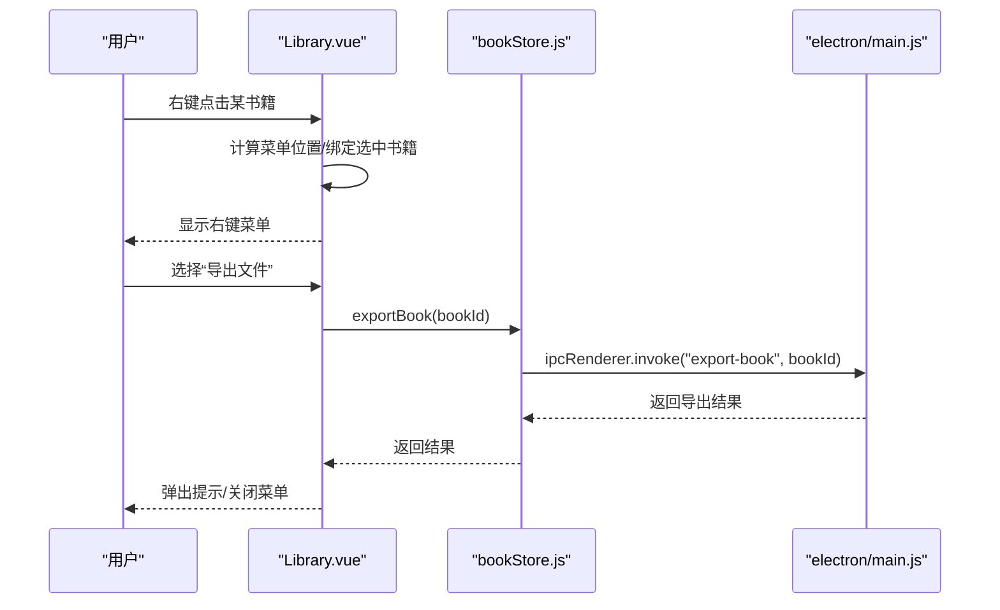
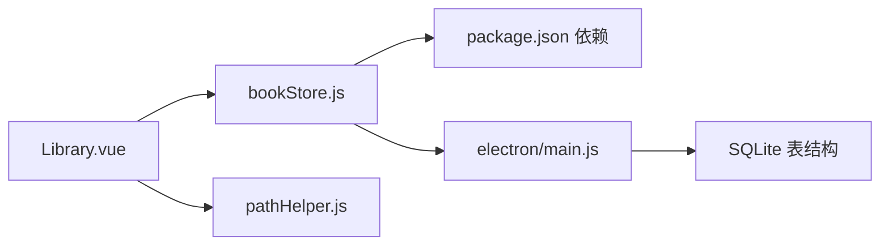

# 书架管理

<cite>
**本文引用的文件**
- [Library.vue](file://src/components/Library.vue)
- [bookStore.js](file://src/stores/bookStore.js)
- [App.vue](file://src/App.vue)
- [main.js](file://src/main.js)
- [pathHelper.js](file://src/utils/pathHelper.js)
- [style.css](file://src/style.css)
- [main.js（Electron主进程）](file://electron/main.js)
- [package.json](file://package.json)
- [DATA_STORAGE.md](file://docs/DATA_STORAGE.md)
</cite>

## 目录
1. [简介](#简介)
2. [项目结构](#项目结构)
3. [核心组件](#核心组件)
4. [架构总览](#架构总览)
5. [详细组件分析](#详细组件分析)
6. [依赖关系分析](#依赖关系分析)
7. [性能考量](#性能考量)
8. [故障排查指南](#故障排查指南)
9. [结论](#结论)
10. [附录](#附录)

## 简介
本文件面向ROSAA电子书阅读器的“书架管理”功能，系统性梳理书籍添加、删除、分类管理、搜索与排序、UI布局与交互、右键菜单与导出能力，并给出用户体验优化建议与最佳实践。读者无需深厚的前端背景即可理解整体实现思路与使用方式。

## 项目结构
- 前端采用Vue 3 + Pinia，组件化管理书架与书籍列表，状态集中于store。
- Electron主进程负责数据库初始化、文件系统操作、IPC通信桥接。
- 资源路径统一由工具函数处理，兼容开发与生产环境。
- UI采用网格布局与响应式设计，支持搜索与排序。

图表来源
- [App.vue:1-64](file://src/App.vue#L1-L64)
- [Library.vue:1-1291](file://src/components/Library.vue#L1-L1291)
- [bookStore.js:1-234](file://src/stores/bookStore.js#L1-L234)
- [pathHelper.js:1-63](file://src/utils/pathHelper.js#L1-L63)
- [style.css:1-692](file://src/style.css#L1-L692)
- [main.js（Electron主进程）:1-820](file://electron/main.js#L1-L820)

章节来源
- [App.vue:1-64](file://src/App.vue#L1-L64)
- [main.js:1-11](file://src/main.js#L1-L11)

## 核心组件
- 书架组件（Library.vue）：负责渲染左侧分类栏、右侧书籍网格、搜索与排序、右键菜单、分类与登录对话框。
- 状态管理（bookStore.js）：集中管理书籍与分类数据，封装与Electron IPC的交互。
- 路径工具（pathHelper.js）：统一构建file:// URL，适配开发/生产环境。
- 主入口（App.vue/main.js）：应用启动、路由切换（书架/阅读器）。
- Electron主进程（electron/main.js）：数据库初始化、表结构、各类IPC处理（增删改查、导出、删除等）。

章节来源
- [Library.vue:1-1291](file://src/components/Library.vue#L1-L1291)
- [bookStore.js:1-234](file://src/stores/bookStore.js#L1-L234)
- [pathHelper.js:1-63](file://src/utils/pathHelper.js#L1-L63)
- [App.vue:1-64](file://src/App.vue#L1-L64)
- [main.js:1-11](file://src/main.js#L1-L11)
- [main.js（Electron主进程）:1-820](file://electron/main.js#L1-L820)

## 架构总览
前端通过Pinia Store调用window.electronAPI（由Electron主进程暴露），执行数据库查询、新增、删除、导出等操作；Store再将结果回填到组件，驱动UI更新。路径工具负责将数据库中存储的相对路径转换为可访问的file:// URL。

图表来源
- [Library.vue:365-369](file://src/components/Library.vue#L365-L369)
- [bookStore.js:71-104](file://src/stores/bookStore.js#L71-L104)
- [main.js（Electron主进程）:32-147](file://electron/main.js#L32-L147)
- [main.js（Electron主进程）:167-284](file://electron/main.js#L167-L284)

## 详细组件分析

### 书架组件（Library.vue）
- 分类系统
  - 左侧分类栏展示“全部图书”与用户自定义分类，支持点击切换当前分类。
  - 新建分类：弹出对话框，支持预设颜色选择，提交后调用store.addCategory并刷新分类列表。
  - 分类颜色：每个分类项显示彩色圆点，当前分类高亮。
- 书籍网格
  - 响应式网格布局，书籍卡片包含封面图与标题，支持点击打开阅读器。
  - 封面加载失败时显示占位字符，提升健壮性。
- 搜索与排序
  - 实时搜索：基于书名与作者模糊匹配，支持输入即过滤。
  - 排序：支持“最近添加”和“书名”两种排序，按需排序后返回。
- 右键菜单
  - 支持“打开”、“添加至分类”、“导出文件”、“导出笔记”、“彻底删除”等操作。
  - 菜单定位随鼠标位置动态调整，点击外部区域自动关闭。
- 登录与用户态
  - 支持用户登录/登出，登录后显示用户名，本地缓存token与用户名。

章节来源
- [Library.vue:1-1291](file://src/components/Library.vue#L1-L1291)

#### 书架组件类图

图表来源
- [Library.vue:248-621](file://src/components/Library.vue#L248-L621)

#### 书架-分类-书籍流程图（搜索与排序）

图表来源
- [Library.vue:266-294](file://src/components/Library.vue#L266-L294)

#### 右键菜单交互序列图

图表来源
- [Library.vue:427-438](file://src/components/Library.vue#L427-L438)
- [bookStore.js:137-145](file://src/stores/bookStore.js#L137-L145)
- [main.js（Electron主进程）:495-531](file://electron/main.js#L495-L531)

### 状态管理（bookStore.js）
- 数据源
  - books：当前分类下的书籍集合。
  - categories：分类集合。
  - currentCategory：当前选中的分类ID（null表示全部）。
- 关键方法
  - loadBooks/loadCategories：从Electron API拉取数据。
  - openEpub：打开文件选择器，解析EPUB并入库，返回新增/跳过统计。
  - deleteBook/deleteBookCompletely：软删除/彻底删除书籍。
  - updateBookCategory：将书籍分配到指定分类。
  - exportBook/exportNotes：导出书籍与笔记。
  - 进度与书签：提供进度读取/保存、书签增删查。

章节来源
- [bookStore.js:1-234](file://src/stores/bookStore.js#L1-L234)

### 路径工具（pathHelper.js）
- 功能
  - 将数据库中存储的相对路径（如“upload/books/xxx.epub”）转换为file:// URL。
  - 兼容开发与生产环境，统一使用用户数据目录作为根路径。
- 重要点
  - 生产环境通过用户数据目录拼接绝对路径，避免打包后资源路径问题。
  - 提供有效性校验，便于调试。

章节来源
- [pathHelper.js:1-63](file://src/utils/pathHelper.js#L1-L63)

### 主入口与应用切换（App.vue/main.js）
- App.vue
  - 根据是否处于阅读模式切换Library与Reader组件。
  - 初始化时加载书籍数据，支持通过URL参数自动打开阅读器。
- main.js
  - 注册Pinia，挂载应用。

章节来源
- [App.vue:1-64](file://src/App.vue#L1-L64)
- [main.js:1-11](file://src/main.js#L1-L11)

### Electron主进程（electron/main.js）
- 数据库初始化
  - 创建数据库目录与表：books、categories、reading_progress、bookmarks、annotations。
  - 为books表增加category_id字段，支持外键关联。
- IPC处理
  - 书籍：openEpub、deleteBook、deleteBookCompletely、updateBookCategory、exportBook、exportNotes、getBooks、getCategories。
  - 进度与书签：save-progress、get-progress、add-bookmark、get-bookmarks、delete-bookmark。
  - 其他：get-app-path、get-user-data-path、open-reader-window。
- EPUB解析与文件复制
  - 解析OPF元数据，抽取封面与书籍文件，复制到用户数据目录，写入数据库。

章节来源
- [main.js（Electron主进程）:167-284](file://electron/main.js#L167-L284)
- [main.js（Electron主进程）:32-147](file://electron/main.js#L32-L147)
- [main.js（Electron主进程）:495-531](file://electron/main.js#L495-L531)
- [main.js（Electron主进程）:533-592](file://electron/main.js#L533-L592)
- [main.js（Electron主进程）:696-708](file://electron/main.js#L696-L708)
- [main.js（Electron主进程）:762-769](file://electron/main.js#L762-L769)

## 依赖关系分析
- 前端依赖
  - Vue 3 + Pinia：状态管理与响应式UI。
  - better-sqlite3：数据库（仅主进程）。
  - adm-zip/xml2js：EPUB解析与压缩包处理。
- IPC桥接
  - Library.vue通过bookStore.js调用window.electronAPI，主进程通过ipcMain.handle暴露接口。
- 资源路径
  - pathHelper统一构建file:// URL，避免跨平台路径差异。

图表来源
- [package.json:22-41](file://package.json#L22-L41)
- [bookStore.js:1-234](file://src/stores/bookStore.js#L1-L234)
- [main.js（Electron主进程）:167-284](file://electron/main.js#L167-L284)
- [pathHelper.js:1-63](file://src/utils/pathHelper.js#L1-L63)

章节来源
- [package.json:1-82](file://package.json#L1-L82)
- [bookStore.js:1-234](file://src/stores/bookStore.js#L1-L234)
- [main.js（Electron主进程）:167-284](file://electron/main.js#L167-L284)
- [pathHelper.js:1-63](file://src/utils/pathHelper.js#L1-L63)

## 性能考量
- 前端过滤与排序
  - 当前实现为内存内过滤与排序，适合中小规模数据集；若书籍量较大，建议在主进程侧做分页或服务端过滤。
- 路径构建
  - 路径工具在每次渲染封面时调用，建议在Store层缓存构建结果，减少重复计算。
- 图片加载
  - 封面加载失败时回退占位符，避免阻塞页面渲染；可考虑懒加载与占位骨架提升体验。
- 数据库
  - 主进程启用WAL模式，提升并发读写性能；建议在高频操作前后使用事务或批量提交。

[本节为通用建议，不直接分析具体文件]

## 故障排查指南
- 无法打开EPUB
  - 确认Electron API可用且已注入；检查主进程openEpub流程与文件复制逻辑。
  - 参考：[bookStore.js:71-104](file://src/stores/bookStore.js#L71-L104)，[main.js（Electron主进程）:32-147](file://electron/main.js#L32-L147)
- 封面不显示
  - 检查数据库中cover_path是否正确；确认用户数据目录下文件存在；验证file:// URL构建。
  - 参考：[Library.vue:591-620](file://src/components/Library.vue#L591-L620)，[pathHelper.js:13-53](file://src/utils/pathHelper.js#L13-L53)
- 分类颜色异常
  - 确认分类color字段非空；检查CSS渲染逻辑。
  - 参考：[Library.vue:35-36](file://src/components/Library.vue#L35-L36)
- 导出失败
  - 检查目标路径权限与源文件是否存在；确认IPC返回的错误信息。
  - 参考：[bookStore.js:137-155](file://src/stores/bookStore.js#L137-L155)，[main.js（Electron主进程）:495-531](file://electron/main.js#L495-L531)
- 登录状态丢失
  - 检查localStorage缓存与token有效期；确认退出登录时清理逻辑。
  - 参考：[Library.vue:503-559](file://src/components/Library.vue#L503-L559)

章节来源
- [bookStore.js:71-104](file://src/stores/bookStore.js#L71-L104)
- [pathHelper.js:13-53](file://src/utils/pathHelper.js#L13-L53)
- [main.js（Electron主进程）:32-147](file://electron/main.js#L32-L147)
- [Library.vue:591-620](file://src/components/Library.vue#L591-L620)
- [Library.vue:503-559](file://src/components/Library.vue#L503-L559)

## 结论
ROSAA电子书阅读器的书架管理以Vue + Pinia + Electron为核心，实现了书籍添加、分类管理、搜索排序、右键菜单与导出等完整功能。前端通过Store与主进程IPC交互，主进程负责数据库与文件系统操作。建议在大规模数据场景下引入服务端过滤与缓存策略，持续优化路径构建与图片懒加载，以获得更佳的用户体验。

[本节为总结性内容，不直接分析具体文件]

## 附录

### 书籍右键菜单功能清单
- 打开：直接进入阅读器。
- 添加至分类：弹出分类选择对话框，支持“不分类”与各分类。
- 导出文件：弹出保存对话框，复制书籍文件到目标路径。
- 导出笔记：导出批注与书签为文本文件。
- 彻底删除：删除书籍文件与封面文件，并级联删除数据库记录。

章节来源
- [Library.vue:164-186](file://src/components/Library.vue#L164-L186)
- [Library.vue:188-213](file://src/components/Library.vue#L188-L213)
- [bookStore.js:137-155](file://src/stores/bookStore.js#L137-L155)
- [main.js（Electron主进程）:495-531](file://electron/main.js#L495-L531)
- [main.js（Electron主进程）:533-592](file://electron/main.js#L533-L592)
- [main.js（Electron主进程）:594-632](file://electron/main.js#L594-L632)

### 分类系统架构要点
- 分类创建：输入名称与颜色，写入categories表，刷新列表。
- 分类颜色：每个分类维护color字段，渲染时使用。
- 分类分配：通过updateBookCategory将书籍category_id更新为对应分类。
- 删除分类：删除后若当前分类被删除，自动切换到“全部图书”。

章节来源
- [bookStore.js:35-61](file://src/stores/bookStore.js#L35-L61)
- [main.js（Electron主进程）:462-493](file://electron/main.js#L462-L493)

### 搜索与排序技术实现
- 搜索：基于书名与作者的模糊匹配，实时过滤。
- 排序：最近添加（added_at降序）、书名（localeCompare）。
- 复杂度：过滤O(n)，排序O(n log n)。

章节来源
- [Library.vue:266-294](file://src/components/Library.vue#L266-L294)

### 用户界面设计要点
- 布局：左侧分类栏 + 右侧书籍网格，响应式网格与滚动区域。
- 视觉反馈：按钮悬停、菜单高亮、占位符与徽标提示。
- 媒体查询：在style.css中提供基础断点与弹性布局。

章节来源
- [Library.vue:888-988](file://src/components/Library.vue#L888-L988)
- [style.css:67-121](file://src/style.css#L67-L121)

### 用户体验优化建议
- 预加载与骨架屏：大图懒加载与占位骨架，降低感知延迟。
- 批量操作：在右键菜单中扩展“批量导出/删除”，减少多次点击。
- 快捷键：支持Enter打开、Delete删除、右键菜单快捷操作。
- 数据同步：在主进程侧增加去重与索引，提升查询性能。
- 错误提示：统一错误文案与国际化，增强可读性。

[本节为通用建议，不直接分析具体文件]