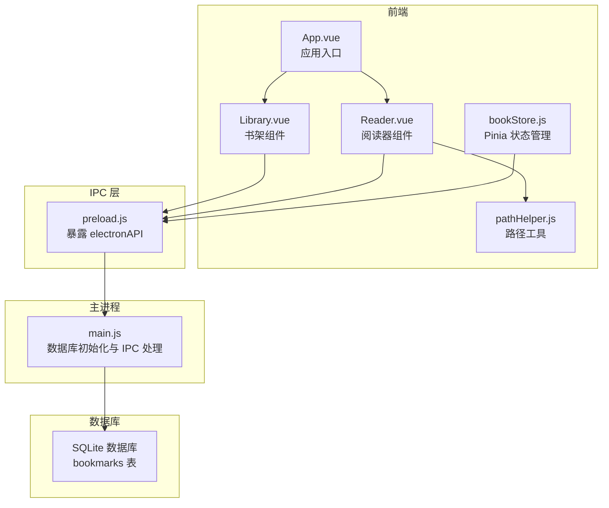
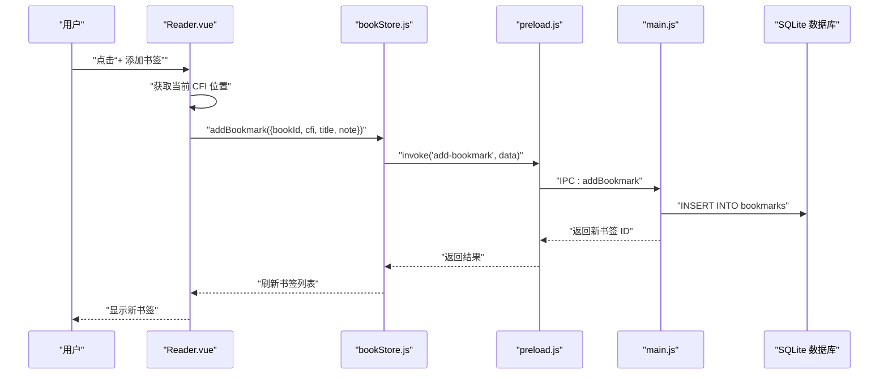
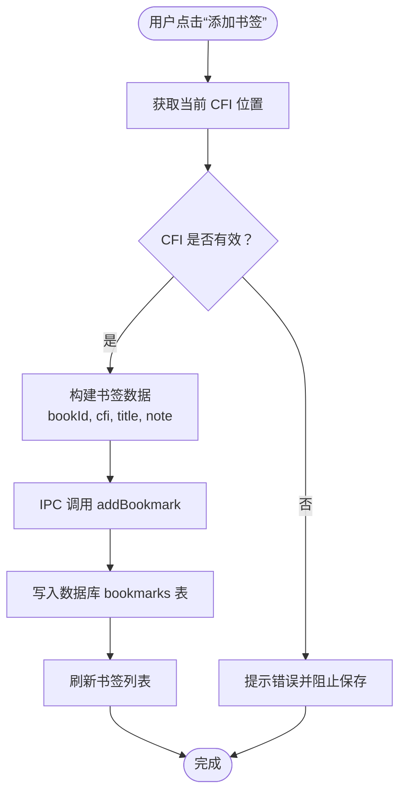
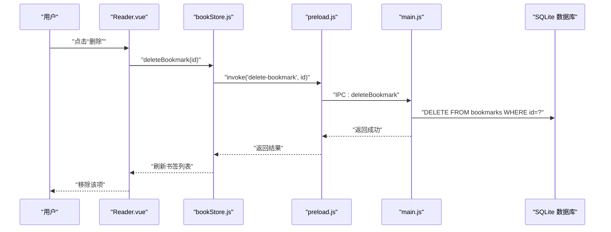
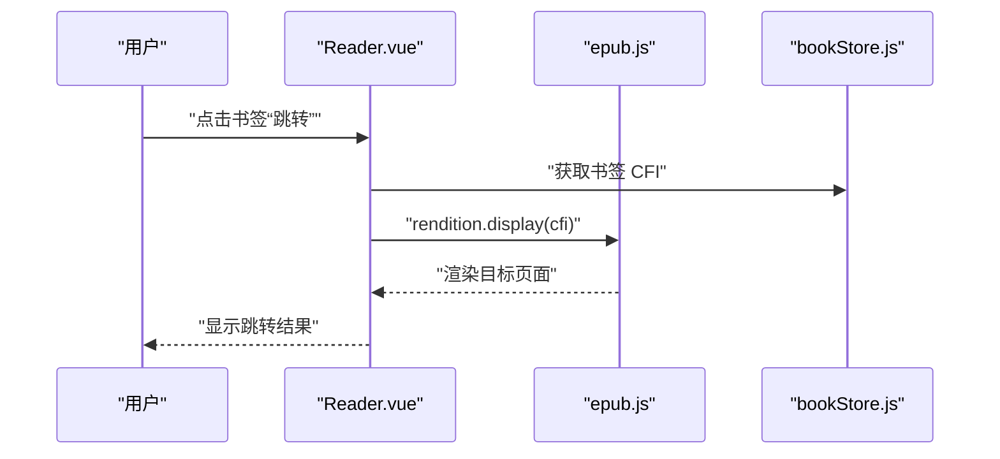
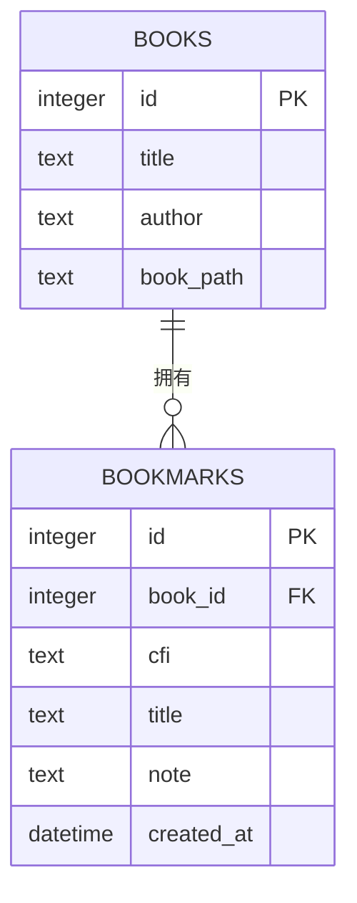
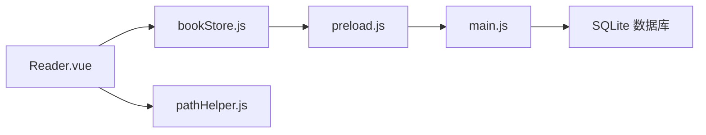

# 书签系统

<cite>
**本文引用的文件**
- [README.md](file://README.md)
- [src/App.vue](file://src/App.vue)
- [src/main.js](file://src/main.js)
- [src/components/Reader.vue](file://src/components/Reader.vue)
- [src/stores/bookStore.js](file://src/stores/bookStore.js)
- [src/utils/pathHelper.js](file://src/utils/pathHelper.js)
- [src/components/Library.vue](file://src/components/Library.vue)
- [electron/main.js](file://electron/main.js)
- [electron/preload.js](file://electron/preload.js)
- [docs/DATA_STORAGE.md](file://docs/DATA_STORAGE.md)
- [docs/PATH_COMPATIBILITY.md](file://docs/PATH_COMPATIBILITY.md)
</cite>

## 目录
1. [简介](#简介)
2. [项目结构](#项目结构)
3. [核心组件](#核心组件)
4. [架构概览](#架构概览)
5. [详细组件分析](#详细组件分析)
6. [依赖关系分析](#依赖关系分析)
7. [性能考虑](#性能考虑)
8. [故障排除指南](#故障排除指南)
9. [结论](#结论)
10. [附录](#附录)

## 简介
本文件针对 ROSAA 电子书阅读器的书签系统进行全面的技术文档说明。内容涵盖书签创建的技术实现（CFI 位置记录、章节信息提取、书签标题生成）、书签管理功能（列表展示、编辑修改、删除操作）、快速跳转机制（点击跳转、键盘快捷键、书签面板导航）、数据模型设计（存储结构、索引优化、查询性能）、导入导出功能（技术实现与使用指南），以及与其他功能模块的集成方式和最佳实践。

## 项目结构
ROSAA 电子书阅读器采用 Electron + Vue 3 + SQLite 的架构，书签系统贯穿前端组件层、状态管理层、IPC 层与数据库层，形成完整的数据流闭环。

**图表来源**
- [src/App.vue](file://src/App.vue)
- [src/components/Library.vue](file://src/components/Library.vue)
- [src/components/Reader.vue](file://src/components/Reader.vue)
- [src/stores/bookStore.js](file://src/stores/bookStore.js)
- [src/utils/pathHelper.js](file://src/utils/pathHelper.js)
- [electron/preload.js](file://electron/preload.js)
- [electron/main.js](file://electron/main.js)

**章节来源**
- [README.md](file://README.md)
- [src/App.vue](file://src/App.vue)
- [src/main.js](file://src/main.js)

## 核心组件
- 阅读器组件（Reader.vue）：负责书签的创建、展示、删除与跳转；与 epub.js 协作获取当前 CFI 位置；维护侧边栏标签页（书签/目录）。
- 状态管理（bookStore.js）：封装与后端 IPC 的交互，提供加载/添加/删除书签的方法，并维护本地状态。
- IPC 桥接（preload.js）：将主进程能力暴露给渲染进程，提供 addBookmark/getBookmarks/deleteBookmark 等接口。
- 主进程（main.js）：负责数据库初始化、创建 bookmarks 表、实现 IPC 处理器（增删查）。
- 路径工具（pathHelper.js）：统一构建 file:// URL，确保开发与生产环境一致。
- 书架组件（Library.vue）：提供书籍管理与导出功能，其中包含笔记导出（包含书签与批注）。

**章节来源**
- [src/components/Reader.vue](file://src/components/Reader.vue)
- [src/stores/bookStore.js](file://src/stores/bookStore.js)
- [electron/preload.js](file://electron/preload.js)
- [electron/main.js](file://electron/main.js)
- [src/utils/pathHelper.js](file://src/utils/pathHelper.js)
- [src/components/Library.vue](file://src/components/Library.vue)

## 架构概览
书签系统的关键流程如下：
- 创建书签：阅读器获取当前 CFI 位置，调用 bookStore.addBookmark，通过 preload.js 发送 IPC 至 main.js，写入 SQLite 的 bookmarks 表。
- 展示书签：bookStore.loadBookmarks 通过 IPC 查询数据库，Reader.vue 渲染书签列表。
- 跳转书签：点击“跳转”按钮，Reader.vue 调用 epub.js 的 rendition.display(cfi) 实现快速定位。
- 删除书签：bookStore.deleteBookmark 调用 IPC 删除对应记录，刷新列表。

**图表来源**
- [src/components/Reader.vue](file://src/components/Reader.vue)
- [src/stores/bookStore.js](file://src/stores/bookStore.js)
- [electron/preload.js](file://electron/preload.js)
- [electron/main.js](file://electron/main.js)

## 详细组件分析

### 书签创建与 CFI 位置记录
- 当前位置获取：Reader.vue 在添加书签时调用 epub.js 的 currentLocation()，从中提取 CFI（Canonical Fragment Identifier）作为精确位置标识。
- 位置持久化：将 bookId、cfi、title、note 写入数据库 bookmarks 表，用于后续跳转与展示。
- CFI 语义：CFI 是 EPUB 规范中的标准片段标识符，可精确定位到文档中的特定段落或元素，确保跨版本与排版变化的稳定性。

**图表来源**
- [src/components/Reader.vue](file://src/components/Reader.vue)
- [src/stores/bookStore.js](file://src/stores/bookStore.js)
- [electron/main.js](file://electron/main.js)

**章节来源**
- [src/components/Reader.vue](file://src/components/Reader.vue)
- [src/stores/bookStore.js](file://src/stores/bookStore.js)
- [electron/main.js](file://electron/main.js)

### 章节信息提取与书签标题生成
- 章节信息：Reader.vue 初始化时加载 EPUB 的目录（TOC），用于引导首次阅读位置与章节跳转。
- 标题生成：Reader.vue 的书签表单允许用户输入标题；若未填写，可使用默认标题“书签”。建议在 UI 层提供“自动生成标题”的选项，例如基于当前章节标题或上下文文本摘要。
- 备注支持：表单支持备注字段，便于记录阅读时的思考或摘录。

**章节来源**
- [src/components/Reader.vue](file://src/components/Reader.vue)

### 书签管理功能
- 列表展示：Reader.vue 侧边栏“书签”标签页展示所有书签，包含标题、备注与操作按钮。
- 编辑修改：当前实现未提供直接编辑书签标题/备注的 UI；可通过删除后重新添加的方式间接实现。
- 删除操作：点击“删除”按钮，确认后调用 bookStore.deleteBookmark，刷新列表。

**图表来源**
- [src/components/Reader.vue](file://src/components/Reader.vue)
- [src/stores/bookStore.js](file://src/stores/bookStore.js)
- [electron/preload.js](file://electron/preload.js)
- [electron/main.js](file://electron/main.js)

**章节来源**
- [src/components/Reader.vue](file://src/components/Reader.vue)
- [src/stores/bookStore.js](file://src/stores/bookStore.js)
- [electron/main.js](file://electron/main.js)

### 快速跳转机制
- 点击跳转：点击书签项中的“跳转”按钮，Reader.vue 调用 epub.js 的 rendition.display(cfi) 实现快速定位。
- 键盘快捷键：当前未实现专用快捷键；可在 Reader.vue 中监听键盘事件（如 Ctrl/Cmd + K）触发添加书签或跳转。
- 书签面板导航：侧边栏标签页切换“书签/目录”，目录页支持章节跳转，书签页支持书签跳转。

**图表来源**
- [src/components/Reader.vue](file://src/components/Reader.vue)

**章节来源**
- [src/components/Reader.vue](file://src/components/Reader.vue)

### 数据模型设计
- 存储结构：SQLite 数据库包含 bookmarks 表，字段包括 id、book_id、cfi、title、note、created_at。
- 索引优化：建议在 book_id、created_at 上建立索引以提升查询性能；当前未显式声明索引，但按 book_id 查询已能利用主键索引。
- 查询性能：按书签创建时间倒序查询，适合展示最新书签；按书签数量增长，可考虑分页或缓存策略。
- 外键约束：book_id 外键关联 books 表，删除书籍时通过级联删除清理书签。

**图表来源**
- [electron/main.js](file://electron/main.js)

**章节来源**
- [electron/main.js](file://electron/main.js)

### 导入导出功能
- 导出笔记：Library.vue 的导出功能（exportNotes）会将书签与批注合并导出为文本文件，包含标题、备注与创建时间等信息。
- 导入功能：当前未提供书签导入接口；如需扩展，可在主进程新增 IPC 处理器，接收外部书签数据并批量插入数据库。

**章节来源**
- [src/components/Library.vue](file://src/components/Library.vue)
- [electron/main.js](file://electron/main.js)

### 与其他功能模块的集成
- 与阅读进度：书签与阅读进度共享 CFI 位置，可实现“从书签继续阅读”的无缝衔接。
- 与目录导航：目录页提供章节跳转，书签页提供精确位置跳转，二者互补。
- 与批注系统：批注与书签均基于 CFI，可实现“书签+批注”的复合定位与高亮。
- 与路径兼容：Reader.vue 通过 pathHelper.js 统一构建 file:// URL，确保开发与生产环境一致。

**章节来源**
- [src/components/Reader.vue](file://src/components/Reader.vue)
- [src/utils/pathHelper.js](file://src/utils/pathHelper.js)
- [docs/PATH_COMPATIBILITY.md](file://docs/PATH_COMPATIBILITY.md)

## 依赖关系分析
- Reader.vue 依赖 epub.js 获取 CFI 与渲染页面，依赖 bookStore.js 进行数据交互。
- bookStore.js 通过 preload.js 调用主进程 IPC 处理器。
- preload.js 暴露 electronAPI，封装 IPC 调用。
- main.js 负责数据库初始化与 IPC 处理，提供书签 CRUD 能力。
- pathHelper.js 提供路径构建工具，确保文件访问一致性。

**图表来源**
- [src/components/Reader.vue](file://src/components/Reader.vue)
- [src/stores/bookStore.js](file://src/stores/bookStore.js)
- [electron/preload.js](file://electron/preload.js)
- [electron/main.js](file://electron/main.js)
- [src/utils/pathHelper.js](file://src/utils/pathHelper.js)

**章节来源**
- [src/components/Reader.vue](file://src/components/Reader.vue)
- [src/stores/bookStore.js](file://src/stores/bookStore.js)
- [electron/preload.js](file://electron/preload.js)
- [electron/main.js](file://electron/main.js)
- [src/utils/pathHelper.js](file://src/utils/pathHelper.js)

## 性能考虑
- CFI 生成：Reader.vue 在后台生成 locations（每 160 个字符一个位置），有助于滚动模式下的进度计算与百分比估算，但会增加初始化时间。建议根据书籍长度动态调整密度或延迟生成。
- 查询优化：按 book_id 查询书签时可考虑在 created_at 上建立索引，减少排序成本。
- UI 响应：书签列表渲染采用虚拟滚动或分页策略，可进一步提升大书签集的交互流畅度。
- IPC 调用：批量操作（如导入）建议合并为一次 IPC 调用，减少往返次数。

## 故障排除指南
- 无法添加书签：检查当前页面是否已渲染完成，确保 CFI 可用；查看控制台日志定位 IPC 错误。
- 书签无法跳转：确认 CFI 是否有效，检查数据库中是否存在对应记录；验证 epub.js 的 rendition 实例是否正确初始化。
- 删除书签无效：确认 IPC 调用返回成功；检查数据库中记录是否已被删除。
- 路径问题：开发与生产环境路径差异可能导致文件无法加载，使用 pathHelper.js 统一构建 URL 并开启详细日志。

**章节来源**
- [src/components/Reader.vue](file://src/components/Reader.vue)
- [electron/main.js](file://electron/main.js)
- [docs/PATH_COMPATIBILITY.md](file://docs/PATH_COMPATIBILITY.md)

## 结论
ROSAA 书签系统以 CFI 为核心位置标识，结合 SQLite 数据库存储与 IPC 交互，实现了稳定可靠的书签创建、展示与跳转。通过与目录导航、批注系统、阅读进度的协同，形成了完整的阅读体验闭环。未来可在 UI 编辑、快捷键、导入导出等方面进一步增强用户体验。

## 附录
- 使用说明（来自 README）：添加书签的操作流程与注意事项。
- 数据存储路径：用户数据目录与数据库文件位置，确保备份与迁移时的数据完整性。
- 路径兼容性：开发与生产环境路径构建逻辑统一，避免运行时异常。

**章节来源**
- [README.md](file://README.md)
- [docs/DATA_STORAGE.md](file://docs/DATA_STORAGE.md)
- [docs/PATH_COMPATIBILITY.md](file://docs/PATH_COMPATIBILITY.md)