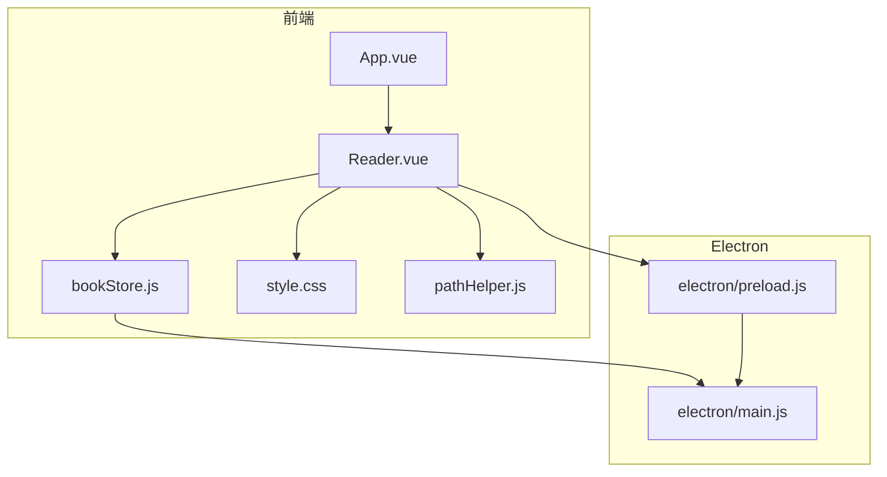
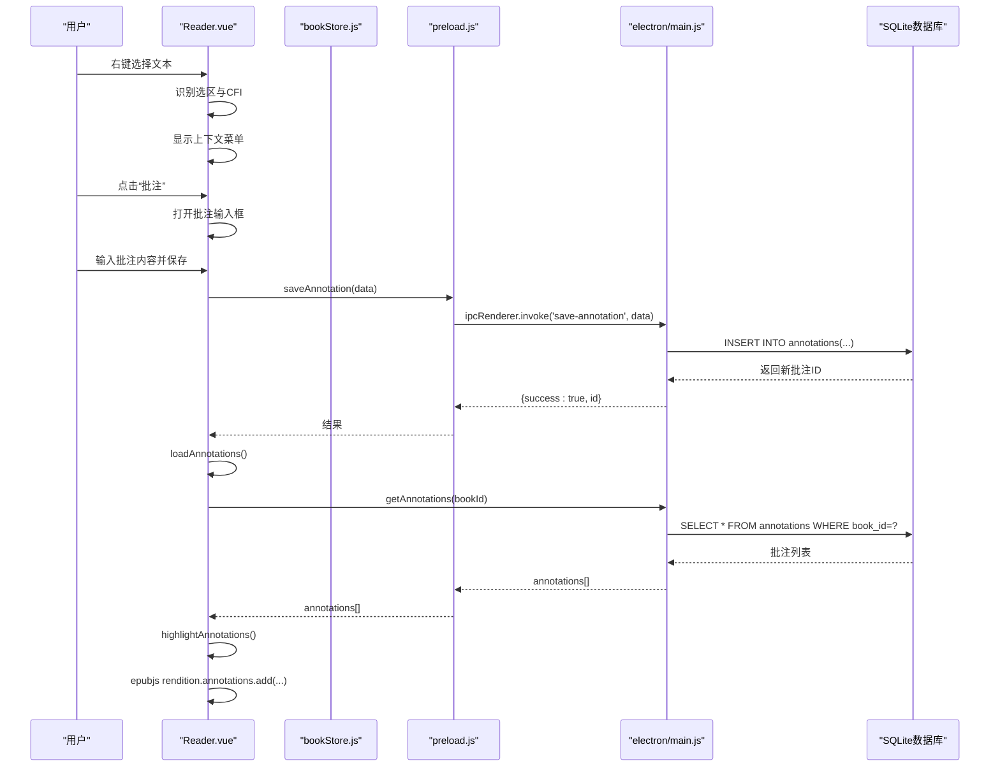
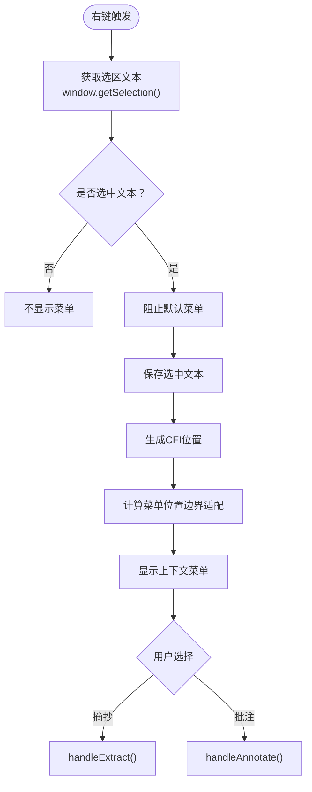
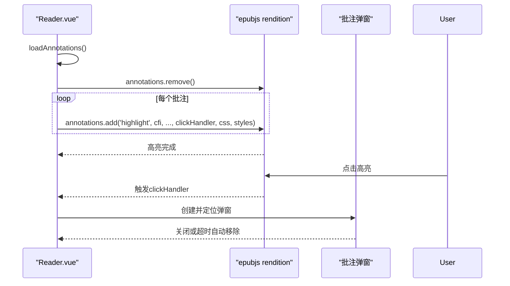
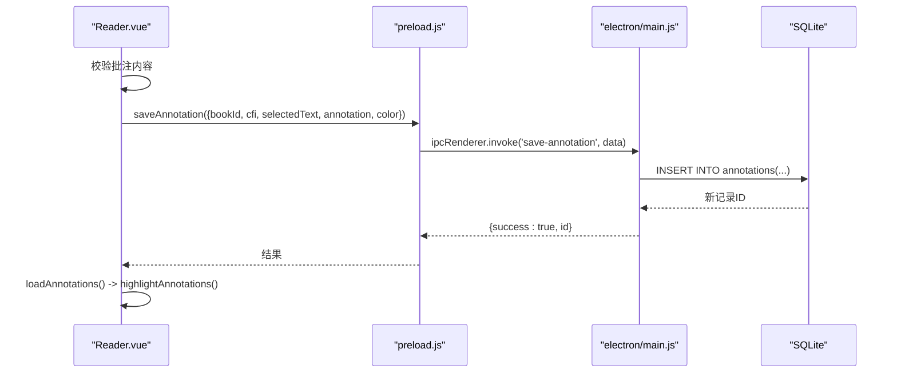
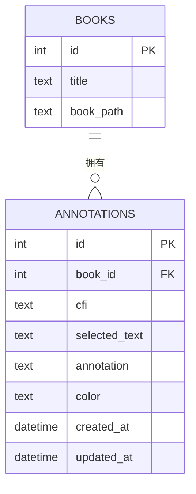
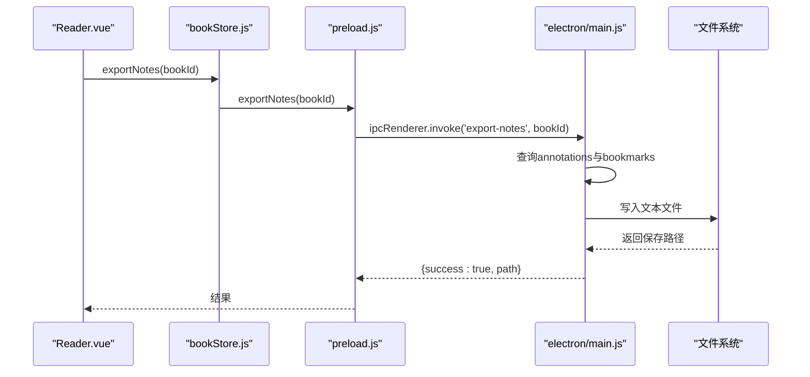
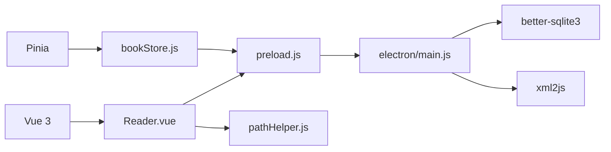

# 批注功能

<cite>
**本文档引用的文件**
- [Reader.vue](file://src/components/Reader.vue)
- [bookStore.js](file://src/stores/bookStore.js)
- [main.js](file://electron/main.js)
- [preload.js](file://electron/preload.js)
- [pathHelper.js](file://src/utils/pathHelper.js)
- [style.css](file://src/style.css)
- [App.vue](file://src/App.vue)
- [package.json](file://package.json)
</cite>

## 目录
1. [简介](#简介)
2. [项目结构](#项目结构)
3. [核心组件](#核心组件)
4. [架构总览](#架构总览)
5. [详细组件分析](#详细组件分析)
6. [依赖关系分析](#依赖关系分析)
7. [性能考虑](#性能考虑)
8. [故障排除指南](#故障排除指南)
9. [结论](#结论)

## 简介
本文件面向ROSAA电子书阅读器的批注功能，系统性梳理从文本选择、DOM元素识别、选区计算、高亮显示，到批注创建、内容编辑、颜色标记与位置记录，再到批注管理（列表、分类、搜索过滤）、摘抄功能（文本提取、格式保持、批量操作）、数据模型（存储结构、查询优化、版本管理），以及导出功能（实现方案与使用指南）。同时提供性能优化与用户体验改进建议，帮助开发者与使用者更好地理解和使用该功能。

## 项目结构
- 前端采用Vue 3 + Vite，核心阅读器组件位于src/components/Reader.vue，状态管理使用Pinia（src/stores/bookStore.js）。
- Electron主进程负责数据库初始化与IPC通信（electron/main.js），预加载脚本暴露安全的API桥接（electron/preload.js）。
- 工具模块提供路径处理（src/utils/pathHelper.js），样式定义位于src/style.css。
- 应用入口在src/App.vue，package.json定义了依赖与构建脚本。

**图表来源**
- [App.vue](file://src/App.vue)
- [Reader.vue](file://src/components/Reader.vue)
- [bookStore.js](file://src/stores/bookStore.js)
- [main.js](file://electron/main.js)
- [preload.js](file://electron/preload.js)
- [pathHelper.js](file://src/utils/pathHelper.js)
- [style.css](file://src/style.css)

**章节来源**
- [App.vue](file://src/App.vue)
- [Reader.vue](file://src/components/Reader.vue)
- [bookStore.js](file://src/stores/bookStore.js)
- [main.js](file://electron/main.js)
- [preload.js](file://electron/preload.js)
- [pathHelper.js](file://src/utils/pathHelper.js)
- [style.css](file://src/style.css)
- [package.json](file://package.json)

## 核心组件
- 文本选择与上下文菜单：在阅读器中拦截右键事件，识别选区文本与CFI位置，提供“摘抄”“批注”菜单项。
- 批注创建与高亮：保存批注后重新加载并调用epub.js的annotations接口进行高亮；点击高亮显示批注弹窗。
- 批注管理：通过store与IPC访问数据库，支持加载、保存、删除批注，并在UI中展示。
- 摘抄功能：预留接口，当前为占位实现，后续可扩展为独立摘抄条目与导出。
- 数据模型：基于SQLite的annotations表，包含book_id、cfi、selected_text、annotation、color等字段。

**章节来源**
- [Reader.vue](file://src/components/Reader.vue)
- [bookStore.js](file://src/stores/bookStore.js)
- [main.js](file://electron/main.js)

## 架构总览
批注功能遵循“前端交互 -> IPC桥接 -> 主进程数据库”的经典Electron架构。前端通过window.electronAPI调用主进程注册的IPC处理器，主进程执行SQL操作并返回结果。

**图表来源**
- [Reader.vue](file://src/components/Reader.vue)
- [bookStore.js](file://src/stores/bookStore.js)
- [preload.js](file://electron/preload.js)
- [main.js](file://electron/main.js)

## 详细组件分析

### 文本选择与DOM元素识别
- 右键拦截：在顶层文档与iframe内部分别设置contextmenu监听，优先从iframe内部获取选区，避免跨域限制。
- 选区计算：使用window.getSelection或iframe.contentWindow.getSelection获取Range，结合epub.js的getCFI或content.cfiFromRange生成CFI定位。
- 上下文菜单：根据选区是否为空决定是否显示菜单；计算菜单位置确保在可视区域内。

**图表来源**
- [Reader.vue](file://src/components/Reader.vue)

**章节来源**
- [Reader.vue](file://src/components/Reader.vue)

### 批注高亮与弹窗
- 高亮策略：每次加载批注时先清除旧高亮，再逐条调用rendition.annotations.add，传入颜色、CSS类与点击回调。
- 弹窗展示：点击高亮后创建固定定位的弹窗，显示原文与批注内容，支持手动关闭与定时自动关闭。

**图表来源**
- [Reader.vue](file://src/components/Reader.vue)

**章节来源**
- [Reader.vue](file://src/components/Reader.vue)

### 批注添加流程
- 输入校验：检查批注内容是否为空。
- IPC保存：调用window.electronAPI.saveAnnotation，传入bookId、cfi、selectedText、annotation、color。
- 成功后刷新：重新加载批注并高亮；失败则提示错误信息。

**图表来源**
- [Reader.vue](file://src/components/Reader.vue)
- [preload.js](file://electron/preload.js)
- [main.js](file://electron/main.js)

**章节来源**
- [Reader.vue](file://src/components/Reader.vue)
- [preload.js](file://electron/preload.js)
- [main.js](file://electron/main.js)

### 批注管理与数据模型
- 数据表结构：annotations表包含id、book_id、cfi、selected_text、annotation、color、created_at、updated_at。
- 查询优化：按book_id查询并按创建时间升序排列，便于展示最新批注。
- 版本管理：使用updated_at字段记录更新时间，支持后续版本对比与同步。

**图表来源**
- [main.js](file://electron/main.js)

**章节来源**
- [main.js](file://electron/main.js)

### 摘抄功能实现
- 当前状态：handleExtract为占位实现，仅弹出提示并输出日志。
- 建议扩展：新增摘抄表（如抄录条目），支持保存选中文本、CFI、时间戳与备注；提供批量导出与搜索过滤。

**章节来源**
- [Reader.vue](file://src/components/Reader.vue)

### 批注导出方案与使用指南
- 导出接口：主进程提供export-notes接口，读取annotations与bookmarks，生成文本格式笔记。
- 输出内容：包含书籍标题、作者、导出时间、批注列表（原文、批注、时间）与书签列表（标题、备注、时间）。
- 使用建议：导出为纯文本便于分享与备份；若需富文本，可在前端渲染HTML并另存为网页。

**图表来源**
- [bookStore.js](file://src/stores/bookStore.js)
- [preload.js](file://electron/preload.js)
- [main.js](file://electron/main.js)

**章节来源**
- [bookStore.js](file://src/stores/bookStore.js)
- [preload.js](file://electron/preload.js)
- [main.js](file://electron/main.js)

## 依赖关系分析
- 前端依赖：Vue 3、Pinia、epubjs、better-sqlite3（通过preload.js间接使用）、xml2js（EPUB解析）。
- IPC桥接：preload.js暴露统一的electronAPI，Reader.vue与bookStore.js通过该API调用主进程能力。
- 路径处理：pathHelper.js负责file:// URL构建，兼容开发与生产环境。

**图表来源**
- [package.json](file://package.json)
- [Reader.vue](file://src/components/Reader.vue)
- [bookStore.js](file://src/stores/bookStore.js)
- [preload.js](file://electron/preload.js)
- [main.js](file://electron/main.js)
- [pathHelper.js](file://src/utils/pathHelper.js)

**章节来源**
- [package.json](file://package.json)
- [Reader.vue](file://src/components/Reader.vue)
- [bookStore.js](file://src/stores/bookStore.js)
- [preload.js](file://electron/preload.js)
- [main.js](file://electron/main.js)
- [pathHelper.js](file://src/utils/pathHelper.js)

## 性能考虑
- 首屏加载优化：Reader.vue在initReader中延迟生成locations，避免阻塞首屏显示；后台异步生成，提升感知速度。
- 高亮渲染优化：每次加载批注前先清理旧高亮，减少重复叠加；按需高亮，避免全量重绘。
- CFI计算稳定性：在iframe环境中通过rendition.getContents与content.cfiFromRange生成CFI，增强跨章节定位准确性。
- 数据库性能：主进程启用WAL模式，提升并发读写性能；查询按book_id过滤并排序，索引可按需添加（建议为book_id、created_at建立索引）。

**章节来源**
- [Reader.vue](file://src/components/Reader.vue)
- [main.js](file://electron/main.js)

## 故障排除指南
- 无法获取CFI：检查iframe是否加载完成，必要时增加重试机制；确认selection.range存在。
- 高亮不生效：确认rendition.annotations.remove已调用；检查颜色与CSS类是否正确传入。
- 批注保存失败：查看IPC调用返回的错误信息；确认bookId与cfi有效；检查数据库连接与权限。
- 导出失败：确认目标路径可写；检查annotations与bookmarks查询是否返回数据。

**章节来源**
- [Reader.vue](file://src/components/Reader.vue)
- [main.js](file://electron/main.js)
- [preload.js](file://electron/preload.js)

## 结论
ROSAA电子书阅读器的批注功能已具备完整的技术闭环：从文本选择、CFI定位、高亮显示，到批注创建、持久化与导出。建议后续完善摘抄功能、引入颜色选择器、支持批注分类与搜索过滤，并持续优化性能与用户体验。