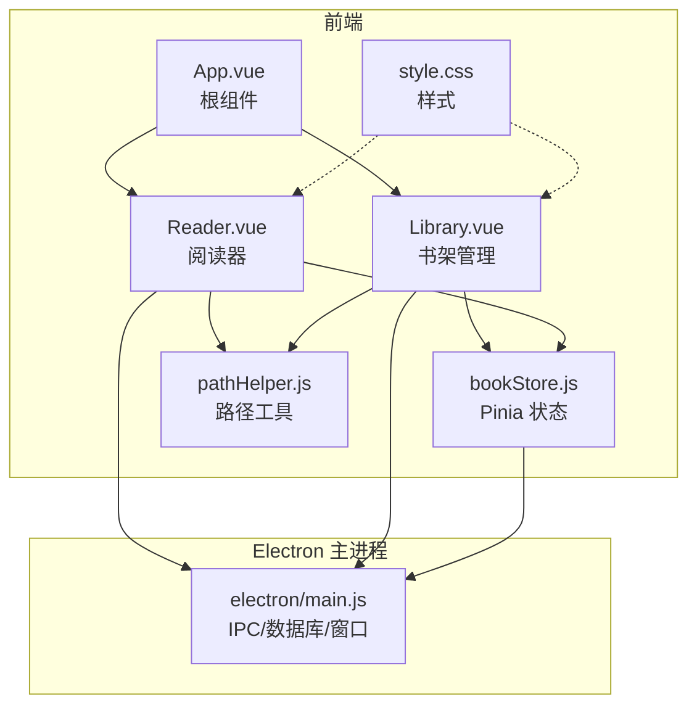
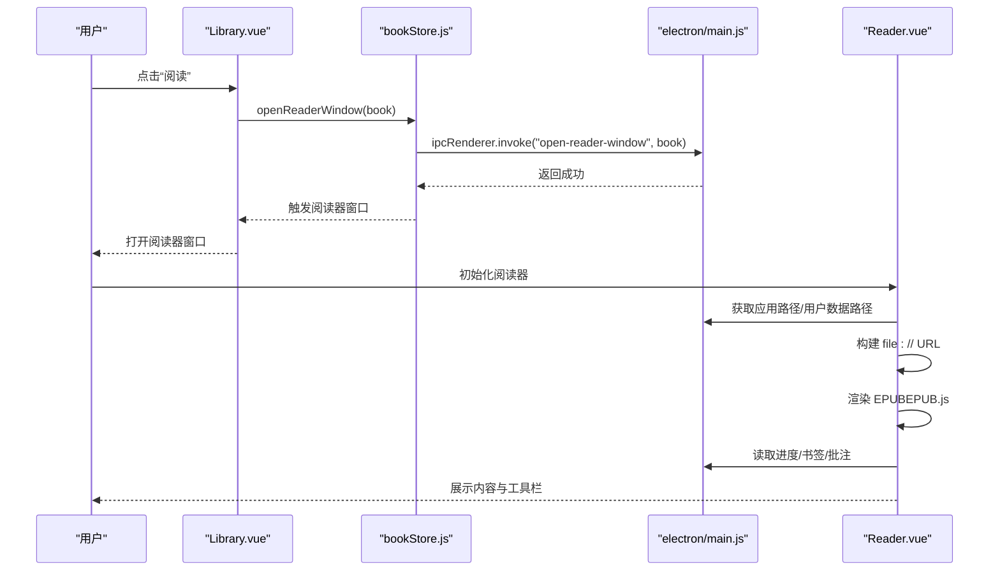
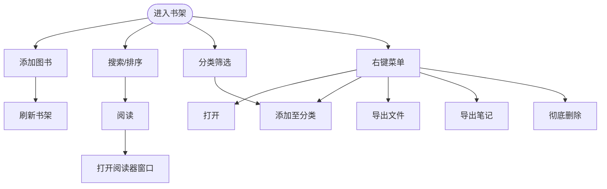
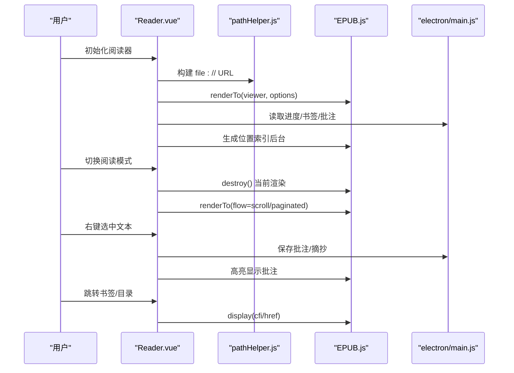
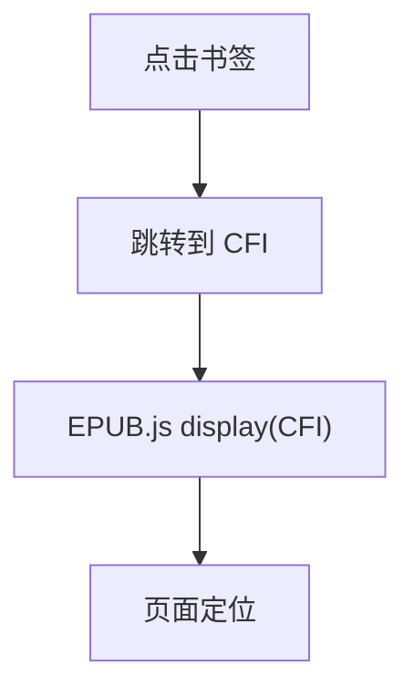
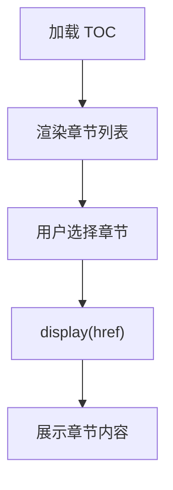
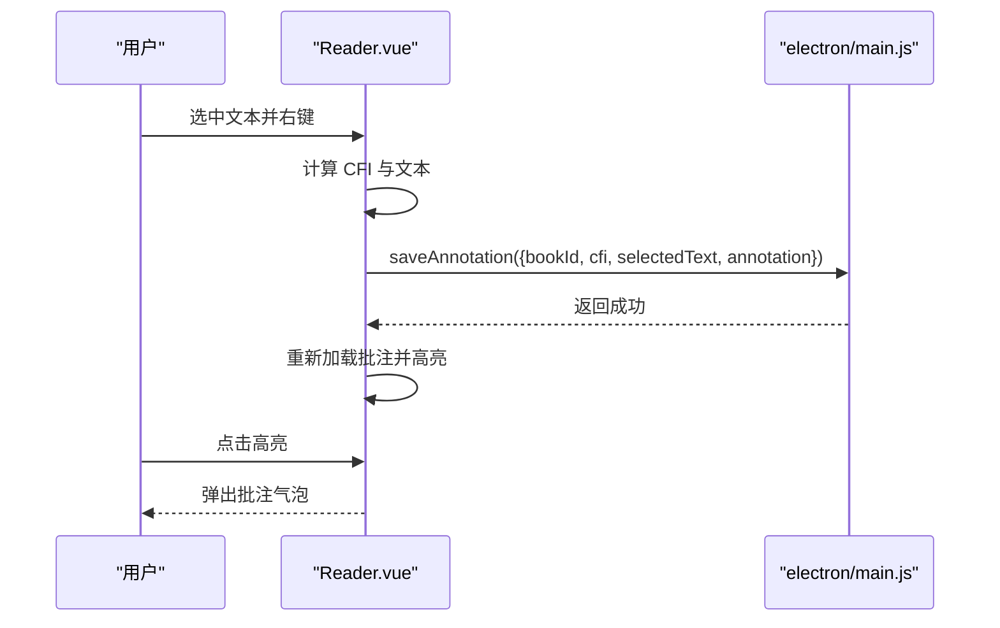
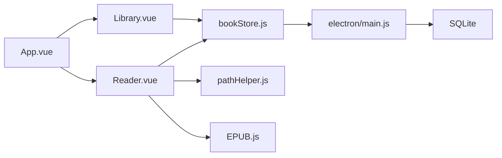

# 用户功能

<cite>
**本文引用的文件**
- [README.md](file://README.md)
- [src/App.vue](file://src/App.vue)
- [src/main.js](file://src/main.js)
- [src/components/Library.vue](file://src/components/Library.vue)
- [src/components/Reader.vue](file://src/components/Reader.vue)
- [src/stores/bookStore.js](file://src/stores/bookStore.js)
- [src/utils/pathHelper.js](file://src/utils/pathHelper.js)
- [src/style.css](file://src/style.css)
- [electron/main.js](file://electron/main.js)
</cite>

## 目录
1. [简介](#简介)
2. [项目结构](#项目结构)
3. [核心组件](#核心组件)
4. [架构总览](#架构总览)
5. [详细组件分析](#详细组件分析)
6. [依赖关系分析](#依赖关系分析)
7. [性能考虑](#性能考虑)
8. [故障排除指南](#故障排除指南)
9. [结论](#结论)
10. [附录](#附录)

## 简介
本文件面向最终用户，系统性梳理 ROSAA 电子书阅读器的用户功能，覆盖书架管理、阅读器功能、书签系统、目录导航、批注与摘抄、以及用户交互最佳实践与常见问题。文档以“功能使用指南 + 技术实现映射”的方式呈现，帮助不同背景的读者快速掌握如何高效使用与维护该阅读器。

## 项目结构
- 前端采用 Vue 3 + Pinia，组件化设计，根组件负责在“书架”和“阅读器”之间切换。
- Electron 主进程负责数据库初始化、IPC 通信、窗口管理与文件路径解析。
- 阅读器基于 EPUB.js 渲染 EPUB 内容，支持翻页与滚动两种阅读模式，具备进度保存、字体调整、书签与批注能力。

图表来源
- [src/App.vue:1-64](file://src/App.vue#L1-L64)
- [src/components/Library.vue:1-120](file://src/components/Library.vue#L1-L120)
- [src/components/Reader.vue:1-120](file://src/components/Reader.vue#L1-L120)
- [src/stores/bookStore.js:1-234](file://src/stores/bookStore.js#L1-L234)
- [src/utils/pathHelper.js:1-63](file://src/utils/pathHelper.js#L1-L63)
- [electron/main.js:695-820](file://electron/main.js#L695-L820)

章节来源
- [src/App.vue:1-64](file://src/App.vue#L1-L64)
- [src/main.js:1-11](file://src/main.js#L1-L11)

## 核心组件
- 书架组件（Library.vue）：提供书籍添加、删除、分类、搜索、排序、右键菜单（打开、分类、导出、彻底删除）、登录态管理等。
- 阅读器组件（Reader.vue）：提供 EPUB 渲染、翻页/滚动模式切换、字体大小调整、目录导航、书签管理、批注与摘抄、进度保存与恢复。
- 状态管理（bookStore.js）：集中管理书籍、分类、当前阅读进度、书签、批注等数据，封装与 Electron IPC 的交互。
- 路径工具（pathHelper.js）：统一处理开发/生产环境下 file:// URL 的构建，保证封面与书籍文件正确加载。
- 根组件（App.vue）：根据路由参数或用户操作在书架与阅读器之间切换。
- 主进程（electron/main.js）：初始化 SQLite 表结构，提供 IPC 接口（书籍、进度、书签、批注、窗口打开等）。

章节来源
- [src/components/Library.vue:1-120](file://src/components/Library.vue#L1-L120)
- [src/components/Reader.vue:1-120](file://src/components/Reader.vue#L1-L120)
- [src/stores/bookStore.js:1-234](file://src/stores/bookStore.js#L1-L234)
- [src/utils/pathHelper.js:1-63](file://src/utils/pathHelper.js#L1-L63)
- [src/App.vue:1-64](file://src/App.vue#L1-L64)
- [electron/main.js:695-820](file://electron/main.js#L695-L820)

## 架构总览
用户在书架中选择书籍，通过 IPC 打开阅读器窗口；阅读器加载 EPUB 并根据目录生成位置索引，恢复上次阅读进度；用户可切换阅读模式、调整字体、添加书签、进行批注与摘抄；所有数据通过 Electron IPC 写入 SQLite 数据库。

图表来源
- [src/components/Library.vue:365-387](file://src/components/Library.vue#L365-L387)
- [src/stores/bookStore.js:208-232](file://src/stores/bookStore.js#L208-L232)
- [electron/main.js:771-820](file://electron/main.js#L771-L820)
- [src/components/Reader.vue:232-425](file://src/components/Reader.vue#L232-L425)

## 详细组件分析

### 书架管理（Library.vue）
- 书籍添加：通过 Electron API 打开文件选择器，批量导入 EPUB，自动刷新书架列表。
- 删除与导出：右键菜单支持导出书籍文件、导出笔记、彻底删除（含文件与数据）。
- 分类管理：支持新建分类（带预设颜色）、分配书籍到分类、移除分类。
- 搜索与排序：按书名/作者模糊搜索，支持按最近添加或书名排序。
- 用户登录：本地登录态缓存，支持退出登录。
- 书籍卡片：点击卡片进入阅读器；右键菜单提供常用操作。

图表来源
- [src/components/Library.vue:100-123](file://src/components/Library.vue#L100-L123)
- [src/components/Library.vue:402-466](file://src/components/Library.vue#L402-L466)
- [src/components/Library.vue:365-387](file://src/components/Library.vue#L365-L387)

章节来源
- [src/components/Library.vue:1-120](file://src/components/Library.vue#L1-L120)
- [src/components/Library.vue:266-294](file://src/components/Library.vue#L266-L294)
- [src/components/Library.vue:365-589](file://src/components/Library.vue#L365-L589)

### 阅读器功能（Reader.vue）
- EPUB 渲染：基于 EPUB.js，自动构建 file:// URL，渲染到容器，支持首次显示后后台生成位置索引。
- 阅读模式：翻页模式（传统翻页）与滚动模式（连续滚动），切换时保存当前位置并重建渲染。
- 字体调整：通过主题注册动态调整字体大小。
- 目录导航：加载 EPUB 目录（TOC），支持章节跳转；若无进度则跳过封面/版权页，定位到首个合适章节。
- 进度保存：监听页面重定位事件，实时保存 CFI、页码与百分比；支持恢复上次阅读位置。
- 书签系统：添加/删除书签，记录标题与备注，支持快速跳转。
- 批注与摘抄：右键菜单支持“摘抄”和“批注”，批注保存到数据库并在阅读器中高亮显示；点击高亮弹出批注气泡。

图表来源
- [src/components/Reader.vue:232-425](file://src/components/Reader.vue#L232-L425)
- [src/utils/pathHelper.js:13-53](file://src/utils/pathHelper.js#L13-L53)
- [electron/main.js:710-760](file://electron/main.js#L710-L760)
- [src/components/Reader.vue:514-562](file://src/components/Reader.vue#L514-L562)

章节来源
- [src/components/Reader.vue:1-120](file://src/components/Reader.vue#L1-L120)
- [src/components/Reader.vue:232-425](file://src/components/Reader.vue#L232-L425)
- [src/components/Reader.vue:514-626](file://src/components/Reader.vue#L514-L626)
- [src/components/Reader.vue:650-761](file://src/components/Reader.vue#L650-L761)
- [src/components/Reader.vue:763-1024](file://src/components/Reader.vue#L763-L1024)

### 书签系统
- 创建：在阅读器中打开“书签”标签，点击“+ 添加书签”，输入标题与备注，保存后立即显示。
- 管理：支持删除书签；书签列表按创建时间倒序排列。
- 快速跳转：点击书签条目中的“跳转”按钮，阅读器定位到对应 CFI。

图表来源
- [src/components/Reader.vue:20-42](file://src/components/Reader.vue#L20-L42)
- [src/components/Reader.vue:601-603](file://src/components/Reader.vue#L601-L603)
- [electron/main.js:665-684](file://electron/main.js#L665-L684)

章节来源
- [src/components/Reader.vue:20-42](file://src/components/Reader.vue#L20-L42)
- [src/components/Reader.vue:628-648](file://src/components/Reader.vue#L628-L648)
- [electron/main.js:665-684](file://electron/main.js#L665-L684)

### 目录导航
- 加载：EPUB.js 提供 TOC，阅读器渲染为章节列表。
- 跳转：点击章节项，阅读器根据 href 定位到对应位置。
- 首次打开策略：若无进度，跳过封面/版权页，优先选择包含“章/Chapter”的章节，否则选择首个可用章节。

图表来源
- [src/components/Reader.vue:336-417](file://src/components/Reader.vue#L336-L417)

章节来源
- [src/components/Reader.vue:45-60](file://src/components/Reader.vue#L45-L60)
- [src/components/Reader.vue:605-607](file://src/components/Reader.vue#L605-L607)

### 批注与摘抄
- 文本选择：在阅读器中选中文本，右键弹出菜单。
- 摘抄：复制选中文本（提示已摘抄）。
- 批注：打开批注输入框，填写批注内容并保存；批注保存到数据库并在阅读器中高亮显示；点击高亮可查看批注气泡。

图表来源
- [src/components/Reader.vue:763-1024](file://src/components/Reader.vue#L763-L1024)
- [electron/main.js:710-760](file://electron/main.js#L710-L760)
- [src/style.css:528-560](file://src/style.css#L528-L560)

章节来源
- [src/components/Reader.vue:946-1012](file://src/components/Reader.vue#L946-L1012)
- [src/components/Reader.vue:514-562](file://src/components/Reader.vue#L514-L562)
- [src/style.css:428-560](file://src/style.css#L428-L560)

## 依赖关系分析
- 组件耦合：
  - App.vue 控制 Library 与 Reader 的切换。
  - Library.vue 与 Reader.vue 均依赖 bookStore.js。
  - Reader.vue 依赖 pathHelper.js 构建 file:// URL。
  - 所有数据持久化通过 Electron IPC 与主进程交互。
- 外部依赖：
  - EPUB.js：EPUB 渲染与位置索引。
  - better-sqlite3：SQLite 数据库（主进程）。
  - Vite/Pinia/Vue：前端构建与状态管理。

图表来源
- [src/App.vue:1-64](file://src/App.vue#L1-L64)
- [src/components/Library.vue:1-120](file://src/components/Library.vue#L1-L120)
- [src/components/Reader.vue:1-120](file://src/components/Reader.vue#L1-L120)
- [src/stores/bookStore.js:1-234](file://src/stores/bookStore.js#L1-L234)
- [src/utils/pathHelper.js:1-63](file://src/utils/pathHelper.js#L1-L63)
- [electron/main.js:695-820](file://electron/main.js#L695-L820)

章节来源
- [src/App.vue:1-64](file://src/App.vue#L1-L64)
- [src/stores/bookStore.js:1-234](file://src/stores/bookStore.js#L1-L234)
- [electron/main.js:695-820](file://electron/main.js#L695-L820)

## 性能考虑
- 首屏加载优化：先显示内容，再后台生成位置索引，避免阻塞首屏。
- 阅读模式切换：销毁并重建渲染，确保模式切换稳定；滚动模式下对 iframe 宽度进行兜底修复。
- 字体调整：仅通过主题注册调整字号，避免频繁 DOM 重排。
- 批注高亮：按需清除与重建高亮，减少重复渲染成本。
- 路径解析：统一 file:// URL 构建，避免跨环境路径差异导致的二次请求。

章节来源
- [src/components/Reader.vue:427-438](file://src/components/Reader.vue#L427-L438)
- [src/components/Reader.vue:650-761](file://src/components/Reader.vue#L650-L761)
- [src/components/Reader.vue:622-626](file://src/components/Reader.vue#L622-L626)
- [src/utils/pathHelper.js:13-53](file://src/utils/pathHelper.js#L13-L53)

## 故障排除指南
- 无法打开书籍文件
  - 确认 Electron API 可用；检查书籍路径是否正确（file:// URL）。
  - 若路径异常，检查用户数据目录权限与文件是否存在。
- 阅读器无法显示内容
  - 检查 EPUB.js 渲染是否成功；确认 viewer 容器内存在 iframe。
  - 若滚动模式下宽度为 0，检查主进程对 iframe 宽度的修复逻辑。
- 书签/批注无效
  - 确认数据库中对应表已创建（主进程初始化时创建）。
  - 检查 CFI 是否正确生成；若 CFI 为空，无法定位到具体位置。
- 阅读模式切换失败
  - 确认当前页面位置已保存；切换时会销毁并重建渲染。
- 右键菜单不出现
  - 检查 iframe 内容文档是否可访问；主进程提供重试机制，最多重试若干次。

章节来源
- [src/components/Reader.vue:418-424](file://src/components/Reader.vue#L418-L424)
- [src/components/Reader.vue:737-756](file://src/components/Reader.vue#L737-L756)
- [src/components/Reader.vue:810-939](file://src/components/Reader.vue#L810-L939)
- [electron/main.js:223-261](file://electron/main.js#L223-L261)

## 结论
ROSAA 电子书阅读器围绕“书架管理 + 阅读器 + 数据持久化”的闭环设计，提供完整的 EPUB 阅读体验。书架侧支持分类、搜索、排序与批量导入；阅读器侧提供双模式切换、进度保存、书签与批注等增强功能。通过 Electron IPC 与 SQLite 的配合，实现跨平台的数据一致性与稳定性。

## 附录

### 功能使用指南
- 添加书籍：点击“添加图书”，选择本地 EPUB 文件，自动加入书架。
- 阅读书籍：在书架中点击“阅读”，进入阅读器；使用工具栏翻页、切换模式、调整字体。
- 添加书签：在阅读器左侧“书签”标签中点击“+ 添加书签”，输入标题与备注，保存后可快速跳转。
- 目录导航：在“目录”标签中点击章节，即可跳转到对应位置。
- 批注与摘抄：选中文本，右键选择“批注”或“摘抄”，批注会高亮显示并可弹出查看。
- 进度保存：阅读器自动保存进度，下次打开同一本书时从上次位置继续。

章节来源
- [README.md:126-165](file://README.md#L126-L165)

### 常见问题
- 为什么打包后图标不生效？
  - 需要将 PNG 转换为 ICO 并放置到 public 目录，参考 README 的图标转换说明。
- 为什么安装后无法打开？
  - 检查用户数据目录权限与数据库路径配置；查看控制台日志定位具体错误。
- 为什么右键菜单不出现？
  - 检查 iframe 内容文档是否可访问；主进程已内置重试机制。

章节来源
- [README.md:197-250](file://README.md#L197-L250)
- [README.md:410-419](file://README.md#L410-L419)