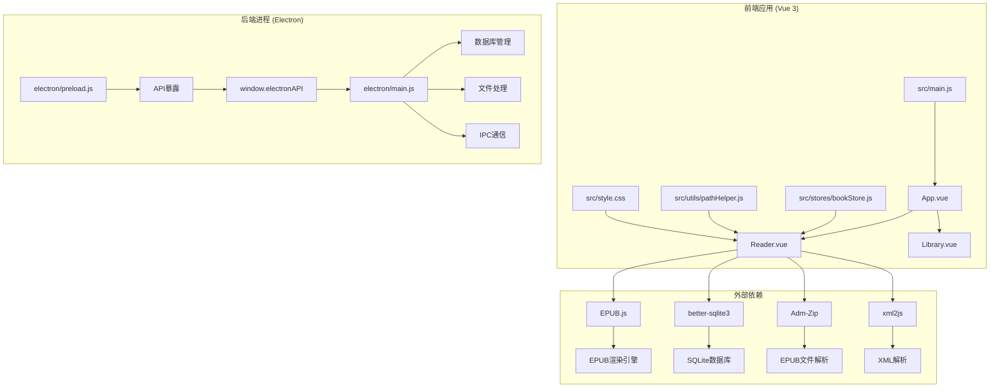
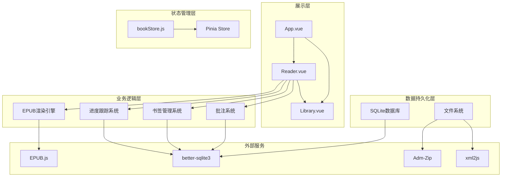
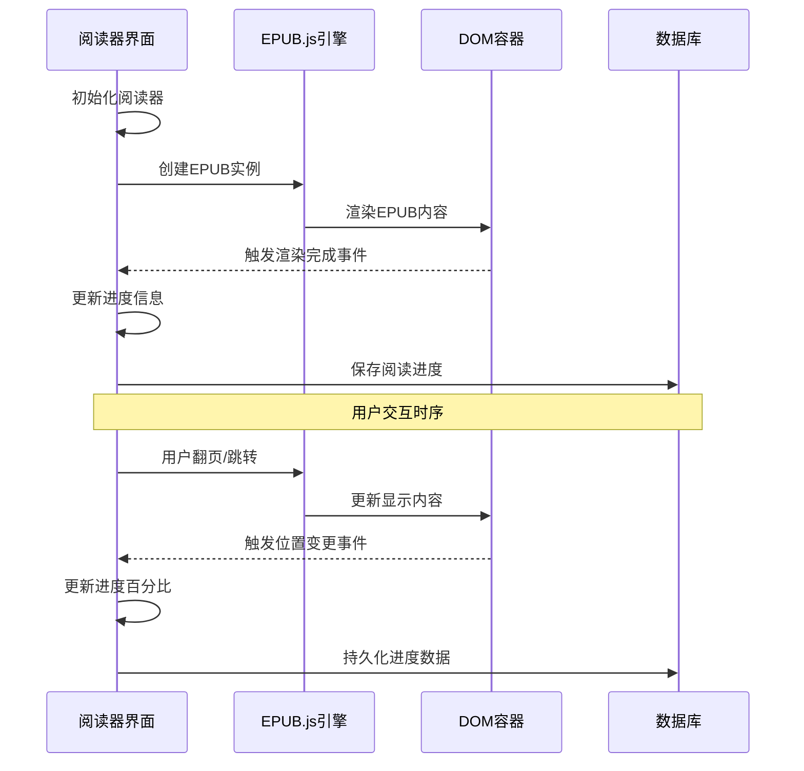
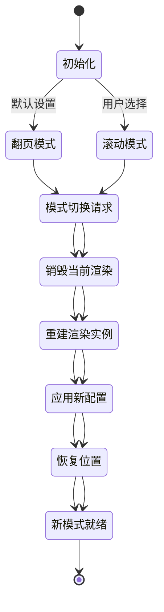
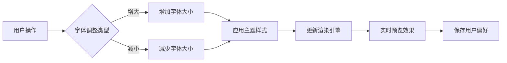
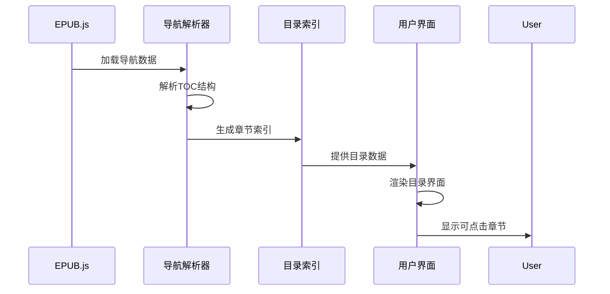
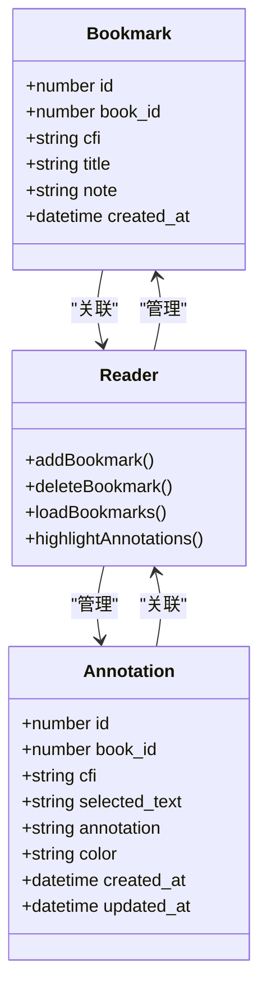
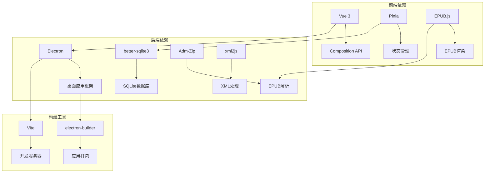
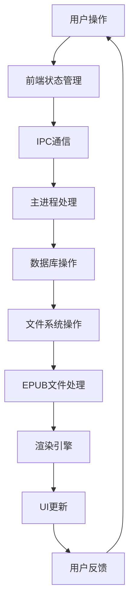

# 阅读器界面

<cite>
**本文档引用的文件**
- [Reader.vue](file://src/components/Reader.vue)
- [bookStore.js](file://src/stores/bookStore.js)
- [main.js](file://src/main.js)
- [App.vue](file://src/App.vue)
- [style.css](file://src/style.css)
- [main.js](file://electron/main.js)
- [preload.js](file://electron/preload.js)
- [pathHelper.js](file://src/utils/pathHelper.js)
- [package.json](file://package.json)
- [README.md](file://README.md)
</cite>

## 目录
1. [简介](#简介)
2. [项目结构](#项目结构)
3. [核心组件](#核心组件)
4. [架构概览](#架构概览)
5. [详细组件分析](#详细组件分析)
6. [依赖关系分析](#依赖关系分析)
7. [性能考虑](#性能考虑)
8. [故障排除指南](#故障排除指南)
9. [结论](#结论)

## 简介

ROSAA电子书阅读器是一个基于Electron + Vue 3 + SQLite的现代化EPUB电子书阅读器桌面应用。该应用提供了流畅的EPUB文件渲染、双模式阅读体验、智能进度保存系统以及丰富的阅读辅助功能。

本项目的核心优势在于其完整的EPUB渲染引擎实现，支持翻页模式和滚动模式的无缝切换，具备完善的阅读进度跟踪、书签管理和批注功能。通过EPUB.js库的强大渲染能力，应用能够准确还原EPUB文档的原始格式和布局。

## 项目结构

该项目采用典型的Electron + Vue 3架构，主要分为前端Vue应用和后端Electron主进程两大部分：



**图表来源**
- [main.js:1-11](file://src/main.js#L1-L11)
- [App.vue:1-64](file://src/App.vue#L1-L64)
- [Reader.vue:1-160](file://src/components/Reader.vue#L1-L160)
- [main.js:1-80](file://electron/main.js#L1-L80)

**章节来源**
- [main.js:1-11](file://src/main.js#L1-L11)
- [package.json:22-29](file://package.json#L22-L29)

## 核心组件

### 阅读器组件 (Reader.vue)

阅读器组件是整个应用的核心，负责EPUB文件的渲染、用户交互和状态管理。该组件实现了完整的阅读体验，包括双模式切换、进度跟踪、书签管理和批注功能。

#### 主要功能特性

1. **双模式阅读支持**
   - 翻页模式：模拟传统纸质书籍的翻页效果
   - 滚动模式：连续滚动阅读体验

2. **智能进度保存**
   - 基于CFI（EPUB标准）的精确位置定位
   - 自动保存和恢复阅读进度
   - 断点续读功能

3. **丰富的交互功能**
   - 右键菜单支持摘抄和批注
   - 目录导航和快速跳转
   - 书签管理和书签集成

**章节来源**
- [Reader.vue:1-160](file://src/components/Reader.vue#L1-L160)
- [Reader.vue:232-425](file://src/components/Reader.vue#L232-L425)

### 状态管理 (bookStore.js)

应用使用Pinia进行状态管理，bookStore.js提供了统一的数据访问接口，封装了所有与书籍、进度、书签和批注相关的操作。

#### 核心状态管理功能

- 书籍列表管理
- 阅读进度跟踪
- 书签系统
- 批注管理
- 分类管理

**章节来源**
- [bookStore.js:1-234](file://src/stores/bookStore.js#L1-L234)

### 主进程架构 (electron/main.js)

Electron主进程负责应用的底层功能，包括数据库管理、文件处理、IPC通信和窗口管理。

#### 主要职责

1. **数据库管理**
   - SQLite数据库初始化
   - 表结构定义和维护
   - 数据持久化

2. **文件处理**
   - EPUB文件解析
   - 元数据提取
   - 文件复制和管理

3. **IPC通信**
   - 前后端数据交换
   - API接口暴露

**章节来源**
- [main.js:167-284](file://electron/main.js#L167-L284)
- [main.js:343-427](file://electron/main.js#L343-L427)

## 架构概览

应用采用分层架构设计，清晰分离了前端展示层、状态管理层、业务逻辑层和数据持久化层：



**图表来源**
- [Reader.vue:161-175](file://src/components/Reader.vue#L161-L175)
- [bookStore.js:1-234](file://src/stores/bookStore.js#L1-L234)
- [main.js:1-80](file://electron/main.js#L1-L80)

## 详细组件分析

### EPUB渲染引擎工作原理

#### 渲染流程分析

EPUB渲染引擎基于EPUB.js库，实现了完整的EPUB文档渲染管道：



**图表来源**
- [Reader.vue:250-332](file://src/components/Reader.vue#L250-L332)
- [Reader.vue:497-507](file://src/components/Reader.vue#L497-L507)

#### CFI定位技术实现

应用使用CFI（Content Fragment Identifier）技术实现精确的EPUB位置定位：

1. **CFI生成机制**
   - 基于EPUB标准的唯一标识符
   - 精确到字符级别的位置定位
   - 支持跨章节的绝对定位

2. **进度跟踪算法**
   ```mermaid
flowchart TD
A[用户位置变更] --> B{检查阅读模式}
B --> |翻页模式| C[计算页内百分比]
B --> |滚动模式| D[使用整书百分比]
C --> E[更新进度信息]
D --> E
E --> F[保存到数据库]
F --> G[更新UI显示]
```

**图表来源**
- [Reader.vue:440-495](file://src/components/Reader.vue#L440-L495)
- [Reader.vue:497-507](file://src/components/Reader.vue#L497-L507)

**章节来源**
- [Reader.vue:250-332](file://src/components/Reader.vue#L250-L332)
- [Reader.vue:440-495](file://src/components/Reader.vue#L440-L495)

### 翻页模式与滚动模式切换机制

#### 模式切换实现

应用支持两种阅读模式的无缝切换，每种模式都有其独特的用户体验和适用场景：



**图表来源**
- [Reader.vue:650-761](file://src/components/Reader.vue#L650-L761)

#### 翻页模式特点

**优点：**
- 模拟传统纸质书籍阅读体验
- 适合长时间阅读，减少眼部疲劳
- 提供明确的阅读边界感
- 支持精确的页内定位

**缺点：**
- 页面切换可能影响阅读连贯性
- 对长段落文本的阅读体验略显割裂
- 移动设备上可能影响阅读流畅度

**适用场景：**
- 长篇小说阅读
- 学术文献研读
- 需要精确定位的阅读需求
- 传统阅读习惯用户

#### 滚动模式特点

**优点：**
- 连续滚动提供流畅的阅读体验
- 适合移动设备和触摸屏操作
- 便于快速浏览和搜索内容
- 减少页面切换的中断感

**缺点：**
- 缺乏明确的页面边界感
- 难以实现精确的页内定位
- 可能影响阅读专注度

**适用场景：**
- 新闻资讯阅读
- 短篇内容浏览
- 移动设备阅读
- 快速浏览和检索

**章节来源**
- [Reader.vue:650-761](file://src/components/Reader.vue#L650-L761)

### 阅读进度保存系统

#### CFI定位技术详解

应用采用EPUB标准的CFI（Content Fragment Identifier）技术实现精确的位置定位：

1. **CFI生成过程**
   - 解析EPUB文档结构
   - 生成唯一的片段标识符
   - 支持跨章节的绝对定位

2. **进度同步机制**
   ```mermaid
sequenceDiagram
participant User as 用户
participant Reader as 阅读器
participant Engine as 渲染引擎
participant Store as 状态管理
participant DB as 数据库
User->>Reader : 阅读位置变更
Reader->>Engine : 获取当前位置
Engine-->>Reader : 返回CFI位置
Reader->>Store : 更新进度状态
Store->>DB : 保存进度数据
DB-->>Store : 确认保存
Store-->>Reader : 进度更新完成
Reader-->>User : 显示最新进度
```

**图表来源**
- [Reader.vue:497-507](file://src/components/Reader.vue#L497-L507)
- [bookStore.js:169-176](file://src/stores/bookStore.js#L169-L176)

#### 断点续读功能实现

断点续读功能通过以下机制实现：

1. **自动保存机制**
   - 监听位置变更事件
   - 实时保存阅读进度
   - 防抖处理避免频繁写入

2. **智能恢复策略**
   - 启动时自动加载进度
   - 检测封面/版权页异常
   - 自动跳转到合适章节

**章节来源**
- [Reader.vue:344-417](file://src/components/Reader.vue#L344-L417)
- [bookStore.js:161-176](file://src/stores/bookStore.js#L161-L176)

### 字体调整功能

#### 字体大小调节系统

应用提供了灵活的字体调整功能，支持用户自定义阅读体验：



**图表来源**
- [Reader.vue:617-626](file://src/components/Reader.vue#L617-L626)

#### 主题切换机制

虽然当前版本主要支持字体大小调整，但系统架构已为更丰富的主题切换预留了扩展空间：

1. **主题注册系统**
   - 支持动态主题注册
   - 统一的主题管理接口
   - 可扩展的样式定制

2. **样式应用策略**
   - 基于EPUB.js的主题系统
   - 实时样式更新机制
   - 性能优化的样式缓存

**章节来源**
- [Reader.vue:270-277](file://src/components/Reader.vue#L270-L277)
- [Reader.vue:622-626](file://src/components/Reader.vue#L622-L626)

### 目录导航功能

#### 章节索引生成

应用通过EPUB.js自动解析EPUB文档的导航结构，生成完整的目录索引：



**图表来源**
- [Reader.vue:336-338](file://src/components/Reader.vue#L336-L338)

#### 快速跳转实现

目录导航支持多种跳转方式：

1. **章节跳转**
   - 点击目录项直接跳转
   - 支持深层目录结构
   - 平滑的页面过渡效果

2. **智能章节识别**
   - 自动跳过封面/版权页
   - 优先选择正式章节
   - 备选章节的智能选择

**章节来源**
- [Reader.vue:45-60](file://src/components/Reader.vue#L45-L60)
- [Reader.vue:605-607](file://src/components/Reader.vue#L605-L607)

### 批注与书签系统

#### 书签管理

应用提供了完整的书签管理系统，支持书签的创建、编辑和删除：



**图表来源**
- [Reader.vue:628-648](file://src/components/Reader.vue#L628-L648)
- [Reader.vue:514-527](file://src/components/Reader.vue#L514-L527)

#### 批注功能实现

批注系统提供了强大的文本标注能力：

1. **右键菜单集成**
   - 支持选中文本批注
   - 摘抄功能
   - 实时批注高亮

2. **批注持久化**
   - 数据库存储
   - 颜色定制
   - 批注弹窗显示

**章节来源**
- [Reader.vue:763-939](file://src/components/Reader.vue#L763-L939)
- [Reader.vue:974-1012](file://src/components/Reader.vue#L974-L1012)

## 依赖关系分析

### 核心依赖关系

应用的依赖关系体现了清晰的分层架构：



**图表来源**
- [package.json:22-41](file://package.json#L22-L41)

### 数据流分析

应用内部的数据流体现了完整的CRUD操作模式：



**图表来源**
- [preload.js:7-92](file://electron/preload.js#L7-L92)
- [bookStore.js:161-176](file://src/stores/bookStore.js#L161-L176)

**章节来源**
- [package.json:22-41](file://package.json#L22-L41)

## 性能考虑

### 渲染性能优化

应用在渲染性能方面采用了多项优化策略：

1. **异步加载机制**
   - EPUB内容的延迟加载
   - 目录信息的后台生成
   - 位置索引的异步构建

2. **内存管理优化**
   - 渲染实例的智能销毁
   - DOM元素的及时清理
   - 事件监听器的正确移除

3. **网络和文件I/O优化**
   - EPUB文件的本地缓存
   - 数据库连接池管理
   - 文件路径的标准化处理

### 数据库性能优化

应用使用SQLite数据库，并实施了多项性能优化措施：

1. **WAL模式启用**
   - 提高并发读写性能
   - 减少锁竞争
   - 改善事务处理效率

2. **索引和约束优化**
   - 合理的索引设计
   - 外键约束保证数据完整性
   - 唯一约束防止重复数据

3. **查询优化策略**
   - 参数化查询防止SQL注入
   - 批量操作减少往返次数
   - 适当的事务边界控制

**章节来源**
- [main.js:185-187](file://electron/main.js#L185-L187)
- [main.js:430-449](file://electron/main.js#L430-L449)

## 故障排除指南

### 常见问题诊断

#### EPUB渲染问题

**问题症状：**
- EPUB文件无法正常显示
- 页面布局异常
- 字体显示问题

**解决方案：**
1. 检查EPUB文件的完整性和有效性
2. 验证EPUB.js库的版本兼容性
3. 确认CSS样式文件的正确加载

#### 进度保存异常

**问题症状：**
- 阅读进度无法保存
- 断点续读功能失效
- 进度数据丢失

**诊断步骤：**
1. 检查数据库连接状态
2. 验证CFI格式的有效性
3. 确认文件权限设置

#### 模式切换失败

**问题症状：**
- 翻页模式切换到滚动模式失败
- 滚动模式切换回翻页模式异常
- 模式切换后页面空白

**解决方法：**
1. 确认渲染实例的正确销毁
2. 检查新配置参数的合法性
3. 验证DOM容器的重新渲染

### 调试技巧

#### 开发环境调试

应用提供了完善的调试支持：

1. **前端调试**
   - Vue DevTools支持
   - 控制台日志输出
   - 组件状态监控

2. **后端调试**
   - Electron主进程日志
   - IPC通信调试
   - 数据库查询跟踪

3. **性能监控**
   - 渲染性能分析
   - 内存使用监控
   - 网络请求跟踪

**章节来源**
- [README.md:431-452](file://README.md#L431-L452)

## 结论

ROSAA电子书阅读器展现了现代桌面应用开发的最佳实践，通过精心设计的架构和实现，为用户提供了优质的EPUB阅读体验。

### 技术亮点

1. **完整的EPUB支持**
   - 基于EPUB.js的专业渲染引擎
   - 标准化的CFI定位技术
   - 全面的EPUB特性支持

2. **优秀的用户体验**
   - 双模式阅读满足不同需求
   - 智能的进度保存系统
   - 丰富的阅读辅助功能

3. **稳健的技术架构**
   - 清晰的分层设计
   - 完善的错误处理
   - 良好的性能表现

### 发展方向

未来可以在以下几个方面进一步完善：

1. **功能增强**
   - 支持更多EPUB高级特性
   - 增强个性化定制选项
   - 扩展多语言支持

2. **性能优化**
   - 进一步提升渲染性能
   - 优化内存使用效率
   - 改善大文件处理能力

3. **用户体验改进**
   - 简化用户操作流程
   - 增强无障碍访问支持
   - 优化移动端适配

通过持续的迭代和优化，ROSAA电子书阅读器将成为一个功能完备、性能优异的现代化EPUB阅读解决方案。