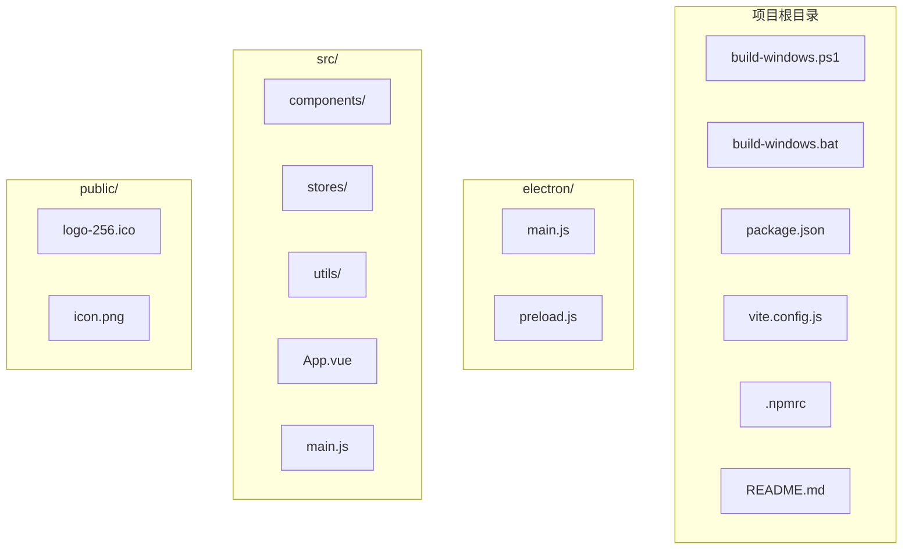
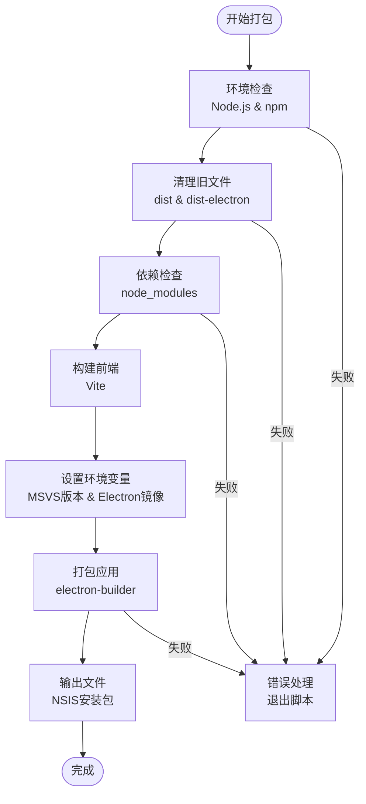
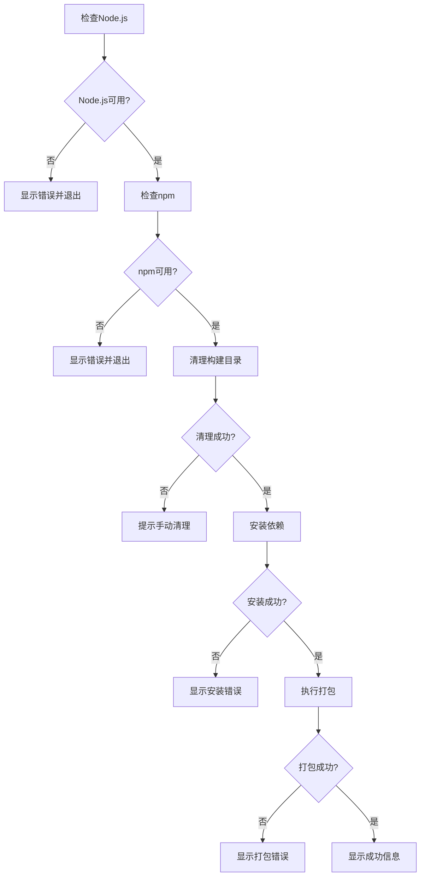
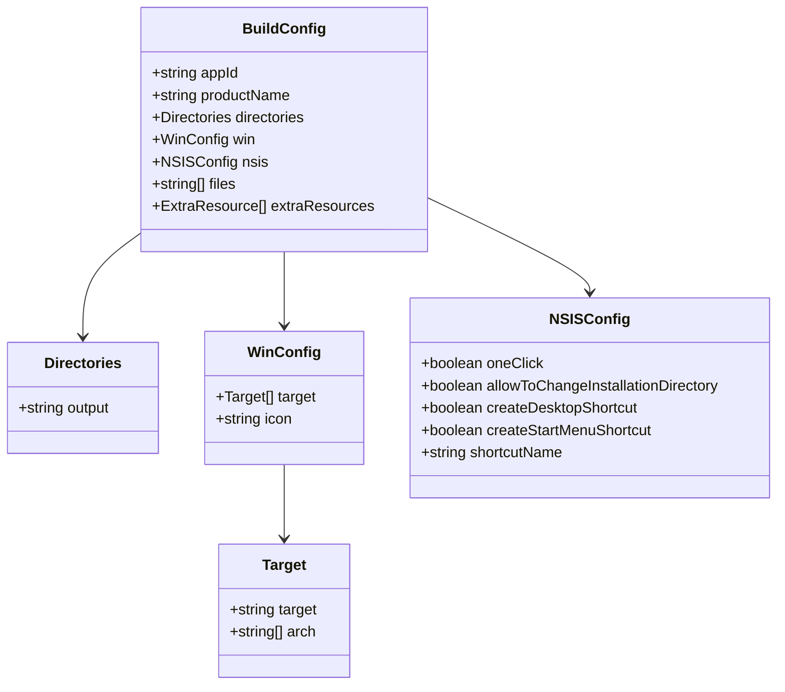
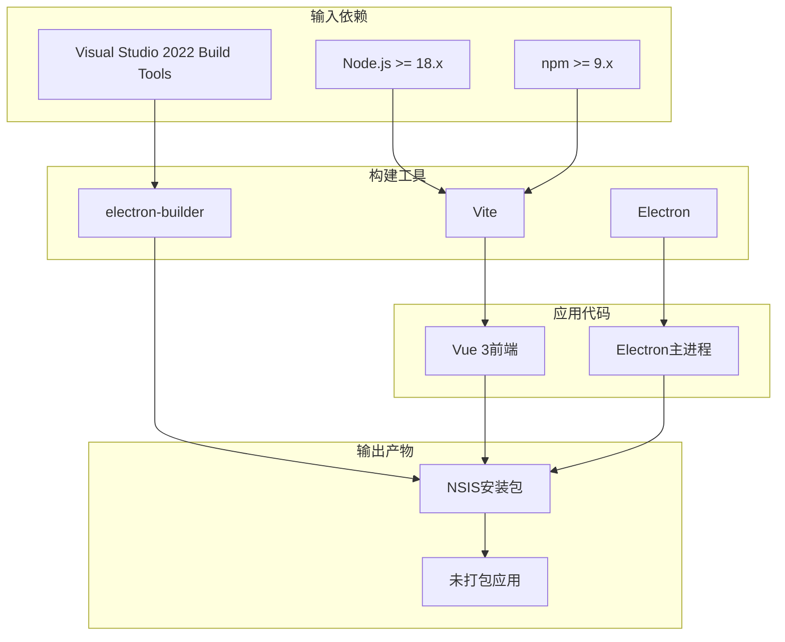

# Windows平台打包

<cite>
**本文引用的文件**
- [build-windows.ps1](file://build-windows.ps1)
- [build-windows.bat](file://build-windows.bat)
- [package.json](file://package.json)
- [vite.config.js](file://vite.config.js)
- [.npmrc](file://.npmrc)
- [README.md](file://README.md)
- [electron/main.js](file://electron/main.js)
- [convert-icon.bat](file://convert-icon.bat)
</cite>

## 目录
1. [简介](#简介)
2. [项目结构](#项目结构)
3. [核心组件](#核心组件)
4. [架构概览](#架构概览)
5. [详细组件分析](#详细组件分析)
6. [依赖关系分析](#依赖关系分析)
7. [性能考虑](#性能考虑)
8. [故障排除指南](#故障排除指南)
9. [结论](#结论)
10. [附录](#附录)

## 简介
本指南详细说明了Windows平台下EPUB Reader桌面应用的打包流程。项目提供了两种打包脚本：PowerShell脚本build-windows.ps1和批处理脚本build-windows.bat，两者都实现了相同的打包逻辑，但PowerShell版本具有更好的用户体验和错误处理能力。

## 项目结构
项目采用典型的Electron + Vue 3 + Vite架构，包含以下关键目录：
- `electron/`: Electron主进程和预加载脚本
- `src/`: Vue 3前端源码
- `public/`: 静态资源文件
- 根目录包含打包脚本和配置文件

**图表来源**
- [build-windows.ps1:1-103](file://build-windows.ps1#L1-L103)
- [build-windows.bat:1-113](file://build-windows.bat#L1-L113)
- [package.json:1-82](file://package.json#L1-L82)

**章节来源**
- [build-windows.ps1:1-103](file://build-windows.ps1#L1-L103)
- [build-windows.bat:1-113](file://build-windows.bat#L1-L113)
- [package.json:1-82](file://package.json#L1-L82)

## 核心组件
本项目的Windows打包主要由以下核心组件构成：

### 1. 打包脚本组件
- **PowerShell版本** (build-windows.ps1): 提供彩色输出、详细错误提示和交互式反馈
- **批处理版本** (build-windows.bat): 兼容性更好，适用于所有Windows系统

### 2. 构建配置组件
- **package.json**: 定义打包配置、目标平台和输出目录
- **vite.config.js**: Vite构建工具配置
- **.npmrc**: npm配置文件，包含镜像源和环境变量

### 3. Electron集成组件
- **electron/main.js**: 主进程入口，负责应用生命周期管理
- **electron/preload.js**: 预加载脚本，提供安全的IPC通信

**章节来源**
- [build-windows.ps1:64-69](file://build-windows.ps1#L64-L69)
- [build-windows.bat:69-74](file://build-windows.bat#L69-L74)
- [package.json:42-81](file://package.json#L42-L81)

## 架构概览
Windows打包流程采用分层架构，从环境检查到最终输出形成完整的流水线。

**图表来源**
- [build-windows.ps1:9-76](file://build-windows.ps1#L9-L76)
- [build-windows.bat:10-81](file://build-windows.bat#L10-L81)

## 详细组件分析

### PowerShell打包脚本 (build-windows.ps1)
PowerShell版本提供了更丰富的用户交互和错误处理机制。

#### 核心功能流程
1. **环境检查阶段**
   - 验证Node.js安装状态
   - 检查npm可用性
   - 显示版本信息

2. **清理阶段**
   - 删除dist目录
   - 安全删除dist-electron目录
   - 处理文件占用情况

3. **依赖管理**
   - 检测node_modules是否存在
   - 自动执行npm install
   - 错误恢复机制

4. **打包执行**
   - 设置MSVS版本为2022
   - 配置Electron镜像源
   - 执行electron:build脚本

#### 错误处理机制

**图表来源**
- [build-windows.ps1:10-76](file://build-windows.ps1#L10-L76)

#### 输出文件处理
脚本会自动检测生成的安装包并显示详细信息：
- 安装包位置：`dist-electron\EPUB Reader Setup 1.0.0.exe`
- 文件大小计算和显示
- 可选的自动打开输出文件夹功能

**章节来源**
- [build-windows.ps1:10-103](file://build-windows.ps1#L10-L103)

### 批处理打包脚本 (build-windows.bat)
批处理版本保持了最大的兼容性，适用于所有Windows系统。

#### 主要特点
- **兼容性强**: 适用于所有Windows版本
- **简洁明了**: 基础的命令行界面
- **错误处理**: 基础的错误级别检查

#### 执行流程对比
| 步骤 | PowerShell版本 | 批处理版本 |
|------|----------------|------------|
| 环境检查 | 使用where命令和版本查询 | 直接调用node --version |
| 错误处理 | 详细的错误消息和恢复 | 基础的errorlevel检查 |
| 用户交互 | 彩色输出和进度提示 | 简单的文本提示 |
| 文件清理 | 详细的清理状态报告 | 基础的清理确认 |

**章节来源**
- [build-windows.bat:10-113](file://build-windows.bat#L10-L113)

### 构建配置分析
#### package.json中的打包配置

**图表来源**
- [package.json:42-81](file://package.json#L42-L81)

#### 关键配置说明
- **输出目录**: `dist-electron` - 所有打包产物的输出位置
- **目标平台**: Windows (NSIS安装器)
- **架构**: x64
- **图标**: `public/logo-256.ico`
- **额外资源**: 包含数据库文件夹

**章节来源**
- [package.json:42-81](file://package.json#L42-L81)

### 环境变量配置
#### 自动设置的环境变量
1. **MSVS版本**: `msvs_version=2022`
   - 用于编译原生模块（如better-sqlite3）
   - 确保与Visual Studio 2022 Build Tools兼容

2. **Electron镜像源**: `npm_config_electron_mirror=https://npmmirror.com/mirrors/electron/`
   - 加速Electron运行时下载
   - 解决GitHub访问问题

#### 持久化配置
项目还提供了.npmrc文件，包含：
- npm registry镜像源配置
- MSVS版本持久化设置
- Electron镜像源配置

**章节来源**
- [build-windows.ps1:65-66](file://build-windows.ps1#L65-L66)
- [build-windows.bat:70-71](file://build-windows.bat#L70-L71)
- [.npmrc:1-7](file://.npmrc#L1-L7)

### Vite构建配置
Vite作为构建工具，提供了快速的开发服务器和高效的生产构建。

#### 关键配置项
- **插件系统**: Vue 3插件支持
- **路径别名**: `@` 指向 `src` 目录
- **开发服务器**: 端口5173，严格端口模式
- **基础路径**: 相对路径配置

**章节来源**
- [vite.config.js:1-18](file://vite.config.js#L1-L18)

## 依赖关系分析

### 打包流程依赖图

**图表来源**
- [README.md:77-82](file://README.md#L77-L82)
- [package.json:30-41](file://package.json#L30-L41)

### 关键依赖说明
1. **运行时依赖**:
   - `better-sqlite3`: SQLite数据库支持
   - `epubjs`: EPUB文件解析
   - `vue`: 前端框架

2. **开发依赖**:
   - `electron`: 桌面应用框架
   - `electron-builder`: 应用打包工具
   - `vite`: 构建工具

**章节来源**
- [package.json:22-41](file://package.json#L22-L41)
- [README.md:32-41](file://README.md#L32-L41)

## 性能考虑

### 构建性能优化策略
1. **镜像源加速**
   - 使用淘宝镜像源加速npm包下载
   - 配置Electron镜像源减少下载时间

2. **增量构建**
   - Vite提供快速的热重载和增量编译
   - electron-builder支持增量更新

3. **并行处理**
   - PowerShell版本提供更好的并发处理能力
   - 批处理版本保持简单高效

### 首次构建时间
- **总时长**: 5-15分钟
- **主要耗时**: Electron运行时下载和原生模块编译
- **后续构建**: 快速增量构建

**章节来源**
- [README.md:71](file://README.md#L71)

## 故障排除指南

### 常见问题及解决方案

#### 1. Node.js版本问题
**症状**: 依赖安装失败或编译错误
**解决方案**: 
- 确保使用Node.js 18或更高版本
- 使用nvm管理多个Node.js版本

#### 2. Visual Studio版本不匹配
**症状**: better-sqlite3编译失败
**解决方案**:
- 安装Visual Studio 2022 Build Tools
- 确保环境变量`msvs_version=2022`正确设置

#### 3. 文件占用问题
**症状**: 无法删除dist-electron目录
**解决方案**:
- 关闭所有EPUB Reader相关进程
- 在任务管理器中结束相关进程
- 重新运行打包脚本

#### 4. 网络连接问题
**症状**: 无法下载Electron运行时
**解决方案**:
- 确认网络连接正常
- 检查防火墙设置
- 使用代理服务器

#### 5. 打包失败处理
**症状**: electron:build命令执行失败
**解决方案**:
- 检查package.json中的构建配置
- 验证图标文件存在且格式正确
- 查看详细的错误日志

### 调试技巧
1. **查看详细日志**: 在PowerShell中运行脚本以获得完整错误信息
2. **检查依赖完整性**: 确保所有npm包正确安装
3. **验证配置文件**: 检查package.json和.vite配置文件
4. **清理缓存**: 使用`npm cache clean --force`清理npm缓存

**章节来源**
- [README.md:370-420](file://README.md#L370-L420)

## 结论
本项目的Windows打包方案提供了完整的自动化流程，包括环境检查、依赖管理、构建执行和输出处理。PowerShell版本提供了更好的用户体验，而批处理版本确保了最大的兼容性。通过合理的配置和错误处理机制，用户可以轻松地将EPUB Reader应用打包为Windows安装程序。

## 附录

### 输出文件说明
打包完成后，将在`dist-electron`目录生成以下文件：
- **EPUB Reader Setup 1.0.0.exe**: 主安装程序（约87 MB）
- **EPUB Reader Setup 1.0.0.exe.blockmap**: 增量更新文件
- **win-unpacked/**: 未打包的应用程序文件夹

### 使用方法总结
1. **PowerShell方式**: `.\build-windows.ps1`
2. **批处理方式**: `build-windows.bat`
3. **npm脚本方式**: `npm run build:win`

### 最佳实践建议
1. **定期清理**: 每次打包前清理旧的构建文件
2. **测试验证**: 在干净的Windows环境中测试安装包
3. **版本管理**: 修改package.json中的版本号后重新打包
4. **备份配置**: 重要配置文件做好版本控制