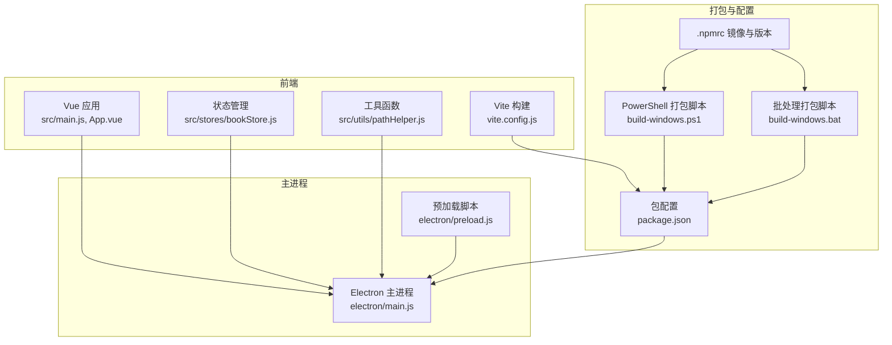
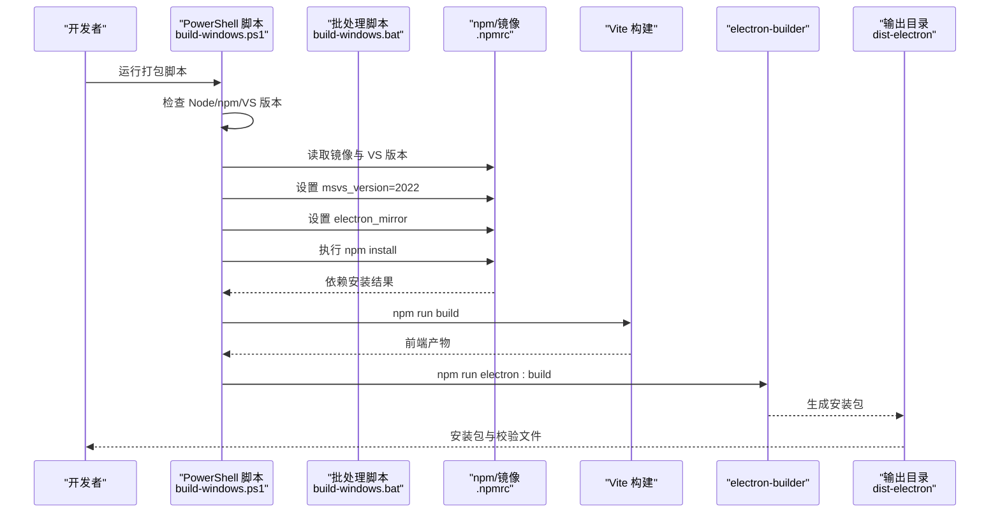
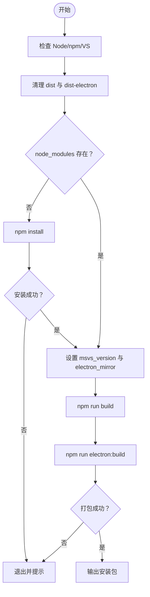
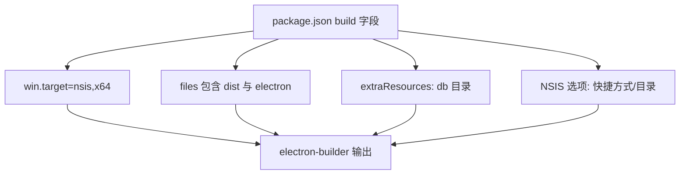
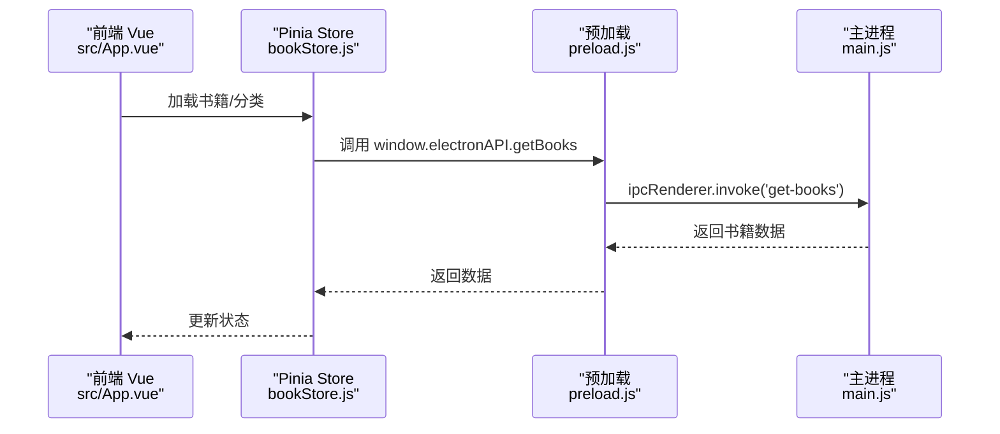
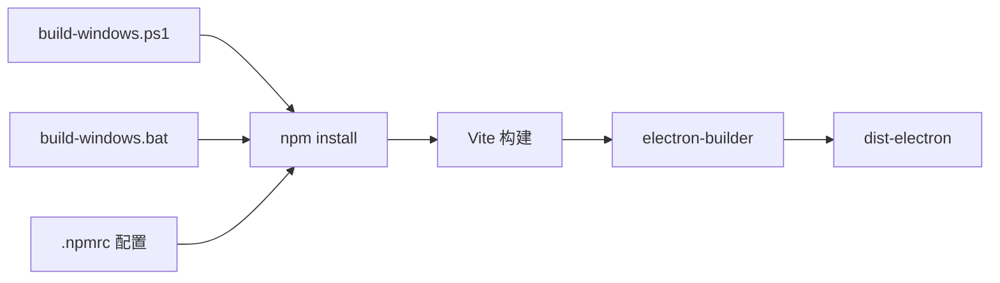

# 打包故障排除

<cite>
**本文引用的文件**
- [package.json](file://package.json)
- [vite.config.js](file://vite.config.js)
- [build-windows.bat](file://build-windows.bat)
- [build-windows.ps1](file://build-windows.ps1)
- [electron/main.js](file://electron/main.js)
- [.npmrc](file://.npmrc)
- [README.md](file://README.md)
- [docs/ICON_FIX_GUIDE.md](file://docs/ICON_FIX_GUIDE.md)
- [docs/DATA_STORAGE.md](file://docs/DATA_STORAGE.md)
- [src/main.js](file://src/main.js)
- [src/App.vue](file://src/App.vue)
- [src/stores/bookStore.js](file://src/stores/bookStore.js)
- [src/utils/pathHelper.js](file://src/utils/pathHelper.js)
- [electron/preload.js](file://electron/preload.js)
</cite>

## 目录
1. [简介](#简介)
2. [项目结构](#项目结构)
3. [核心组件](#核心组件)
4. [架构总览](#架构总览)
5. [详细组件分析](#详细组件分析)
6. [依赖关系分析](#依赖关系分析)
7. [性能考虑](#性能考虑)
8. [故障排除指南](#故障排除指南)
9. [结论](#结论)
10. [附录](#附录)

## 简介
本指南聚焦于本项目在打包过程中常见的问题与解决方案，覆盖 Node.js 版本不兼容、npm 依赖安装失败、Visual Studio 构建工具缺失、权限问题、图标配置不当、打包产物被占用、以及 CI/CD 集成等主题。文档同时提供诊断思路、日志定位方法、跨平台注意事项与性能优化建议，帮助你建立可重复的构建环境并稳定产出安装包。

## 项目结构
该项目采用 Electron + Vue 3 + Vite 的组合，前端通过 Vite 构建，主进程负责窗口、数据库与 IPC，打包由 electron-builder 完成。Windows 平台提供 PowerShell 与批处理两种打包脚本，自动检测环境、清理旧产物、安装依赖并执行打包。

**图表来源**
- [vite.config.js:1-18](file://vite.config.js#L1-L18)
- [src/main.js:1-11](file://src/main.js#L1-L11)
- [src/App.vue:1-64](file://src/App.vue#L1-L64)
- [src/stores/bookStore.js:1-234](file://src/stores/bookStore.js#L1-L234)
- [src/utils/pathHelper.js:1-63](file://src/utils/pathHelper.js#L1-L63)
- [electron/main.js:1-820](file://electron/main.js#L1-L820)
- [electron/preload.js:1-95](file://electron/preload.js#L1-L95)
- [package.json:1-82](file://package.json#L1-L82)
- [.npmrc:1-7](file://.npmrc#L1-L7)
- [build-windows.ps1:1-103](file://build-windows.ps1#L1-L103)
- [build-windows.bat:1-113](file://build-windows.bat#L1-L113)

**章节来源**
- [README.md:167-194](file://README.md#L167-L194)
- [package.json:1-82](file://package.json#L1-L82)
- [vite.config.js:1-18](file://vite.config.js#L1-L18)
- [build-windows.ps1:1-103](file://build-windows.ps1#L1-L103)
- [build-windows.bat:1-113](file://build-windows.bat#L1-L113)

## 核心组件
- 打包配置与目标
  - electron-builder 目标为 NSIS 安装器，x64 架构，输出目录 dist-electron，包含数据库资源复制。
- 构建脚本
  - PowerShell 与批处理脚本均执行：环境检查、清理旧产物、依赖安装、前端构建、electron:build。
- 镜像与工具链
  - .npmrc 指定淘宝镜像与 VS 版本，提升依赖与原生模块编译成功率。
- 前端与主进程
  - Vite 配置、Vue 应用入口、主进程数据库初始化与 IPC、预加载桥接 API。

**章节来源**
- [package.json:42-80](file://package.json#L42-L80)
- [build-windows.ps1:9-75](file://build-windows.ps1#L9-L75)
- [build-windows.bat:10-81](file://build-windows.bat#L10-L81)
- [.npmrc:1-7](file://.npmrc#L1-L7)
- [vite.config.js:1-18](file://vite.config.js#L1-L18)
- [electron/main.js:167-284](file://electron/main.js#L167-L284)
- [electron/preload.js:7-92](file://electron/preload.js#L7-L92)

## 架构总览
下面的序列图展示了 Windows 打包的关键流程与关键节点，便于定位失败环节。

**图表来源**
- [build-windows.ps1:9-75](file://build-windows.ps1#L9-L75)
- [build-windows.bat:10-81](file://build-windows.bat#L10-L81)
- [.npmrc:1-7](file://.npmrc#L1-7)
- [package.json:6-12](file://package.json#L6-L12)

## 详细组件分析

### 打包脚本（PowerShell 与批处理）
- 功能要点
  - 环境检查：Node.js、npm、VS 版本。
  - 清理：dist 与 dist-electron，若被占用给出明确提示。
  - 依赖：检测 node_modules，不存在则安装；安装失败直接退出。
  - 打包：设置 msvs_version 与 electron_mirror，执行 npm run electron:build。
- 常见失败点
  - VS 版本不匹配导致原生模块编译失败。
  - 网络受限导致 electron-builder 下载 Electron 失败。
  - dist-electron 被占用（进程残留）。
  - 依赖安装失败（权限或缓存问题）。

**图表来源**
- [build-windows.ps1:9-75](file://build-windows.ps1#L9-L75)
- [build-windows.bat:10-81](file://build-windows.bat#L10-L81)

**章节来源**
- [build-windows.ps1:9-75](file://build-windows.ps1#L9-L75)
- [build-windows.bat:10-81](file://build-windows.bat#L10-L81)

### electron-builder 配置与 NSIS 安装器
- 目标与架构
  - win.target: nsis, arch: x64。
- 输出与资源
  - 输出目录 dist-electron，复制 db 目录到安装包内。
- NSIS 选项
  - 允许自定义安装目录、创建桌面/开始菜单快捷方式。
- 常见问题
  - 图标尺寸不足导致安装器图标模糊或打包警告。
  - 未正确设置 icon 路径或类型。

**图表来源**
- [package.json:42-80](file://package.json#L42-L80)

**章节来源**
- [package.json:42-80](file://package.json#L42-L80)
- [docs/ICON_FIX_GUIDE.md:1-101](file://docs/ICON_FIX_GUIDE.md#L1-L101)

### .npmrc 镜像与工具链
- 镜像与版本
  - registry 指向 npmmirror.com。
  - msvs_version=2022。
  - electron_mirror 指向 npmmirror.com/mirrors/electron/。
- 作用
  - 加速依赖下载，减少因网络导致的安装/编译失败。
  - 指定 VS 版本以匹配原生模块编译需求。

**章节来源**
- [.npmrc:1-7](file://.npmrc#L1-L7)
- [build-windows.ps1:64-66](file://build-windows.ps1#L64-L66)
- [build-windows.bat:70-71](file://build-windows.bat#L70-L71)

### 前端构建与主进程交互
- Vite 配置
  - 插件：@vitejs/plugin-vue。
  - 别名：@ -> src。
  - 严格端口：5173。
- 主进程职责
  - 初始化数据库、创建窗口、IPC 处理、文件与封面保存。
- 预加载桥接
  - 通过 contextBridge 暴露 window.electronAPI，供前端调用。

**图表来源**
- [src/App.vue:18-41](file://src/App.vue#L18-L41)
- [src/stores/bookStore.js:12-22](file://src/stores/bookStore.js#L12-L22)
- [electron/preload.js:12-14](file://electron/preload.js#L12-L14)
- [electron/main.js:429-449](file://electron/main.js#L429-L449)

**章节来源**
- [vite.config.js:1-18](file://vite.config.js#L1-L18)
- [electron/main.js:167-284](file://electron/main.js#L167-L284)
- [electron/preload.js:7-92](file://electron/preload.js#L7-L92)
- [src/App.vue:18-41](file://src/App.vue#L18-L41)
- [src/stores/bookStore.js:12-22](file://src/stores/bookStore.js#L12-L22)

## 依赖关系分析
- 打包链路
  - build-windows.ps1/bat -> npm install -> npm run build -> npm run electron:build -> dist-electron。
- 关键耦合点
  - VS 版本与原生模块编译（better-sqlite3）。
  - electron-builder 与 NSIS 配置。
  - 镜像与网络环境。
- 潜在环路
  - 无直接循环依赖；但若脚本未清理 dist-electron，可能导致后续打包失败。

**图表来源**
- [build-windows.ps1:9-75](file://build-windows.ps1#L9-L75)
- [build-windows.bat:10-81](file://build-windows.bat#L10-L81)
- [package.json:6-12](file://package.json#L6-L12)
- [.npmrc:1-7](file://.npmrc#L1-L7)

**章节来源**
- [build-windows.ps1:9-75](file://build-windows.ps1#L9-L75)
- [build-windows.bat:10-81](file://build-windows.bat#L10-L81)
- [package.json:6-12](file://package.json#L6-L12)
- [.npmrc:1-7](file://.npmrc#L1-L7)

## 性能考虑
- 依赖安装加速
  - 使用淘宝镜像与 electron 镜像，减少网络抖动影响。
- 原生模块编译
  - 明确 msvs_version=2022，避免版本不匹配导致的多次重试。
- 构建缓存
  - 保持 node_modules 与 dist 缓存，减少重复安装与构建时间。
- 打包体积
  - 控制 extraResources，仅包含必要 db 目录。
- 并行与顺序
  - 前端构建与打包串行执行，避免资源竞争。

[本节为通用建议，无需特定文件引用]

## 故障排除指南

### 1) Node.js 版本不兼容
- 症状
  - npm install/better-sqlite3 编译报错，或 electron-builder 报版本不匹配。
- 诊断
  - 检查脚本中的 Node/npm/VS 版本检查是否通过。
- 解决
  - 使用 nvm 切换到 Node.js 18+。
  - 确认 .npmrc 中 msvs_version=2022。
- 预防
  - 在 CI 中固定 Node 版本矩阵，避免漂移。

**章节来源**
- [README.md:372-380](file://README.md#L372-L380)
- [.npmrc:3](file://.npmrc#L3)
- [build-windows.ps1:10-16](file://build-windows.ps1#L10-L16)
- [build-windows.bat:18](file://build-windows.bat#L18)

### 2) npm 依赖安装失败
- 症状
  - npm install 失败，脚本退出。
- 诊断
  - 查看脚本输出与 npm 日志；检查 .npmrc 配置。
- 解决
  - 清理缓存后重试；使用 --ignore-scripts 临时绕过安装脚本。
  - 确保网络可达 npmmirror.com。
- 预防
  - 在 CI 中缓存 node_modules 与 npm 镜像缓存。

**章节来源**
- [build-windows.ps1:48-58](file://build-windows.ps1#L48-L58)
- [build-windows.bat:52-63](file://build-windows.bat#L52-L63)
- [.npmrc:1-2](file://.npmrc#L1-L2)

### 3) Visual Studio 构建工具缺失或版本不匹配
- 症状
  - better-sqlite3 编译失败，electron-builder 原生模块编译失败。
- 诊断
  - 查看编译日志中的 VS 版本提示。
- 解决
  - 安装 Visual Studio 2022 Build Tools。
  - 确保 msvs_version=2022 生效。
- 预防
  - 在 CI 镜像中预装 VS 2022。

**章节来源**
- [README.md:389-394](file://README.md#L389-L394)
- [.npmrc:3](file://.npmrc#L3)
- [build-windows.ps1:64-66](file://build-windows.ps1#L64-L66)
- [build-windows.bat:70](file://build-windows.bat#L70)

### 4) 权限问题（Windows）
- 症状
  - 无法写入用户数据目录或安装包输出目录。
- 诊断
  - 检查 dist-electron 是否被占用；查看主进程日志。
- 解决
  - 以管理员权限运行脚本；确保输出目录可写。
- 预防
  - CI 使用专用服务账户并授予必要权限。

**章节来源**
- [docs/DATA_STORAGE.md:1-42](file://docs/DATA_STORAGE.md#L1-L42)
- [build-windows.ps1:34-44](file://build-windows.ps1#L34-L44)
- [build-windows.bat:39-48](file://build-windows.bat#L39-L48)

### 5) 打包产物被占用
- 症状
  - 删除 dist-electron 失败，提示进程占用。
- 诊断
  - 任务管理器检查残留进程。
- 解决
  - 关闭所有相关窗口与进程后重试。
- 预防
  - 打包前强制关闭应用实例。

**章节来源**
- [build-windows.ps1:34-44](file://build-windows.ps1#L34-L44)
- [build-windows.bat:39-48](file://build-windows.bat#L39-L48)

### 6) 图标配置不当
- 症状
  - 安装包图标模糊或打包警告。
- 诊断
  - 检查 package.json 中 icon 路径与尺寸。
- 解决
  - 使用 256x256 ICO；或按指南更新配置。
- 预防
  - 使用 convert-icon.bat 或在线工具生成高质量 ICO。

**章节来源**
- [docs/ICON_FIX_GUIDE.md:1-101](file://docs/ICON_FIX_GUIDE.md#L1-L101)
- [package.json:71](file://package.json#L71)

### 7) 无法下载 Electron
- 症状
  - electron-builder 下载 Electron 超时或失败。
- 诊断
  - 检查网络与镜像配置。
- 解决
  - 使用 .npmrc 中的 electron_mirror；确保网络连通。
- 预防
  - 在 CI 中配置代理与镜像缓存。

**章节来源**
- [build-windows.ps1:64-66](file://build-windows.ps1#L64-L66)
- [build-windows.bat:70-71](file://build-windows.bat#L70-L71)
- [.npmrc:5-6](file://.npmrc#L5-L6)

### 8) 安装后无法打开或功能异常
- 症状
  - 安装成功但启动即退出或功能异常。
- 诊断
  - 查看控制台日志；确认数据库路径与权限。
- 解决
  - 检查用户数据目录写入权限；核对日志中的错误堆栈。
- 预防
  - 在 CI 中模拟真实用户目录进行测试。

**章节来源**
- [docs/DATA_STORAGE.md:1-42](file://docs/DATA_STORAGE.md#L1-L42)
- [README.md:410-419](file://README.md#L410-L419)

### 9) 诊断构建错误的方法
- 日志分析
  - PowerShell/批处理脚本输出；electron-builder 输出；主进程日志。
- 环境检查
  - Node/npm/VS 版本；网络与镜像；磁盘空间与权限。
- 依赖冲突排查
  - 清理 node_modules 与缓存；锁定版本；使用 --verbose 查看依赖树。

**章节来源**
- [build-windows.ps1:10-75](file://build-windows.ps1#L10-L75)
- [build-windows.bat:18-81](file://build-windows.bat#L18-L81)
- [README.md:454-483](file://README.md#L454-L483)

### 10) 不同操作系统下的特殊注意事项
- Windows
  - 使用 PowerShell 脚本更友好；确保 VS 2022；注意 dist-electron 占用。
- macOS/Linux
  - electron-builder 需要对应平台依赖；NSIS 仅适用于 Windows。
  - 建议在 CI 中使用官方镜像或容器，预装编译依赖。

**章节来源**
- [package.json:62-72](file://package.json#L62-L72)
- [README.md:260-368](file://README.md#L260-L368)

### 11) 打包性能优化建议
- 使用镜像与缓存
  - .npmrc 指定镜像；CI 缓存 node_modules 与 npm 镜像。
- 减少打包体积
  - 控制 extraResources；剔除开发依赖。
- 并行与流水线
  - 前端构建与打包串行；在 CI 中并行执行多平台构建。

**章节来源**
- [.npmrc:1-7](file://.npmrc#L1-L7)
- [package.json:53-61](file://package.json#L53-L61)

### 12) 创建可重复的构建环境与 CI/CD 集成
- 可重复环境
  - 固定 Node 版本；使用 .npmrc；统一 VS 版本。
- CI/CD 建议
  - 使用专用构建机或容器；缓存依赖与镜像；分阶段构建与测试；产物签名与校验。
- 集成点
  - 脚本入口：npm run build:win；打包命令：npm run electron:build。

**章节来源**
- [README.md:260-368](file://README.md#L260-L368)
- [build-windows.ps1:68-69](file://build-windows.ps1#L68-L69)
- [build-windows.bat:74](file://build-windows.bat#L74)

## 结论
通过规范的环境检查、镜像与工具链配置、清晰的日志与诊断流程，以及 CI/CD 的标准化集成，可以显著降低打包失败的概率并提升稳定性。针对本项目，重点在于确保 VS 2022、Node 18+、镜像可用与 dist-electron 释放，配合合理的图标与资源配置，即可获得高质量的安装包。

## 附录

### A. 关键配置与路径速查
- 打包目标与输出
  - 目标：nsis；架构：x64；输出：dist-electron。
- 资源复制
  - db 目录复制至安装包。
- 图标
  - 当前使用 PNG；建议使用 256x256 ICO。
- 镜像与工具链
  - registry 与 electron_mirror；msvs_version=2022。

**章节来源**
- [package.json:62-80](file://package.json#L62-L80)
- [docs/ICON_FIX_GUIDE.md:29-38](file://docs/ICON_FIX_GUIDE.md#L29-L38)
- [.npmrc:1-7](file://.npmrc#L1-L7)

### B. 前端与主进程交互要点
- 前端入口与状态管理
  - src/main.js、App.vue、bookStore.js。
- 预加载与 IPC
  - preload.js 暴露 window.electronAPI；main.js 实现 IPC 处理。
- 路径工具
  - pathHelper.js 统一 file:// URL 构建逻辑。

**章节来源**
- [src/main.js:1-11](file://src/main.js#L1-L11)
- [src/App.vue:18-41](file://src/App.vue#L18-L41)
- [src/stores/bookStore.js:12-22](file://src/stores/bookStore.js#L12-L22)
- [electron/preload.js:7-92](file://electron/preload.js#L7-L92)
- [electron/main.js:167-284](file://electron/main.js#L167-L284)
- [src/utils/pathHelper.js:13-53](file://src/utils/pathHelper.js#L13-L53)