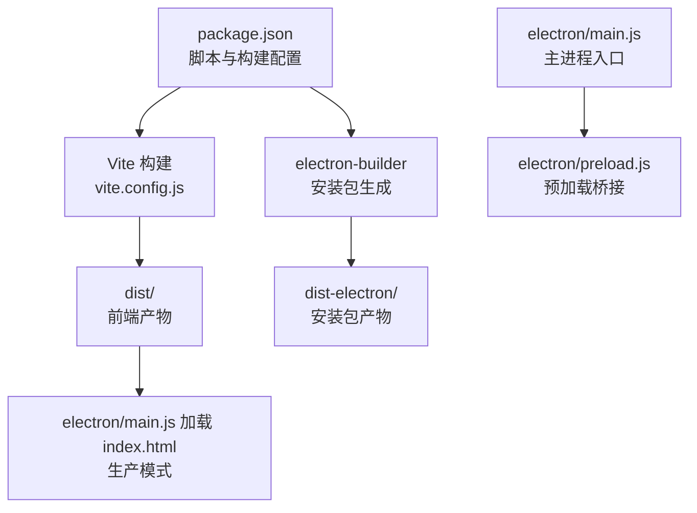
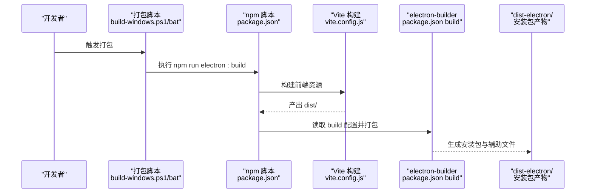
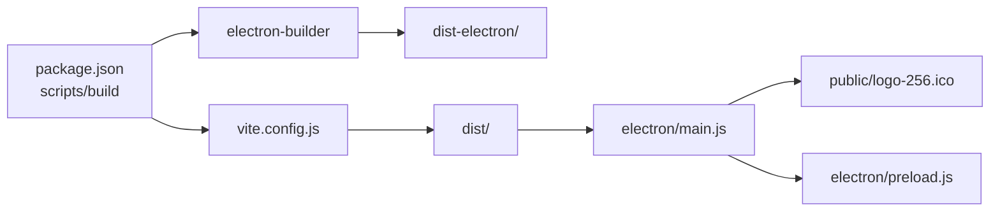

# 构建配置

<cite>
**本文引用的文件**
- [package.json](file://package.json)
- [vite.config.js](file://vite.config.js)
- [build-windows.bat](file://build-windows.bat)
- [build-windows.ps1](file://build-windows.ps1)
- [electron/main.js](file://electron/main.js)
- [electron/preload.js](file://electron/preload.js)
- [convert-icon.bat](file://convert-icon.bat)
- [README.md](file://README.md)
</cite>

## 目录
1. [简介](#简介)
2. [项目结构](#项目结构)
3. [核心组件](#核心组件)
4. [架构总览](#架构总览)
5. [详细组件分析](#详细组件分析)
6. [依赖关系分析](#依赖关系分析)
7. [性能考虑](#性能考虑)
8. [故障排除指南](#故障排除指南)
9. [结论](#结论)
10. [附录](#附录)

## 简介
本文件面向构建工程师与运维人员，系统性说明本项目的构建配置，重点覆盖：
- package.json 中 electron-builder 的关键配置项与高级选项（应用标识符、产品名、版本号、构建目标、NSIS 安装器、图标、快捷方式、额外资源等）
- Vite 构建配置对 Electron 应用的影响（前端资源打包、静态文件处理、开发服务器端口等）
- 不同构建场景的配置示例（开发调试、生产发布、Windows 安装包、便携版思路）
- 构建优化策略与性能调优建议

## 项目结构
本项目采用“前端（Vite + Vue）+ Electron 主进程 + 预加载脚本”的典型架构。构建流程由脚本驱动，先通过 Vite 构建前端资源，再由 electron-builder 打包为可分发安装包。

图表来源
- [package.json:6-12](file://package.json#L6-L12)
- [vite.config.js:1-18](file://vite.config.js#L1-L18)
- [electron/main.js:286-315](file://electron/main.js#L286-L315)
- [electron/preload.js:1-95](file://electron/preload.js#L1-L95)

章节来源
- [package.json:6-12](file://package.json#L6-L12)
- [vite.config.js:1-18](file://vite.config.js#L1-L18)
- [README.md:167-194](file://README.md#L167-L194)

## 核心组件
- package.json 的 scripts 与 build 字段
  - scripts：定义开发、构建、打包、安装依赖等命令
  - build：electron-builder 的核心配置入口，包含应用标识符、产品名、输出目录、文件打包规则、额外资源、Windows 平台目标与 NSIS 选项
- vite.config.js：前端构建配置，影响打包产物与开发服务器行为
- electron/main.js：主进程入口，负责窗口创建、资源加载、数据库初始化、IPC 通信
- electron/preload.js：预加载脚本，暴露受限 API 至渲染进程
- 打包脚本：build-windows.bat 与 build-windows.ps1，封装环境检查、依赖安装、清理、打包流程与输出提示

章节来源
- [package.json:6-12](file://package.json#L6-L12)
- [package.json:42-80](file://package.json#L42-L80)
- [vite.config.js:1-18](file://vite.config.js#L1-L18)
- [electron/main.js:286-315](file://electron/main.js#L286-L315)
- [electron/preload.js:1-95](file://electron/preload.js#L1-L95)
- [build-windows.bat:1-113](file://build-windows.bat#L1-L113)
- [build-windows.ps1:1-103](file://build-windows.ps1#L1-L103)

## 架构总览
下图展示从脚本到最终安装包的关键流程与关键配置点。

图表来源
- [build-windows.ps1:69](file://build-windows.ps1#L69)
- [build-windows.bat:74](file://build-windows.bat#L74)
- [package.json:10](file://package.json#L10)
- [package.json:42-80](file://package.json#L42-L80)
- [vite.config.js:1-18](file://vite.config.js#L1-L18)

## 详细组件分析

### package.json 中的 electron-builder 配置详解
- 应用标识符与产品名
  - appId：应用唯一标识符，用于 Windows 上的注册表与文件关联
  - productName：安装包与应用显示名称
- 输出目录与文件打包规则
  - directories.output：指定 electron-builder 输出目录
  - files：声明需要被打包进安装包的文件集合（前端 dist、主进程 electron、package.json）
- 额外资源
  - extraResources：将 db 目录作为额外资源复制到应用包内，便于运行时访问
- Windows 平台目标与 NSIS 安装器
  - win.target：配置目标为 nsis，架构为 x64
  - nsis：定制安装器行为（一键安装、允许变更安装目录、创建桌面/开始菜单快捷方式、快捷方式名称）

章节来源
- [package.json:42-80](file://package.json#L42-L80)

### Vite 构建配置对 Electron 应用的影响
- 基础路径与别名
  - base：设置相对路径基础，避免生产环境下静态资源路径错误
  - resolve.alias：将 @ 指向 src，简化导入路径
- 服务器配置
  - server.port：开发服务器端口固定为 5173，便于等待与 Electron 加载
  - server.strictPort：严格端口，避免端口冲突导致的开发失败

章节来源
- [vite.config.js:1-18](file://vite.config.js#L1-L18)
- [electron/main.js:305-310](file://electron/main.js#L305-L310)

### electron/main.js 与预加载脚本的配合
- 主进程窗口加载逻辑
  - 开发模式：加载本地 Vite 服务地址
  - 生产模式：加载 dist/index.html
  - 窗口图标：使用 public/logo-256.ico
- 预加载脚本
  - 通过 contextBridge 暴露受控 API 至渲染进程，统一通过 ipcRenderer.invoke 调用主进程 IPC 处理器

章节来源
- [electron/main.js:286-315](file://electron/main.js#L286-L315)
- [electron/preload.js:1-95](file://electron/preload.js#L1-L95)

### 打包脚本与环境准备
- 环境检查与清理
  - 检查 Node.js 与 npm 是否可用
  - 清理旧的 dist 与 dist-electron 目录
- 依赖安装与环境变量
  - 自动安装依赖（如缺失）
  - 设置 msvs_version 与 npm_config_electron_mirror 以加速原生模块编译与 Electron 下载
- 执行打包与输出提示
  - 调用 npm run electron:build
  - 成功后定位安装包并提示打开输出目录

章节来源
- [build-windows.ps1:1-103](file://build-windows.ps1#L1-L103)
- [build-windows.bat:1-113](file://build-windows.bat#L1-L113)

### 图标与资源转换
- 图标转换辅助脚本
  - convert-icon.bat：引导将 public/icon.png 转换为 ICO 格式，并提示后续打包步骤
- 实际使用图标
  - electron/main.js 与 package.json 中均指向 public/logo-256.ico 作为窗口图标

章节来源
- [convert-icon.bat:1-29](file://convert-icon.bat#L1-L29)
- [electron/main.js:295](file://electron/main.js#L295)
- [package.json:71](file://package.json#L71)

### 不同构建场景的配置示例

- 开发调试
  - 使用 npm run electron:dev 同时启动 Vite 开发服务器与 Electron；主进程在开发模式下加载本地地址并开启开发者工具
  - 适合快速迭代与热更新
- 生产发布（Windows 安装包）
  - 使用 npm run build 生成前端产物，再执行 npm run electron:build 由 electron-builder 生成安装包
  - 打包脚本会自动设置环境变量并清理旧产物，最终在 dist-electron 生成安装包与辅助文件
- 便携版思路
  - 可参考 electron-builder 的多目标配置，在 win.target 中增加 portable 目标，或将打包产物解压后直接运行（需自行处理依赖与图标）
  - 注意：当前配置未启用 portable 目标，如需便携版可扩展 win.target

章节来源
- [package.json:9-12](file://package.json#L9-L12)
- [build-windows.ps1:69](file://build-windows.ps1#L69)
- [build-windows.bat:74](file://build-windows.bat#L74)
- [README.md:260-367](file://README.md#L260-L367)

### 高级配置要点与最佳实践
- NSIS 安装器设置
  - oneClick=false：非一键安装，允许用户自定义安装路径
  - allowToChangeInstallationDirectory=true：允许用户选择安装目录
  - createDesktopShortcut/createStartMenuShortcut：创建桌面与开始菜单快捷方式
  - shortcutName：快捷方式名称
- 图标与资源
  - 确保 public/logo-256.ico 存在且可访问
  - 如需 Linux/macOS，可在对应平台字段补充图标与目标
- 额外资源
  - db 目录通过 extraResources 复制，保证运行时可读写
- 版本号与标识符
  - 修改 package.json 的 version 与 appId，确保每次发布唯一且可识别

章节来源
- [package.json:62-79](file://package.json#L62-L79)
- [package.json:53-61](file://package.json#L53-L61)
- [README.md:306-333](file://README.md#L306-L333)

## 依赖关系分析
- 脚本依赖
  - build-windows.ps1/bat 依赖 npm 脚本 npm run electron:build
  - electron:build 依赖 npm run build（Vite）与 electron-builder
- 构建产物依赖
  - electron/main.js 在生产模式下依赖 dist/index.html
  - electron-builder 依赖 package.json 的 build 配置与 files/extraResources
- 运行时依赖
  - 主进程窗口图标依赖 public/logo-256.ico
  - 预加载脚本通过 contextBridge 暴露 API，渲染进程通过 ipcRenderer.invoke 调用

图表来源
- [package.json:6-12](file://package.json#L6-L12)
- [package.json:42-80](file://package.json#L42-L80)
- [vite.config.js:1-18](file://vite.config.js#L1-L18)
- [electron/main.js:295](file://electron/main.js#L295)
- [electron/preload.js:1-95](file://electron/preload.js#L1-L95)

章节来源
- [package.json:6-12](file://package.json#L6-L12)
- [package.json:42-80](file://package.json#L42-L80)
- [vite.config.js:1-18](file://vite.config.js#L1-L18)
- [electron/main.js:295](file://electron/main.js#L295)
- [electron/preload.js:1-95](file://electron/preload.js#L1-L95)

## 性能考虑
- 构建性能
  - 使用淘宝镜像加速 Electron 下载，减少首次打包耗时
  - 固定开发服务器端口，避免端口冲突导致的重复启动
- 运行性能
  - 主进程启用 WAL 模式提升 SQLite 写入性能
  - 预加载脚本限制 API 暴露范围，降低安全风险与上下文开销
- 打包体积
  - files 与 extraResources 精准控制打包内容，避免冗余资源进入安装包
  - 建议在生产构建中启用压缩与最小化（Vite 默认行为）

章节来源
- [build-windows.ps1:65-66](file://build-windows.ps1#L65-L66)
- [build-windows.bat:70-71](file://build-windows.bat#L70-L71)
- [vite.config.js:13-16](file://vite.config.js#L13-L16)
- [electron/main.js:185-187](file://electron/main.js#L185-L187)
- [package.json:48-61](file://package.json#L48-L61)

## 故障排除指南
- Node.js 与 npm 未安装或不可用
  - 打包脚本会检测并报错，按提示安装或修复 PATH
- better-sqlite3 编译错误
  - 确保安装 Visual Studio 2022 Build Tools，并设置 msvs_version=2022
- 打包失败：无法下载 Electron
  - 脚本已设置 npm_config_electron_mirror，若仍失败检查网络
- 打包失败：文件被占用
  - 关闭所有应用实例，释放 dist 与 dist-electron 目录
- 安装后无法打开
  - 检查用户数据目录写入权限与数据库路径
- 图标不生效
  - 确认 public/logo-256.ico 存在，或使用 convert-icon.bat 转换并放置正确路径

章节来源
- [build-windows.ps1:10-25](file://build-windows.ps1#L10-L25)
- [build-windows.bat:10-30](file://build-windows.bat#L10-L30)
- [README.md:370-420](file://README.md#L370-L420)
- [convert-icon.bat:1-29](file://convert-icon.bat#L1-L29)

## 结论
本项目的构建配置围绕“Vite 前端 + Electron 主进程 + electron-builder 安装包”的标准流程展开。通过明确的脚本、清晰的配置与完善的打包脚本，能够稳定地生成 Windows 安装包。建议在持续集成中复用现有脚本与配置，并根据需要扩展 macOS/Linux 目标与便携版支持。

## 附录

### 常用命令与用途
- npm run dev：启动 Vite 开发服务器
- npm run build：构建前端资源至 dist
- npm run electron:dev：同时启动 Vite 与 Electron（开发）
- npm run electron:build：先构建前端，再由 electron-builder 打包
- npm run build:win：执行 Windows 打包脚本（PowerShell 或批处理）

章节来源
- [package.json:6-12](file://package.json#L6-L12)
- [build-windows.ps1:69](file://build-windows.ps1#L69)
- [build-windows.bat:74](file://build-windows.bat#L74)