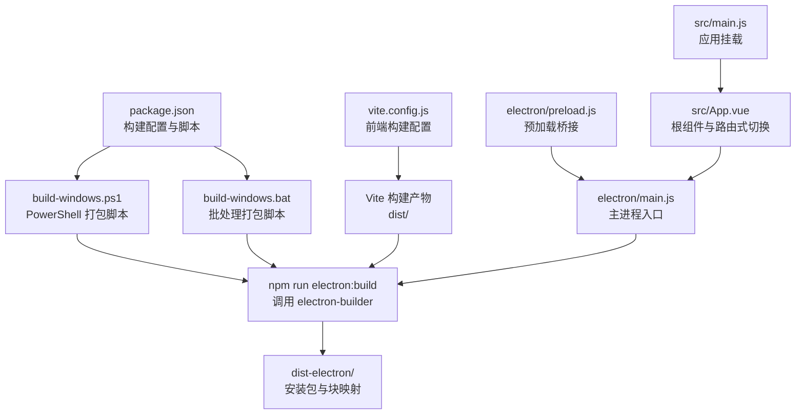
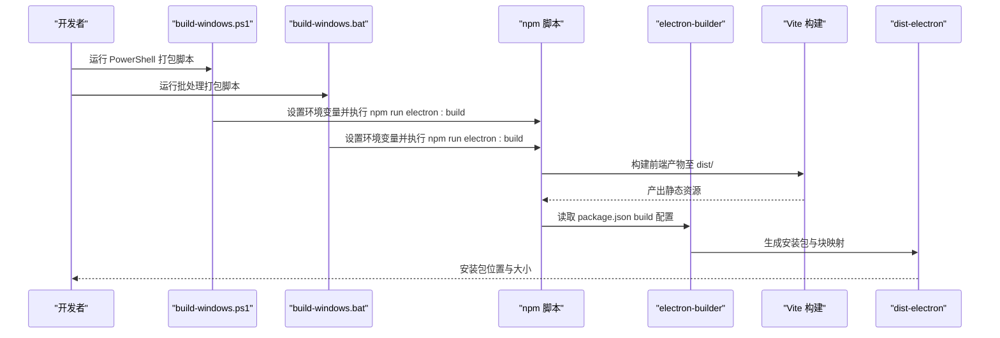
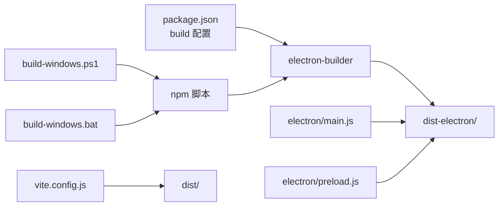

# 部署打包

<cite>
**本文引用的文件**
- [package.json](file://package.json)
- [build-windows.bat](file://build-windows.bat)
- [build-windows.ps1](file://build-windows.ps1)
- [convert-icon.bat](file://convert-icon.bat)
- [vite.config.js](file://vite.config.js)
- [electron/main.js](file://electron/main.js)
- [electron/preload.js](file://electron/preload.js)
- [src/App.vue](file://src/App.vue)
- [src/main.js](file://src/main.js)
- [README.md](file://README.md)
</cite>

## 目录
1. [简介](#简介)
2. [项目结构](#项目结构)
3. [核心组件](#核心组件)
4. [架构总览](#架构总览)
5. [详细组件分析](#详细组件分析)
6. [依赖分析](#依赖分析)
7. [性能考虑](#性能考虑)
8. [故障排除指南](#故障排除指南)
9. [结论](#结论)
10. [附录](#附录)

## 简介
本指南面向在 Windows 平台上部署与打包 ROSAA 电子书阅读器（基于 Electron + Vue 3 + SQLite）的工程师与运维人员。文档覆盖从环境准备、依赖安装、前端构建到 Electron 打包的全流程，重点解释 electron-builder 的配置项（应用标识、产品名称、安装目标、NSIS 安装器设置等），并提供版本管理与增量更新的配置思路、故障排除与性能优化建议，以及不同部署场景的最佳实践。

## 项目结构
项目采用“前端（Vue 3 + Vite）+ Electron 主进程 + 预加载脚本 + 数据库”的分层组织方式。打包脚本负责自动化执行环境检查、清理旧产物、安装依赖、前端构建与 Electron 打包；electron-builder 负责生成 Windows 安装包（NSIS）。

图表来源
- [package.json:42-80](file://package.json#L42-L80)
- [build-windows.ps1:64-69](file://build-windows.ps1#L64-L69)
- [build-windows.bat:70-74](file://build-windows.bat#L70-L74)
- [vite.config.js:1-18](file://vite.config.js#L1-L18)
- [electron/main.js:286-315](file://electron/main.js#L286-L315)
- [electron/preload.js:1-95](file://electron/preload.js#L1-L95)
- [src/App.vue:1-64](file://src/App.vue#L1-L64)
- [src/main.js:1-11](file://src/main.js#L1-L11)

章节来源
- [README.md:167-193](file://README.md#L167-L193)
- [package.json:42-80](file://package.json#L42-L80)
- [vite.config.js:1-18](file://vite.config.js#L1-L18)

## 核心组件
- 打包脚本（PowerShell 与批处理）
  - 自动检查 Node.js 与 npm，清理旧产物，按需安装依赖，设置编译环境变量，调用 electron:build。
- electron-builder 配置
  - 应用标识、产品名称、输出目录、打包文件清单、附加资源、Windows 目标与 NSIS 选项。
- 前端构建（Vite）
  - 基于别名与相对路径的基础配置，确保生产环境静态资源正确引用。
- Electron 主进程与预加载
  - 主进程负责窗口创建、数据库初始化、IPC 处理；预加载脚本暴露安全的 API 桥接。

章节来源
- [build-windows.ps1:9-102](file://build-windows.ps1#L9-L102)
- [build-windows.bat:10-112](file://build-windows.bat#L10-L112)
- [package.json:42-80](file://package.json#L42-L80)
- [vite.config.js:1-18](file://vite.config.js#L1-L18)
- [electron/main.js:286-315](file://electron/main.js#L286-L315)
- [electron/preload.js:1-95](file://electron/preload.js#L1-L95)

## 架构总览
下图展示了从脚本到安装包的端到端流程，以及关键配置项如何影响最终产物。

图表来源
- [build-windows.ps1:64-69](file://build-windows.ps1#L64-L69)
- [build-windows.bat:70-74](file://build-windows.bat#L70-L74)
- [package.json:10-12](file://package.json#L10-L12)
- [package.json:42-80](file://package.json#L42-L80)
- [vite.config.js:1-18](file://vite.config.js#L1-L18)

## 详细组件分析

### 打包脚本（PowerShell 与批处理）
- 功能要点
  - 环境检查：验证 Node.js 与 npm 是否可用。
  - 清理：删除旧的 dist 与 dist-electron 目录（若被占用会提示手动释放）。
  - 依赖：若 node_modules 不存在则执行安装。
  - 构建：设置编译环境变量（MSVS 版本与 Electron 镜像），执行 npm run electron:build。
  - 结果：打印安装包路径与大小，支持一键打开输出目录。
- 使用建议
  - PowerShell 脚本提供更友好的彩色输出与错误提示，推荐优先使用。
  - 批处理脚本兼容性更好，适合在受限环境中使用。

章节来源
- [build-windows.ps1:9-102](file://build-windows.ps1#L9-L102)
- [build-windows.bat:10-112](file://build-windows.bat#L10-L112)

### electron-builder 配置详解
- 应用标识与产品名称
  - appId：用于唯一标识应用，避免多版本冲突。
  - productName：安装包与快捷方式显示名称。
- 输出目录
  - directories.output：指定打包产物输出目录（默认 dist-electron）。
- 打包文件清单
  - files：声明需要打包的前端产物、主进程与 package.json。
- 附加资源
  - extraResources：将 db 目录作为资源复制到应用目录，便于运行时读取。
- Windows 目标与架构
  - win.target：配置为 nsis，架构为 x64。
- NSIS 安装器设置
  - oneClick：非一键安装，允许用户自定义安装路径。
  - allowToChangeInstallationDirectory：允许用户修改安装目录。
  - createDesktopShortcut / createStartMenuShortcut：创建桌面与开始菜单快捷方式。
  - shortcutName：快捷方式名称。

章节来源
- [package.json:42-80](file://package.json#L42-L80)

### 前端构建（Vite）
- 基础配置
  - plugins：启用 Vue 插件。
  - base：设置相对路径基础，确保打包后静态资源正确加载。
  - alias：将 @ 指向 src，提升导入便捷性。
  - server.port / strictPort：开发服务器端口与严格端口策略。
- 与打包的关系
  - electron-builder 会收集 dist/ 下的静态资源并打包进安装包。

章节来源
- [vite.config.js:1-18](file://vite.config.js#L1-L18)

### Electron 主进程与预加载
- 主进程职责
  - 创建窗口、加载开发或生产页面、初始化数据库、注册 IPC 处理器。
  - 生产环境隐藏菜单栏，设置窗口图标。
- 预加载脚本
  - 通过 contextBridge 暴露受控的 electronAPI，供渲染进程调用。
- 与打包的关系
  - 打包后主进程与预加载脚本随 dist/ 一起被打包进安装包。

章节来源
- [electron/main.js:286-315](file://electron/main.js#L286-L315)
- [electron/preload.js:1-95](file://electron/preload.js#L1-L95)

### 图标转换与验证
- 转换流程
  - 运行 convert-icon.bat，自动打开在线转换站点，按提示将 public/icon.png 转换为 public/logo-256.ico。
- 验证
  - 重新打包后检查桌面快捷方式、任务栏图标、Alt+Tab 切换窗口、安装程序图标与应用窗口标题栏是否使用新图标。

章节来源
- [convert-icon.bat:1-29](file://convert-icon.bat#L1-L29)
- [README.md:197-250](file://README.md#L197-L250)

### 版本管理与增量更新
- 版本管理
  - 修改 package.json 的 version 字段，重新执行打包脚本。
- 增量更新（blockmap）
  - electron-builder 默认生成 blockmap 文件，可用于差分更新（需配合分发服务与客户端逻辑实现）。

章节来源
- [README.md:335-350](file://README.md#L335-L350)
- [package.json:42-80](file://package.json#L42-L80)

## 依赖分析
- 脚本到构建工具链
  - build-windows.ps1 / build-windows.bat -> npm scripts -> electron-builder -> Vite -> dist-electron。
- 配置到产物
  - package.json build 字段决定打包目标、文件清单、附加资源与 NSIS 选项。
- 运行时依赖
  - electron、better-sqlite3、epubjs、pinia、vue、xml2js 等在运行时由 Electron 加载。

图表来源
- [package.json:42-80](file://package.json#L42-L80)
- [build-windows.ps1:64-69](file://build-windows.ps1#L64-L69)
- [build-windows.bat:70-74](file://build-windows.bat#L70-L74)
- [vite.config.js:1-18](file://vite.config.js#L1-L18)
- [electron/main.js:286-315](file://electron/main.js#L286-L315)
- [electron/preload.js:1-95](file://electron/preload.js#L1-L95)

章节来源
- [package.json:30-41](file://package.json#L30-L41)
- [package.json:42-80](file://package.json#L42-L80)

## 性能考虑
- 首次打包耗时较长
  - 需要下载 Electron 运行时与编译原生模块，建议使用内置镜像变量以加速下载。
- 编译环境
  - 确保安装 Visual Studio 2022 Build Tools，设置正确的 MSVS 版本，避免 better-sqlite3 编译失败。
- 产物体积
  - 通过 files 与 extraResources 控制打包内容，避免多余文件进入安装包。
- 运行时性能
  - 主进程启用 SQLite WAL 模式，有助于并发读写性能。

章节来源
- [README.md:75-93](file://README.md#L75-L93)
- [build-windows.ps1:64-66](file://build-windows.ps1#L64-L66)
- [build-windows.bat:70-71](file://build-windows.bat#L70-L71)
- [electron/main.js:185-187](file://electron/main.js#L185-L187)

## 故障排除指南
- Node.js 与 npm 未安装或不在 PATH
  - 现象：脚本报错退出。
  - 处理：安装 Node.js 18+ 与 npm 9+，确保命令可用。
- better-sqlite3 编译错误
  - 现象：原生模块编译失败。
  - 处理：安装 Visual Studio 2022 Build Tools，并设置 msvs_version=2022。
- 无法下载 Electron
  - 现象：网络受限导致下载缓慢或失败。
  - 处理：脚本已配置镜像变量；如仍失败，检查网络或代理。
- 文件被占用（无法删除 dist-electron）
  - 现象：提示目录被占用。
  - 处理：关闭所有相关进程后重试。
- 安装后无法打开
  - 现象：安装成功但启动异常。
  - 处理：检查用户数据目录写权限与控制台日志定位错误。

章节来源
- [README.md:370-420](file://README.md#L370-L420)
- [build-windows.ps1:12-25](file://build-windows.ps1#L12-L25)
- [build-windows.bat:13-28](file://build-windows.bat#L13-L28)

## 结论
通过统一的打包脚本与 electron-builder 配置，ROSAA 电子书阅读器可以在 Windows 平台上稳定地生成 NSIS 安装包。遵循本文档的环境准备、配置说明、故障排除与性能优化建议，可显著提升打包效率与安装包质量。对于版本管理与增量更新，建议结合版本号变更与 blockmap 文件进行持续交付。

## 附录

### 打包步骤清单（Windows）
- 准备环境：安装 Node.js 18+、npm 9+、Visual Studio 2022 Build Tools。
- 生成图标：运行 convert-icon.bat，将 icon.png 转换为 ICO 并放置到 public/。
- 执行打包：使用 PowerShell 脚本或批处理脚本。
- 校验产物：检查 dist-electron 目录下的安装包与块映射文件。
- 分发与签名：根据需要进行代码签名与发布。

章节来源
- [README.md:260-368](file://README.md#L260-L368)
- [convert-icon.bat:1-29](file://convert-icon.bat#L1-L29)
- [build-windows.ps1:64-69](file://build-windows.ps1#L64-L69)
- [build-windows.bat:70-74](file://build-windows.bat#L70-L74)