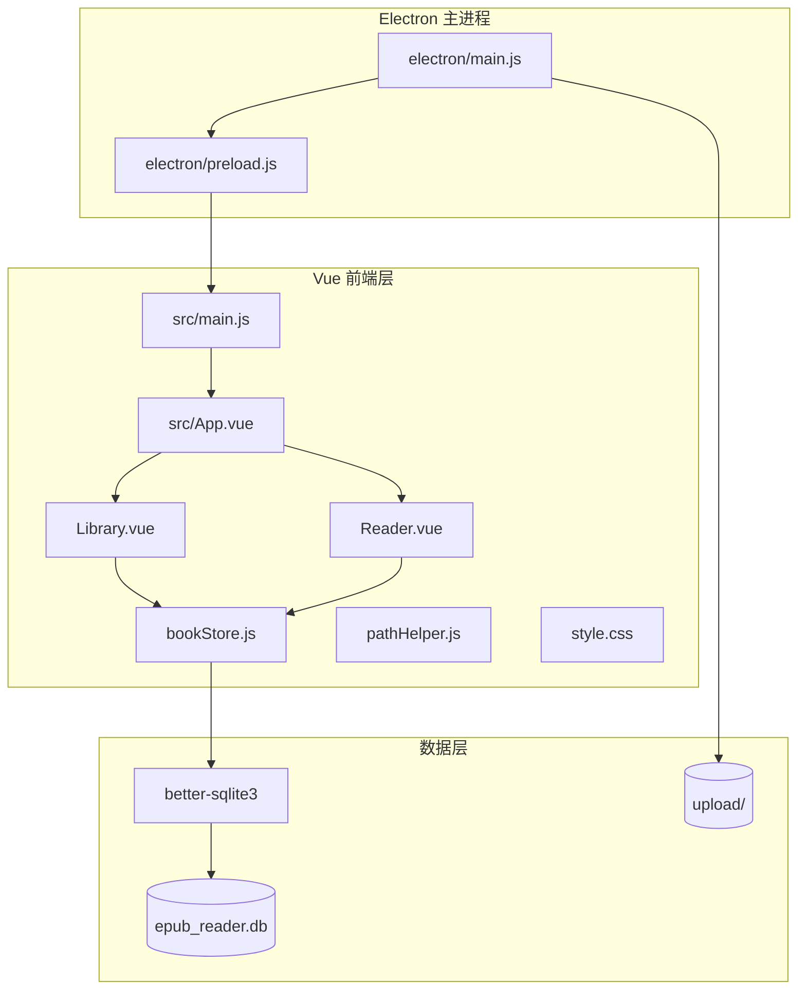
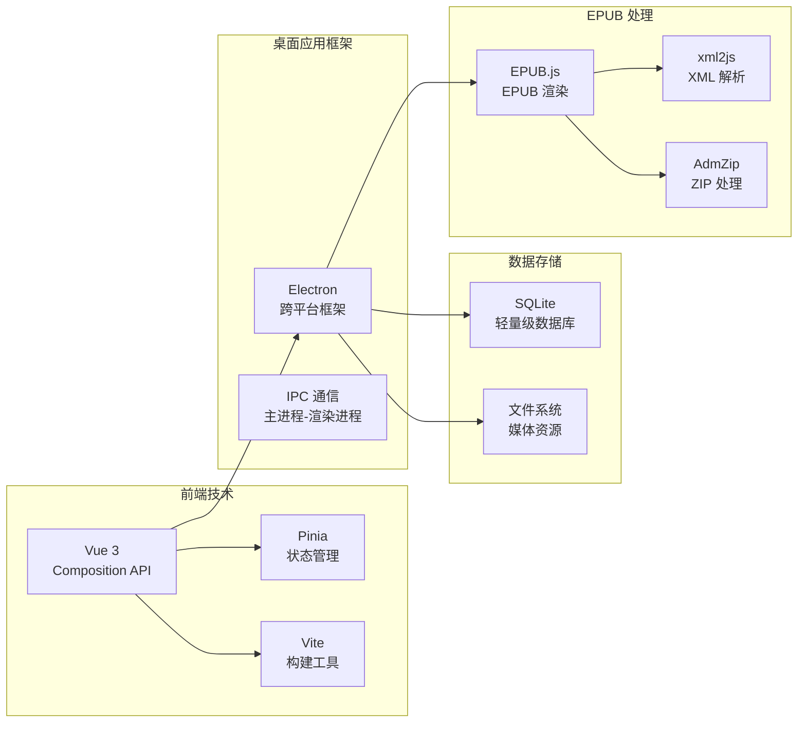
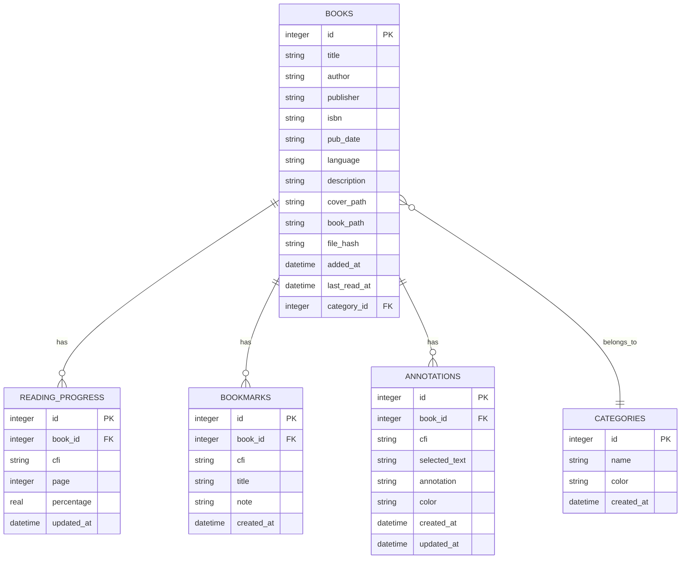
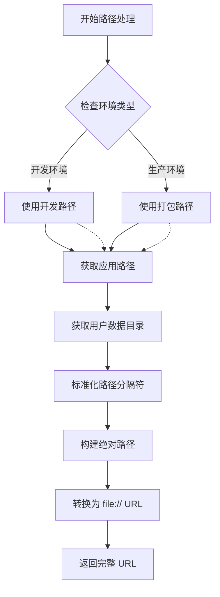
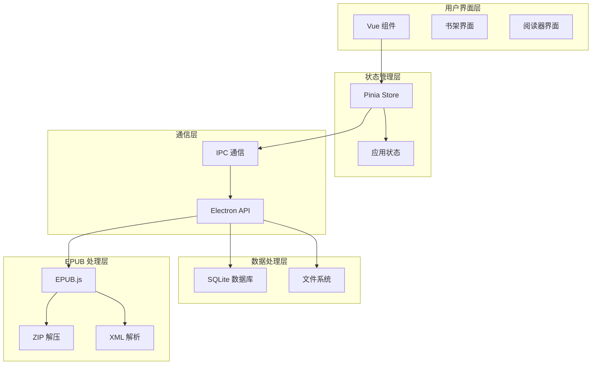
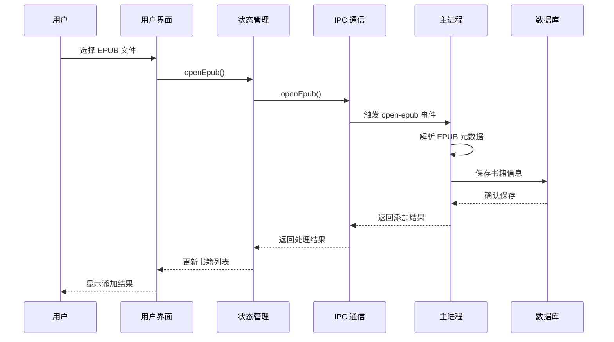
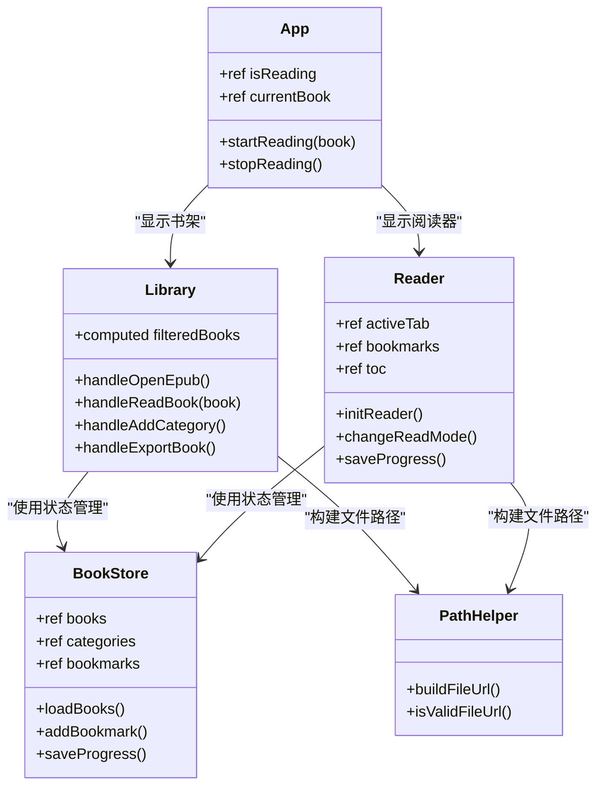
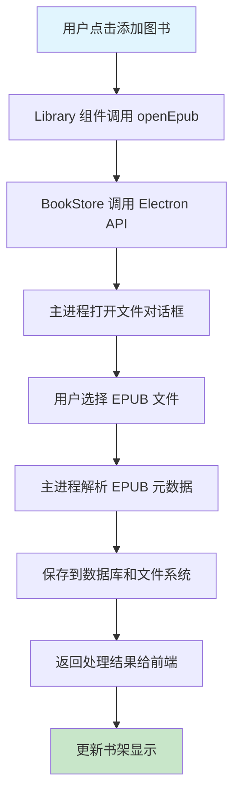
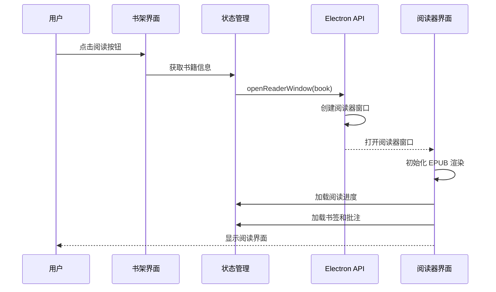
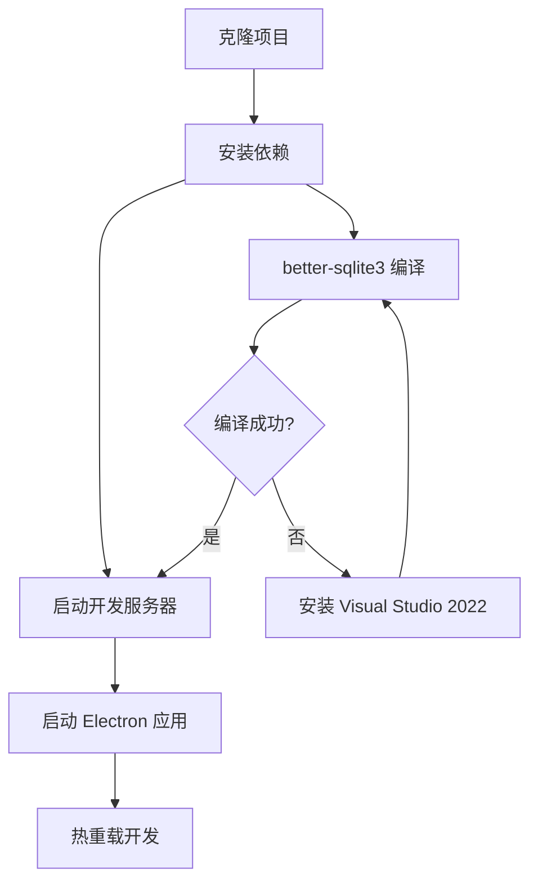

# 项目概述

<cite>
**本文档引用的文件**
- [README.md](file://README.md)
- [package.json](file://package.json)
- [vite.config.js](file://vite.config.js)
- [electron/main.js](file://electron/main.js)
- [electron/preload.js](file://electron/preload.js)
- [src/main.js](file://src/main.js)
- [src/App.vue](file://src/App.vue)
- [src/components/Library.vue](file://src/components/Library.vue)
- [src/components/Reader.vue](file://src/components/Reader.vue)
- [src/stores/bookStore.js](file://src/stores/bookStore.js)
- [src/utils/pathHelper.js](file://src/utils/pathHelper.js)
- [src/style.css](file://src/style.css)
- [docs/DATA_STORAGE.md](file://docs/DATA_STORAGE.md)
- [docs/PATH_COMPATIBILITY.md](file://docs/PATH_COMPATIBILITY.md)
</cite>

## 目录
1. [项目简介](#项目简介)
2. [项目结构](#项目结构)
3. [核心功能特性](#核心功能特性)
4. [技术栈与架构理念](#技术栈与架构理念)
5. [数据存储与路径管理](#数据存储与路径管理)
6. [应用架构概览](#应用架构概览)
7. [组件关系与交互流程](#组件关系与交互流程)
8. [性能与用户体验考量](#性能与用户体验考量)
9. [开发与部署指南](#开发与部署指南)
10. [总结](#总结)

## 项目简介

ROSAA EPUB 电子书阅读器是一个基于 Electron + Vue 3 + SQLite 的现代化桌面应用，专注于提供流畅、舒适的电子书阅读体验。该项目旨在为用户提供：

- **跨平台桌面应用**：支持 Windows、macOS 和 Linux 平台
- **现代化技术栈**：采用 Electron、Vue 3、SQLite 等前沿技术
- **完整的阅读生态**：从书籍管理到深度阅读体验的一体化解决方案
- **数据持久化**：本地化存储，保护用户隐私和数据安全

项目的核心价值在于将传统的 EPUB 阅读器功能与现代桌面应用开发最佳实践相结合，为用户打造专业级的电子书阅读体验。

## 项目结构

项目采用典型的 Electron + Vue 3 单页应用架构，主要分为三个层次：

**图表来源**
- [electron/main.js](file://electron/main.js)
- [electron/preload.js](file://electron/preload.js)
- [src/main.js](file://src/main.js)
- [src/App.vue](file://src/App.vue)

### 目录组织特点

- **按职责分离**：主进程、预加载脚本、前端组件清晰分离
- **模块化设计**：每个功能模块独立封装，便于维护和扩展
- **数据持久化**：SQLite 数据库存储用户数据，文件系统存储媒体资源
- **跨平台兼容**：统一的路径处理机制确保开发和生产环境一致性

**章节来源**
- [README.md](file://README.md)
- [package.json](file://package.json)

## 核心功能特性

### 书架管理
- **批量导入**：支持一次选择多个 EPUB 文件进行批量导入
- **分类管理**：自定义书籍分类，支持颜色标识和动态管理
- **搜索与筛选**：基于书名、作者的智能搜索和排序功能
- **封面展示**：自动生成并显示书籍封面，支持占位符显示

### 阅读功能
- **双模式阅读**：支持翻页模式和滚动模式自由切换
- **进度保存**：自动保存阅读进度，断点续读
- **目录导航**：完整的书籍目录结构，支持快速跳转
- **字体调节**：动态调整字体大小，适配不同阅读需求

### 书签系统
- **智能书签**：基于当前阅读位置自动创建书签
- **书签管理**：支持书签标题和备注编辑
- **快速跳转**：侧边栏书签列表，一键跳转到指定位置

### 批注功能
- **文本高亮**：选中文本进行高亮标记
- **批注管理**：支持添加、编辑、删除批注
- **颜色区分**：多种高亮颜色，便于区分不同类型批注
- **批注弹窗**：点击高亮显示批注详情

### 数据持久化
- **SQLite 存储**：使用 better-sqlite3 实现高性能本地存储
- **文件管理**：EPUB 文件和封面图片统一存储在用户数据目录
- **路径抽象**：统一的路径处理机制，支持开发和生产环境

**章节来源**
- [README.md](file://README.md)
- [src/components/Library.vue](file://src/components/Library.vue)
- [src/components/Reader.vue](file://src/components/Reader.vue)

## 技术栈与架构理念

### 技术栈选择

**图表来源**
- [package.json](file://package.json)
- [electron/main.js](file://electron/main.js)

### 架构设计理念

1. **分层架构**：明确的职责分离，便于维护和扩展
2. **数据驱动**：以 SQLite 为核心的数据存储，确保数据一致性
3. **异步处理**：充分利用 Electron 的异步特性，提升用户体验
4. **路径抽象**：统一的路径处理机制，消除开发和生产环境差异
5. **模块化设计**：每个功能模块独立封装，支持热插拔式扩展

### 技术优势

- **Electron 跨平台**：一套代码多平台运行，降低开发成本
- **Vue 3 现代化**：Composition API 提供更好的逻辑复用和类型支持
- **SQLite 轻量化**：无需外部数据库服务，部署简单
- **EPUB.js 专业性**：专业的 EPUB 渲染引擎，支持标准格式

**章节来源**
- [package.json](file://package.json)
- [vite.config.js](file://vite.config.js)

## 数据存储与路径管理

### 数据库设计

项目采用 SQLite 作为主要数据存储，设计了完整的数据模型：

**图表来源**
- [electron/main.js](file://electron/main.js)

### 路径管理策略

项目实现了统一的路径处理机制，确保开发和生产环境的一致性：

**图表来源**
- [src/utils/pathHelper.js](file://src/utils/pathHelper.js)
- [docs/PATH_COMPATIBILITY.md](file://docs/PATH_COMPATIBILITY.md)

### 数据存储位置

- **用户数据目录**：`C:\Users\<用户名>\AppData\Roaming\epub-reader\`
- **数据库文件**：`db/epub_reader.db`
- **书籍文件**：`upload/books/`
- **封面图片**：`upload/covers/`

**章节来源**
- [docs/DATA_STORAGE.md](file://docs/DATA_STORAGE.md)
- [docs/PATH_COMPATIBILITY.md](file://docs/PATH_COMPATIBILITY.md)

## 应用架构概览

### 整体架构设计

**图表来源**
- [src/App.vue](file://src/App.vue)
- [src/stores/bookStore.js](file://src/stores/bookStore.js)
- [electron/preload.js](file://electron/preload.js)

### 数据流架构

**图表来源**
- [src/stores/bookStore.js](file://src/stores/bookStore.js)
- [electron/main.js](file://electron/main.js)

**章节来源**
- [src/App.vue](file://src/App.vue)
- [src/stores/bookStore.js](file://src/stores/bookStore.js)

## 组件关系与交互流程

### 组件架构

**图表来源**
- [src/App.vue](file://src/App.vue)
- [src/components/Library.vue](file://src/components/Library.vue)
- [src/components/Reader.vue](file://src/components/Reader.vue)
- [src/stores/bookStore.js](file://src/stores/bookStore.js)
- [src/utils/pathHelper.js](file://src/utils/pathHelper.js)

### 交互流程分析

#### 书架管理流程

**图表来源**
- [src/components/Library.vue](file://src/components/Library.vue)
- [src/stores/bookStore.js](file://src/stores/bookStore.js)
- [electron/main.js](file://electron/main.js)

#### 阅读器启动流程

**图表来源**
- [src/components/Library.vue](file://src/components/Library.vue)
- [src/components/Reader.vue](file://src/components/Reader.vue)
- [electron/preload.js](file://electron/preload.js)

**章节来源**
- [src/components/Library.vue](file://src/components/Library.vue)
- [src/components/Reader.vue](file://src/components/Reader.vue)
- [src/stores/bookStore.js](file://src/stores/bookStore.js)

## 性能与用户体验考量

### 性能优化策略

1. **异步加载**：EPUB 文件和数据库操作采用异步处理
2. **懒加载**：组件按需加载，减少初始启动时间
3. **缓存机制**：阅读进度、书签等数据本地缓存
4. **后台处理**：EPUB 位置生成在后台进行，不影响界面响应

### 用户体验设计

1. **双模式切换**：翻页模式和滚动模式满足不同阅读习惯
2. **智能进度**：自动保存阅读进度，支持断点续读
3. **直观界面**：简洁的界面设计，突出阅读内容
4. **响应式布局**：适配不同屏幕尺寸和分辨率

### 错误处理机制

- **文件路径错误**：统一的路径验证和错误提示
- **数据库异常**：完善的异常捕获和恢复机制
- **EPUB 解析失败**：友好的错误提示和重试机制
- **网络请求失败**：离线模式下的本地数据访问

**章节来源**
- [src/components/Reader.vue](file://src/components/Reader.vue)
- [src/utils/pathHelper.js](file://src/utils/pathHelper.js)

## 开发与部署指南

### 开发环境搭建

**图表来源**
- [README.md](file://README.md)

### 构建与打包

项目提供了完整的构建和打包流程：

1. **开发模式**：`npm run electron:dev`
2. **生产构建**：`npm run electron:build`
3. **Windows 打包**：`npm run build:win`

### 部署注意事项

- **依赖安装**：确保 Node.js 18+ 和 Visual Studio 2022
- **数据库迁移**：生产环境使用用户数据目录的数据库
- **图标转换**：需要将 PNG 转换为 ICO 格式
- **权限设置**：确保用户数据目录有写入权限

**章节来源**
- [README.md](file://README.md)
- [package.json](file://package.json)

## 总结

ROSAA EPUB 电子书阅读器项目展现了现代桌面应用开发的最佳实践。通过精心设计的技术架构和功能实现，项目为用户提供了专业级的电子书阅读体验。

### 项目特色

1. **技术先进性**：采用 Electron + Vue 3 + SQLite 的现代化技术组合
2. **功能完整性**：涵盖从书籍管理到深度阅读的完整功能链
3. **用户体验**：注重细节的界面设计和流畅的操作体验
4. **数据安全**：本地化存储，保护用户隐私和数据安全
5. **跨平台支持**：一套代码多平台运行，降低维护成本

### 应用价值

- **个人用户**：提供便捷的电子书管理和服务
- **教育机构**：支持教学资源的数字化管理
- **企业应用**：可定制化的文档管理系统
- **开发者参考**：优秀的 Electron + Vue 3 项目范例

该项目不仅是一个功能完备的电子书阅读器，更是现代桌面应用开发的技术展示，为类似项目提供了宝贵的参考和借鉴价值。